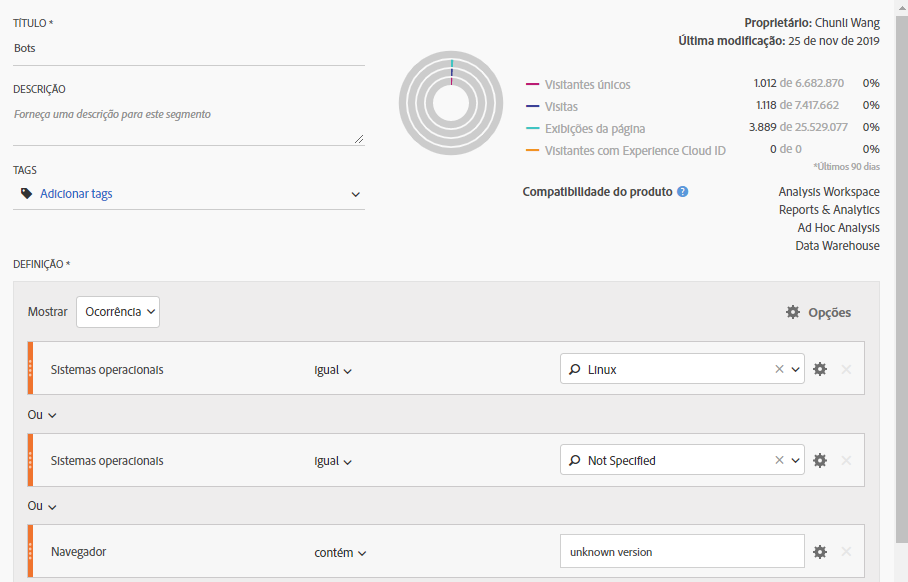
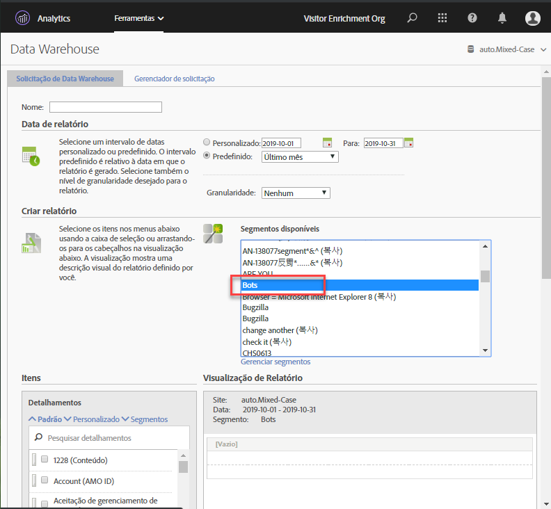

# Remoção de bot no Adobe Analytics

No Adobe Analytics, há duas opções principais para remover o tráfego de robô do relatório:

1. O método de filtragem de bot padrão no Adobe Analytics é [criar regras](/help/admin/admin/bot-removal/bot-rules.md) de bot baseadas na lista de bots IAB. Essa lista é atualizada mensalmente e compila sua lista de muitas fontes, incluindo cdns e propriedades importantes da Internet. Inclui milhares de bots conhecidos incluindo todos os favoritos: Google, Bing, Mozilla etc. Essa lista aborda a maioria dos casos de uso e necessidades na incorporação de robô.

1. Use o plug-in de implementação [s. hitmanager](https://docs.adobe.com/content/help/en/analytics/implementation/javascript-implementation/plugins/hitgovernor.html), que remove os visitantes que se comportam como bots enviando dezenas ou centenas de ocorrências por minuto.

1. Além disso, como os bots avançam rapidamente, a Adobe oferece vários outros recursos poderosos que, quando combinados corretamente e regularmente, podem ajudar a promover a remoção desses inimigos da qualidade dos dados. Esses recursos são: Serviço da Experience Cloud ID, Segmentação, Data warehouse, Atributos do cliente e Conjuntos de relatórios virtuais. Esta é uma visão geral de como você pode aproveitar essas ferramentas:

## Etapa 1: Enviar a Experience Cloud ID de seus visitantes para uma nova ID declarada

Para começar, você desejará criar uma nova ID declarada no serviço principal [de públicos-alvo](https://docs.adobe.com/content/help/en/core-services/interface/audiences/audience-library.html). Você precisará passar a Experience Cloud ID do visitante para esta nova ID declarada, que pode ser feita de forma rápida e fácil com [o Adobe Experience Platform Launch](https://docs.adobe.com/content/help/en/launch/using/implement/solutions/idservice-save.html). Vamos usar o nome «ECID» para a ID declarada.

captura de tela aqui

Aqui está uma captura de tela de como essa ID pode ser capturada por meio do Elemento de dados. Certifique-se de preencher corretamente sua ID da Adobe mcorg no Elemento de dados.

```return Visitor.getInstance("REPLACE_WITH_YOUR_ECORG_ID@AdobeOrg").getExperienceCloudVisitorID();```

Depois que este Elemento de dados estiver configurado, siga [estas instruções](https://docs.adobe.com/content/help/en/launch/using/implement/solutions/idservice-save.html) para passar a ID declarada para a ferramenta ECID no Launch.

## Etapa 2: Usar segmentação para identificar bots

Agora que o ECID do seu visitante foi passado para uma ID declarada, é hora de usar a segmentação na Analysis Workspace para identificar os visitantes que estão agindo como bots. Os bots geralmente são definidos pelo comportamento: visitas de acesso único, agentes incomuns do usuário, informações desconhecidas do dispositivo/navegador, sem referenciadores, novos visitantes, páginas iniciais incomuns etc. Use os poderes de detalhamentos e segmentação do Workspace para identificar os bots que foram filtrados por IAB e as regras do robô do conjunto de relatórios. Por exemplo, esta é uma captura de tela de um segmento que você pode usar:



## Etapa 3: Exportar todas as ecids do segmento via Data Warehouse

Agora que você identificou os bots usando segmentos, a próxima etapa é aproveitar o Data Warehouse para extrair todas as IDs da Experience Cloud associadas a este segmento. É dessa forma que você deve configurar o [relatório do Data Warehouse](https://docs.adobe.com/content/help/en/analytics/export/data-warehouse/data-warehouse.html) :



Lembre-se de usar a ID de visitante da Experience Cloud como dimensão e aplicar o segmento Bots.

## Etapa 4: Enviar esta lista de volta para a Adobe como um atributo do cliente

Depois que o relatório Data Warehouse chegar, você terá uma lista de ecids que precisam ser filtradas de dados históricos. Copie e cole esses ecids em um arquivo CSV em branco com apenas duas colunas, ECID e sinalizador de robô:


Verifique se o cabeçalho da primeira coluna corresponde ao nome atribuído à nova ID declarada acima. Use este arquivo. CSV como arquivo de importação de atributo do cliente e, em seguida, assine seu (s) conjunto (s) de relatórios ao atributo do cliente conforme descrito nesta publicação [do blog](https://theblog.adobe.com/link-digital-behavior-customers).

## Etapa 5: Criar um segmento que aproveita o novo atributo do cliente

Depois que seu conjunto de dados tiver sido processado e integrado à Analysis Workspace, crie mais um segmento que aproveite a nova dimensão de atributo do cliente «Sinalizador de Bot»:
