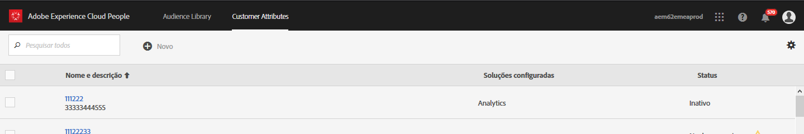
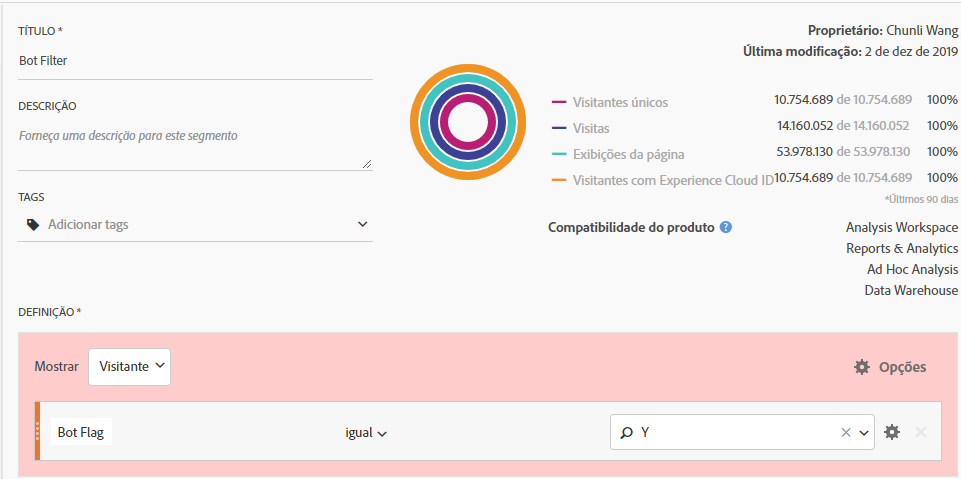
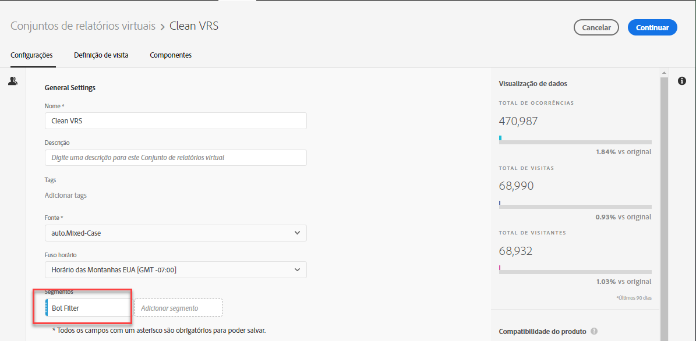

# Remoção de bot no Adobe Analytics

No Adobe Analytics, você tem várias opções para remover o tráfego de bot dos relatórios:

## Usar regras de bot

Both standard and custom bot filtering methods are supported in **[!UICONTROL Analytics]**>**[!UICONTROL  Admin]** > **[!UICONTROL Report Suites]**>**[!UICONTROL  Edit Settings]** > **[!UICONTROL General]**>**[!UICONTROL  Bot Rules]**:

| Tipo de regra | Descrição |
|--- |--- |
| Regras de bot IAB padrão | Selecionar **[!UICONTROL Ativar regras de filtragem de bots IAB]**usa a Lista internacional de spiders e bots (International Advertising Bureau&#39;s) da[IAB](https://www.iab.com/)para remover o tráfego de bot. A maioria dos clientes seleciona essa opção, no mínimo. |
| Regras de bot personalizadas | Você pode definir e adicionar regras de bot personalizadas com base em agentes de usuário, endereços IP ou intervalos IP. |

Para obter mais detalhes, consulte [Visão geral das regras de bot](/help/admin/admin/bot-removal/bot-rules.md).

## Usar uma combinação de ferramentas da Adobe

Além disso, como os bots estão se modificando rapidamente, a Adobe oferece vários outros recursos avançados que, quando combinados de forma adequada e regular, podem ajudar a remover esses inimigos da qualidade dos dados. Esses recursos são: Serviço da Experience Cloud ID, Segmentação, Data Warehouse, Atributos do cliente e Conjuntos de relatórios virtuais. Esta é uma visão geral de como você pode aproveitar essas ferramentas.

### Etapa 1: transmita a Experience Cloud ID dos seus visitantes para uma nova ID declarada

Para iniciar, você deverá criar uma nova ID declarada no [Serviço principal de pessoas](https://docs.adobe.com/content/help/en/core-services/interface/audiences/audience-library.html). Você precisará transmitir a Experience Cloud ID do visitante para essa nova ID declarada, que pode ser feita rápida e facilmente com o [Adobe Experience Platform Launch](https://docs.adobe.com/content/help/en/launch/using/implement/solutions/idservice-save.html). Vamos usar o nome &quot;ECID&quot; para a ID declarada.



Veja como essa ID pode ser capturada por meio do Elemento de dados. Certifique-se de preencher corretamente a Experience Cloud OrgID no Elemento de dados.

```return Visitor.getInstance("REPLACE_WITH_YOUR_ECORG_ID@AdobeOrg").getExperienceCloudVisitorID();```

Depois que esse elemento de dados for configurado, siga [estas instruções](https://docs.adobe.com/content/help/en/launch/using/implement/solutions/idservice-save.html) para transmitir as IDs declaradas para a ferramenta ECID no Launch.

### Etapa 2: usar segmentação para identificar bots

Agora que a ECID do visitante foi transmitida para uma ID declarada, você pode usar a [segmentação na Analysis Workspace](https://docs.adobe.com/content/help/en/analytics/analyze/analysis-workspace/components/t-freeform-project-segment.html) para identificar os visitantes que atuam como bots. Os bots são frequentemente definidos pelo seu comportamento: visitas de acesso único, agentes de usuário incomuns, informações desconhecidas do dispositivo/navegador, nenhum referenciador, novos visitantes, páginas de aterrissagem incomuns etc. Use os potenciais de detalhamento e segmentação do Workspace para identificar os bots que escaparam da filtragem IAB e as regras de bot do conjunto de relatórios. Por exemplo, esta é uma captura de tela de um segmento que você pode usar:


### Etapa 3: exportar tudo [!DNL Experience Cloud IDs] do segmento pelo Data Warehouse

Agora que você identificou os bots usando segmentos, a próxima etapa é aproveitar o Data Warehouse para extrair todas as Experience Cloud IDs associadas a esse segmento. É assim que você deve configurar sua solicitação do [Data Warehouse](https://docs.adobe.com/content/help/en/analytics/export/data-warehouse/data-warehouse.html):


Lembre-se de usar a ID de visitante da Experience Cloud como dimensão e aplicar o segmento Bots.

### Etapa 4: transmitir essa lista para a Adobe como um Atributo do cliente

Quando o relatório do Data Warehouse chegar, você terá uma lista de ECIDs que precisam ser filtrados dos dados históricos. Copie e cole esses ECIDs em um arquivo .CSV em branco com apenas duas colunas, ECID e Sinalizador de bot.

* **ECID**: certifique-se de que esse cabeçalho de coluna corresponde ao nome que você deu à nova ID declarada acima.
* **Sinalizador de bot**: adicione isso como uma dimensão de esquema Atributo do cliente.

Use esse arquivo .CSV como seu arquivo de importação do Atributo do cliente e assine os conjuntos de relatórios no Atributo do cliente, conforme descrito nesta [publicação do blog](https://theblog.adobe.com/link-digital-behavior-customers).


### Etapa 5: criar um segmento que aproveite o novo Atributo do cliente

Depois que seu conjunto de dados tiver sido processado e integrado à Analysis Workspace, crie mais um segmento que aproveite sua nova dimensão de atributo de cliente &quot;Sinalizador de bot&quot; e um contêiner de [!UICONTROL Exclusão]:



### Etapa 6: usar esse segmento como filtro do Conjunto de relatórios virtuais

Por fim, você deve criar um [Conjunto de relatórios virtual](/help/components/vrs/vrs-about.md) que aproveite esse segmento para filtrar os bots identificados:



Esse conjunto de relatórios virtuais recém-segmentado resultará em um conjunto de dados significativamente mais limpo, com os bots identificados completamente removidos.

### Etapa 7: repita as etapas 2, 3 e 4 regularmente

Defina pelo menos um lembrete mensal para identificar e filtrar novos bots, talvez antes da análise programada regularmente.
