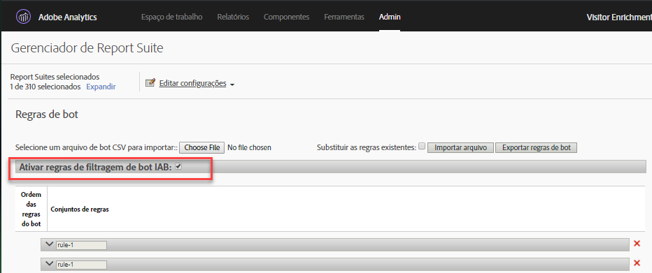

# Visão geral das regras de bot

As regras de bot permitem remover o tráfego do conjunto de relatórios gerado pelos spiders e bots conhecidos. A remoção do tráfego de robô pode fornecer uma medição mais precisa da atividade do usuário em seu site.

Depois que as regras do robô são definidas, todo o tráfego de entrada é comparado às regras definidas. O tráfego que corresponde a qualquer uma dessas regras não é coletado no conjunto de relatórios e não está incluído nas métricas de tráfego.

Para atualizar ou fazer upload das regras do robô, navegue até **[!UICONTROL Analytics]** > **[!UICONTROL Admin]** > **[!UICONTROL Report Suites]**. Selecione o Conjunto de relatórios correto e vá para **[!UICONTROL Edit Settings]** > **[!UICONTROL General]** > **[!UICONTROL Bot Rules]**.

A remoção do tráfego de robô normalmente reduz o volume de tráfego e as métricas de conversão. Muitos clientes acham que a remoção do tráfego de robô resulta em taxas de conversão aumentadas e aumentos em outras métricas de usabilidade. Antes de remover o tráfego de robô, comunique-se com as partes interessadas para garantir que elas possam fazer os ajustes necessários nos principais indicadores de desempenho como resultado dessa mudança. Se possível, recomendamos que, antes, seja removido o tráfego de robô de um report suite pequeno, para estimar o potencial impacto.

Os dados do tráfego de bot são armazenados em um repositório separado para exibição nos relatórios de Páginas de bots e Bots. Há duas opções para ativar a filtragem de bot:

| Tipo de regra | Descrição |
|--- |--- |
| Regras de bot IAB padrão | Selecting [!UICONTROL Enable IAB Bot Filtering Rules] uses the [IAB&#39;s](https://www.iab.com) (International Advertising Bureau&#39;s) International Spiders &amp; Bots List to remove bot traffic. A maioria dos clientes seleciona essa opção, no mínimo. |
| Regras de bot personalizadas | Você pode definir e adicionar regras de bot personalizadas com base em agentes de usuário, endereços IP ou intervalos IP. |

## Regras de bot IAB padrão

As regras de bot IAB padrão podem ser ativadas marcando a [!UICONTROL Enable IAB Bot Filtering Rules] caixa de seleção. Esta seleção removerá bots na Lista Internacional de spiders e bots (International Advertising Bureau&#39;s) da IAB para remover o tráfego de bots. O IAB atualiza essa lista mensalmente.



O Adobe não é capaz de fornecer a lista detalhada de bots da IAB para os clientes, no entanto você pode usar o Relatório de bots para ver uma lista de bots que acessaram seu site. Para enviar um bot para a lista IAB, visite [IAB](https://www.iab.com).

## Regras de bot personalizadas

>[!Note] A interface de usuário permite a definição manual de 500 regras. Quando esse limite é alcançado, as regras precisam ser gerenciadas em massa por meio das opções Importar arquivo e Exportar regras de bot.

As regras do robô personalizadas permitem que você filtre as condições baseadas em tráfego definidas.

As regras do robô personalizadas são definidas usando os seguintes tipos de condição:

* Agente do usuário
* Endereço IP
* Intervalo de IP

Várias condições podem ser definidas para uma única regra. Várias condições são correspondidas usando &quot;ou&quot;. Por exemplo, se você fornecer um valor para Agente do usuário e Endereço IP, o tráfego será considerado tráfego de robô se qualquer uma das condições for atendida.

### Agente do usuário

A User Agent condition checks the user agent value to see if it **[!UICONTROL starts with]** or **[!UICONTROL contains]** the specified string. If **[!UICONTROL contains]** is selected, the substring is matched if it occurs anywhere in the user agent.

Optional values can be included in the **[!UICONTROL does not contain]** list to define values that the user agent must not contain for a successful match. Vários valores podem ser especificados incluindo um valor por linha. Se o agente do usuário atender aos critérios especificados na string de correspondência, mas também contiver uma string no não contém lista, ela não será considerada uma correspondência.

The **[!UICONTROL contains]** field is limited to 100 characters. A lista não contém é limitada a 255 caracteres, menos um caractere separador para cada nova linha. (É igual ao número de strings - 1. Se você especificar 4 *não contém* strings, são necessários 3 caracteres separadores.) Todas as correspondências de string não distinguem maiúsculas de minúsculas.

### Endereço IP (inclusive correspondências curingas)

Corresponde a um endereço IP ou a vários endereços no mesmo bloco usando curingas (*). Forneça os valores numéricos do endereço IP que deseja corresponder. Substitua * por qualquer valor que você deseja corresponder usando um curinga. A lista a seguir contém exemplos de string de correspondência de endereço IP:

```
10.10.10.1
10.10.10.*
```

### Intervalo de endereço IP

Forneça o start e os intervalos finais dos endereços IP para que correspondam. Substitua * por qualquer valor que você deseja corresponder usando um curinga.

### Definir uma regra de bot personalizada

1. Vá até **[!UICONTROL Analytics]** > **[!UICONTROL Admin]**, selecione um ou mais conjuntos de relatórios e clique em **[!UICONTROL General]** > **[!UICONTROL Bot Rules]**.
1. Click **[!UICONTROL Add Rule]** and define one or more match conditions.
1. Clique em **[!UICONTROL Save]**. A alteração deve ocorrer em 30 minutos.

## Fazer upload de regras de bot

Para importar regras do robô em massa, é possível carregar um arquivo CSV que defina as regras.

Crie um arquivo CSV com as seguintes colunas, na ordem apresentada:

| Coluna 1 | Coluna 2 | Coluna 3 | Coluna 4 | Coluna 5 |
|--- |--- |---|---|---|
| Nome do bot | IP Início | IP Fim | Regra de correspondência do agente<br>(contém ou começa com)</br> | Excluir agente<br>(limite de 255 caracteres)</br> |

É possível definir três tipos de regras de bot:

* O agente do usuário contém ou start com
* Endereço IP único ou correspondência curinga
* Correspondência de intervalo de IP

Cada linha no arquivo de importação pode conter apenas uma das seguintes definições de bot:

* **O agente do usuário contém ou start com**: Forneça uma única sequência de agente do usuário para corresponder na coluna Incluir agente. Especifique o tipo de correspondência que deseja executar inserindo *contém* ou *start com* no campo Regra de correspondência de agente. Um valor opcional pode ser incluído na coluna Excluir agente, o qual define uma ou mais strings delimitadas por traço (`|`) que o agente não contém. As correspondências de string não distinguem maiúsculas de minúsculas. As colunas Start IP e Fim IP devem estar vazias.

* **Endereço IP único ou correspondência curinga**: para corresponder a um único endereço IP (`10.10.10.1`) ou endereço IP curinga (`10.10.*.*`), coloque o mesmo valor nas colunas Início de IP e Fim de IP. Regra de correspondência, Incluir agente e Excluir agente devem estar vazios.

* **Correspondência** de intervalo de IP: Defina um intervalo de endereços IP usando o Start IP e as colunas IP End. Os curingas podem ser usados para a correspondência dos intervalos de IP, por exemplo de `10.10.10.*` para `10.10.20.*`. Regra de correspondência, Incluir agente e Excluir agente devem estar vazios.

### Vária regras combinadas com OU

Para corresponder um robô usando uma combinação de regras unidas a um OU (por exemplo, agente do usuário ou endereço IP), forneça um nome idêntico para todas as regras que você deseja combinar no campo de nome do robô. Correspondências AND não são suportadas.

### Substituir todas as regras com um arquivo de upload

Select the **[!UICONTROL Overwrite existing rules]** checkbox to delete all existing rules and replace them with the rules defined in the upload file.

### Exportar regras

The **[!UICONTROL Export Uploaded Bot File]** button exports all rules defined in the UI in a CSV format.


## Impacto das regras de bot na coleta de dados {#section_F01A3130E7A04A9993371CF26F6586F2}

As regras de bot são aplicadas a todos os dados de análises. Os dados removidos pelas regras de bot são visíveis apenas nos Relatórios de Páginas de bots e Bots.

As regras VISTA são aplicadas após as Regras de bot (consulte [Ordem de processamento).](/help/admin/admin/c-processing-rules/c-processing-rules-configuration/processing-rule-order.md)

**Processamento de visita de alta ocorrência:** Se mais de 100 ocorrências ocorrem em uma visita, o relatórios determina se o tempo da visita, em segundos, é menor ou igual ao número de ocorrências na visita. Nessa situação, devido ao custo de processamento de visitas longas e intensas, start de relatórios com uma nova visita. Visitas de alta ocorrência são normalmente causadas por ataques de bot e não são consideradas como navegação normal de visitantes.

>[!NOTE] As ocorrências marcadas como *`bots`* são cobradas como [chamadas do servidor.](/help/admin/c-server-call-usage/overage-overview.md)

## Impacto da ofuscação de IP na filtragem de bot {#section_92E60B95BE8940D983F28C79E0CD6B12}

A lista de bot IAB é baseada exclusivamente no agente do usuário, portanto, a filtragem baseada nessa lista não é afetada pelas configurações de ofuscação de IP. Para filtragem de bot não IAB (regras personalizadas), o IP pode fazer parte dos critérios de filtragem. Se os bots de filtragem utilizam IP, a filtragem de bots ocorre depois que o último octeto é removido (se a configuração está ativada), mas antes de outras opções de ofuscação de IP, como excluir o IP ou substituí-lo por uma ID exclusiva.

Se a ofuscação de IP estiver ativada, a exclusão de IP ocorrerá antes que o endereço IP seja ofuscado, de modo que os clientes não precisam alterar nada quando ativarem a ofuscação de IP.

Se o último octeto for removido, isso será feito antes da filtragem de IP. Dessa forma, o último octeto é substituído por um 0, e as regras de exclusão de IP devem ser atualizadas para corresponder aos endereços IP com um zero no final. A correspondência de * deve corresponder a 0.
