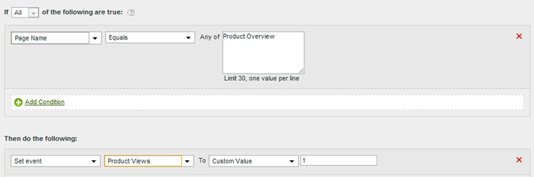

# Definir o evento de exibição de produto na página Visão geral do produto

Eventos podem ser definidos com base em valores de página ou baseados em valores específicos em uma variável.

| Conjunto de regras | Valor |
|---|---|
| Condição | Se o nome da página for igual à visão geral do produto |
| Ação | Definir evento de exibições de produto de evento como valor personalizado 1 |

Por exemplo:

