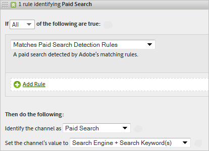
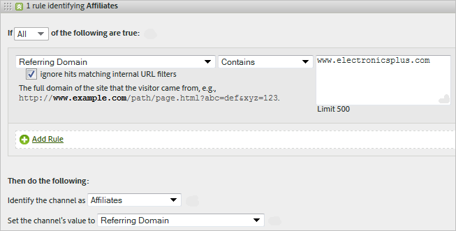

# Regras de processamento de canais de marketing

As regras de processamento de canal de marketing determinam se uma ocorrência do visitante atende aos critérios atribuídos a um canal através do processamento de cada ocorrência que um visitante faz no site. As regras são processadas na ordem especificada e, quando uma regra é atendida, o sistema para de processar as regras restantes.

**[!UICONTROL Analytics]** > **[!UICONTROL Administrador]** > **[!UICONTROL Conjuntos de relatórios]** > **[!UICONTROL Editar configurações]** > **[!UICONTROL Canais de marketing]** > **[!UICONTROL Regras de processamento de canal de marketing]**.

Observações adicionais sobre o processamento:

* Os dados coletados com essas regras são permanentes. As regras alteradas após a coleta de dados não são retroativas. A Adobe recomenda que você analise e considere todas as circunstâncias antes de salvar [!UICONTROL Regras de processamento de canal de marketing] para mitigar a coleta de dados nos canais errados.
* É possível configurar até 25 canais de marketing separados.
* As regras podem acessar variáveis definidas pelo VISTA, mas não podem acessar dados excluídos pelo VISTA.
* Dois canais de marketing nunca recebem crédito pelo mesmo evento (como compras ou cliques). Dessa forma, os canais de marketing diferem das eVars (já que duas eVars podem receber crédito pelo mesmo evento).
* Se houver uma cobertura de falha de suas regras, você poderá ver [Nenhum canal identificado](/help/components/c-marketing-channels/c-faq.md).

## Pré-requisitos

* Revise as informações conceituais em [Introdução aos canais de marketing](/help/components/c-marketing-channels/c-getting-started-mchannel.md).
* Crie um ou mais canais para poder atribuir regras a eles. Consulte [Adicionar canais de marketing](/help/admin/admin/c-manage-report-suites/c-edit-report-suites/marketing-channels/c-channels.md).
* Examine as práticas recomendadas para usar [!UICONTROL Canais de marketing] com o [!UICONTROL Attribution IQ].

## Criar regras de processamento de Canal de marketing

Crie regras de processamento do Canal de marketing. Elas determinam se uma ocorrência de visitante atende aos critérios atribuídos a um canal.

1. Clique em **[!UICONTROL Analytics]** > **[!UICONTROL Administrador]** > **[!UICONTROL Conjuntos de relatórios]**.
2. Selecione um conjunto de relatórios.

   Se seu conjunto de ferramentas de relatório não tem canais definidos, a página [!UICONTROL Configuração inicial automática] é exibida.

   Consulte [Executar a configuração automática](/help/components/c-marketing-channels/c-getting-started-mchannel.md).

3. Clique em **[!UICONTROL Editar configurações]** > **[!UICONTROL Canais de marketing]** > **[!UICONTROL Regras de processamento de canal de marketing]**. Se você executou a configuração automática, um conjunto de canais e regras foi automaticamente definido para você.

   

4. Se quiser adicionar uma regra, selecione no **[!UICONTROL Adicionar novo conjunto de regras]** menu. Se selecionar um canal, você receberá um modelo de regra e, se selecionar Personalizado, começará com uma folha em branco. Ambas as opções permitem modificar o conjunto de regras conforme a necessidade.

   

5. Para continuar criando regras, clique em **[!UICONTROL Adicionar novo conjunto de regras]**.
6. Para criar prioridades de regras, arraste-as e solte-as na posição desejada.
7. Clique em **[!UICONTROL Salvar]**.

### Definir o valor do canal de marketing

**[!UICONTROL Definir o valor do canal]** define a dimensão de detalhes do canal de marketing que está disponível para esse canal.

### Critérios da regra

Essa tabela de referência define os campos, as opções e os atributos de ocorrência que podem ser utilizados para definir as Regras de processamento de canal de marketing.

>[!NOTE]
>
>Qualquer campo de texto definido, como parâmetro de sequência de consulta ou listas de valores para correspondência, é avaliado como **não diferencia maiúsculas de minúsculas** valores. Por exemplo, se você tiver uma regra em que o parâmetro da sequência de consulta `cmp = abc123`, todas as variações de maiúsculas e minúsculas de ambos `cmp` e `abc123` corresponde.

| Termo | Definição |
|--- |--- |
| Todas | Ativa esse canal somente quando todos os critérios na regra são verdadeiros. |
| Qualquer | Ativa esse canal quando qualquer um dos critérios na regra é verdadeiro. Essa opção só estará disponível se houver mais de um critério na regra. |
| ID do AMO | O código de rastreamento primário usado pelas integrações da Advertising Cloud e do Advertising Analytics. Quando uma dessas integrações estiver ativada, o prefixo do código de rastreamento poderá ser usado para identificar canais específicos da Advertising Cloud. Usar &quot;ID do AMO&quot; começa com &quot;AL&quot; para Pesquisa, &quot;AC&quot; para Exibição ou &quot;AO&quot; para Social. Quando a ID do AMO é usada em canais de marketing, as métricas de clique/custo/impressão podem ser atribuídas ao canal correto (quando não estiver configurado, essas métricas vão para Direto ou Nenhum). |
| ID do AMO ED | O código de rastreamento secundário usado pela Advertising Cloud. O objetivo principal desse código de rastreamento é atuar como a chave para enviar dados de volta para a Ad Cloud. No entanto, ele também pode ser usado para identificar ClickThroughs de exibição vs. ViewThroughs de exibição, se você desejar vê-los como dois canais de marketing separados. Isso pode ser feito definindo a lógica do canal de marketing para &quot;AMO EF ID&quot; termina com `:d` para ClickThroughs de exibição ou &quot;AMO EF ID&quot; termina com `:i` para ViewThroughs de Exibição. Se você não desejar dividir a Exibição em dois canais, use a dimensão da ID do AMO. |
| Variáveis de conversão | Consiste de eVars ativadas para esse conjunto de ferramentas de relatório, e se aplica apenas quando essas variáveis são definidas por meio do código Adobe na página. |
| Existe | Diversas seleções estão disponíveis, incluindo:<ul><li>**Não existe**: especifica que o atributo da ocorrência não existe no pedido. Por exemplo, em um domínio de referência, se o usuário digitar um URL ou clicar em um marcador, o atributo de domínio de referência não existe.</li><li>**Está vazio**: especifica que existe um atributo de ocorrência, geralmente uma eVar ou parâmetro de sequência de consulta, mas não há valor associado ao atributo de ocorrência.</li><li>**Não Contém:** permite especificar, por exemplo, que um domínio de referência não contém um valor específico (em vez de usar a seleção &quot;Contém&quot;.)</li></ul> |
| Identificar o canal como | Associa a regra a um canal de marketing adicionado à página Gerenciador de canal de marketing. |
| Corresponde a Regras de Detecção de Pesquisa Paga | Uma pesquisa paga detectada pela Adobe. Pesquisas pagas são quando as empresas pagam uma taxa para que o mecanismo de pesquisa relacione seus sites. As pesquisas pagas em geral aparecem no alto ou à direita dos resultados da pesquisa. |
| Corresponde a Regras de Detecção de Pesquisa Natural | Uma pesquisa não paga detectada pelo relatório da Adobe. |
| Referenciador corresponde a filtros internos de URL | Uma visita cujo URL da página corresponde a um filtro de URL interno, conforme definido para o conjunto de relatórios nas Ferramentas de administração. |
| Referenciador não corresponde a filtros internos de URL | O URL de referência não corresponde a um filtro de URL interno, conforme definido para o conjunto de relatórios nas Ferramentas de administração. Você pode utilizar essas configurações com  A  URL da página  e  existe  para configurar uma regra &quot;pega tudo&quot;, de forma que nenhuma visita chegue até a seção Nenhum canal identificado do relatório. |
| Ignorar ocorrências correspondentes a filtros de URL internos | (Para referenciadores) Acompanha apenas ocorrências provenientes de sites com referenciador externo. Em geral, mantenha essa configuração ativada, a menos que deseje incluir tráfego interno. |
| É a primeira página da visita | A primeira página da visita detectada por um relatório Adobe. |
| Página | A dimensão [Página](/help/components/dimensions/page.md). |
| Domínio de página | O domínio da página onde o visitante chega, como `products.example.com`. |
| Domínio e caminho da página | O domínio e caminho, como `products.example.com/mens/pants/overview.html`. |
| Domínio raiz da página (TLD+1) | O domínio raiz da página onde o visitante chega como, por exemplo, example.co.uk . |
| URL da página | O URL da página da Web de seu site. |
| Domínio de referência | A variável [Domínio referenciador](/help/components/dimensions/referring-domain.md) dimension |
| Parâmetro da sequência de caracteres de consulta | Use um parâmetro de string de consulta individual. Você pode especificar apenas um parâmetro da cadeia de caracteres de consulta por critério. Para adicionar mais parâmetros da string de consulta, use `ANY` como operador, em seguida, adicione os parâmetros da sequência de consulta à regra. |
| Referenciador | O local da página da Web (URL completo) onde seus visitantes estavam antes de chegarem ao seu site. O referenciador existe fora do seu domínio definido. |
| Domínio e caminho de referência | A concatenação de domínio de referência e caminho de URL. Os exemplos incluem:    `www.example.com/products/id/12345` ou `ad.example.com/foo` |
| Parâmetro de referência | Um parâmetro da sequência de consulta no URL do referenciador. Por exemplo, se seus visitantes vêm de `example.com/?page=12345&cat=1`, page e cat são os parâmetros de referência. |
| Domínio raiz de referência | O domínio raiz do referenciador. O referenciador existe fora do seu domínio definido. |
| Mecanismo de pesquisa | Um mecanismo de pesquisa como Google ou Yahoo! que trouxe visitantes ao seu site. |
| Palavras-chave de pesquisa | Uma palavra usada para realizar uma pesquisa usando um mecanismo de pesquisa. |
| Mecanismo de pesquisa + Palavras-chave | Uma concatenação de palavra-chave de pesquisa e mecanismo de pesquisa para identificar de forma exclusiva o mecanismo de pesquisa. Por exemplo, se você pesquisar a palavra computador, o mecanismo de pesquisa e a palavra-chave serão identificados assim:  `Search Tracking Code = "<search_type>:<search engine>:<search keyword>" where    search_type = "n" or "p", search_engine = "Google", and search_keyword = "computer"`**Nota:** n = natural; p = paga |
| Defina o valor do canal como | Define o [Detalhes do canal de marketing](/help/components/dimensions/marketing-detail.md) dimensão. Você determina qual valor seria melhor no contexto da regra. Os exemplos incluem ID de anúncio de banner, palavra-chave de pesquisa ou campanha de email. |

## Ordem e definições da regra de canal de marketing {#channel-rules}

As regras de canal são processadas na ordem especificada. A Adobe recomenda colocar os canais pagos ou gerenciados primeiro (como pesquisa paga, pesquisa natural, exibição ou email) para que eles recebam crédito por canais orgânicos (como domínios diretos, internos, de referência).

Abaixo está a ordem recomendada para regras de canal e definições de exemplo:

### Pesquisa paga {#paid-search}

Uma pesquisa paga é quando um mecanismo de pesquisa é pago para colocar uma palavra ou frase entre os resultados da pesquisa. Normalmente, esse canal é definido com base no parâmetro da sequência de consulta (consulte Exemplo de canal de exibição) ou nas regras de detecção de pesquisa paga.

#### Detecção de pesquisa paga

Para corresponder às regras de detecção de pesquisa paga, o canal de marketing usa configurações definidas na página [!UICONTROL Detecção de pesquisa paga]. ( **[!UICONTROL Admin]** > **[!UICONTROL Conjuntos de relatórios]** > **[!UICONTROL Editar configurações]** > **[!UICONTROL Gerais]** > **[!UICONTROL Detecção de pesquisa com anúncios]**). O URL de destino corresponde à regra de detecção de pesquisa paga existente para o mecanismo de pesquisa.

Para a regra de canal de marketing, as configurações de [!UICONTROL Pesquisa Paga] são:

Consulte [Detecção de pesquisa paga](../general/paid-search-detection/paid-search-detection.md) para obter mais informações.

### Pesquisa natural {#natural-search}

A pesquisa natural ocorre quando os visitantes encontram seu site por meio de um mecanismo de pesquisa e o mecanismo de pesquisa classifica seu site sem que você pague para entrar na lista.

O Adobe determina o tráfego de pesquisa com base em uma pesquisa interna de mecanismos de pesquisa. Se um referenciador corresponder aos critérios de um mecanismo de pesquisa, ele determinará se é pago ou natural usando [Detecção de pesquisa paga](../general/paid-search-detection/paid-search-detection.md) regras que você configurou. Uma ocorrência é considerada pesquisa natural quando não corresponde a nenhuma regra de detecção de pesquisa paga.

Para a regra de canal de marketing, as configurações de Pesquisa natural são as seguintes:

### Exibir {#display}

Essa regra identifica visitantes que se originam de anúncios em banners. Ela é identificada por um parâmetro de sequência de consulta na URL de destino, neste caso *`Ad_01`*. O parâmetro da sequência de consulta e os valores procurados são avaliados como valores que não diferenciam maiúsculas de minúsculas.

### Email {#email}

Essa regra identifica visitantes que se originam de campanhas de email. Ela é identificada por um parâmetro de sequência de consulta no URL de destino, neste caso *`eml`*:

### Afiliados {#afilliates}

Essa regra identifica visitantes que se originam de determinado conjunto de domínios referenciadores. Na regra, você relaciona os domínios de afiliados que gostaria de acompanhar, como segue:

### Outras campanhas {#other-campaigns}

Uma prática recomendada é incluir um canal de &quot;Outras campanhas&quot; seguindo todas as regras de canais pagos. Este canal é abrangente para o tráfego pago sem categoria.

### Redes sociais {#social-networks}

Esta regra identifica os visitantes que se originam de uma rede social, como o Facebook. Muitas vezes, o canal é renomeado para Social orgânico. As configurações podem ser as seguintes:

### Canal interno (atualização de sessão) {#internal}

Essa regra identifica os visitantes cujo URL de referência corresponde à configuração dos filtros de URL internos no Admin Console, ou seja, os visitantes que vieram de dentro do site para iniciar sua visita. Muitas vezes, esse canal é renomeado para Atualização de sessão.

Consulte [Motivos para interno (Atualização de sessão)](https://experienceleague.adobe.com/docs/analytics/components/marketing-channels/c-faq.html?lang=pt-BR#internal) para obter mais informações sobre por que esse canal ocorre.

### Direta {#direct}

Essa regra inclui visitantes que não têm domínio referenciador, ou seja, que vêm ao site diretamente, como a partir de um link de favoritos ou colando o link no navegador. Esse canal geralmente é renomeado para Digitado/Marcado diretamente.

### Canal de domínios referenciadores {#referring-domains}

O canal de domínios referenciadores identifica visitantes que têm um domínio referenciador. Juntos, os canais de Domínios interno, direto e referenciador atuam como abrangentes para todas as ocorrências restantes que ainda não foram categorizadas em um canal.

