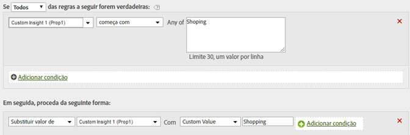

# Limpar valores em um relatório

Você pode fazer a correspondência de valores comparando-os a erros comuns de ortografia e atualizá-los para exibi-los corretamente nos relatórios.

Para assegurar que você não corresponda a outros valores inadvertidamente, use a opção de correspondência mais restritiva disponível. Você pode executar um relatório sobre a variável (prop1 no exemplo a seguir) e pesquisar os termos que seleciona para substituir e assegurar-se de que não ocorra a correspondência com valores não desejados. As comparações de strings não distinguem maiúsculas de minúsculas.

| Conjunto de regras | Valor |
|---|---|
| Condição | Se prop1 começar com compras |
| Ação | Substituir valor de prop1 como compra com valor personalizado |

Por exemplo:

