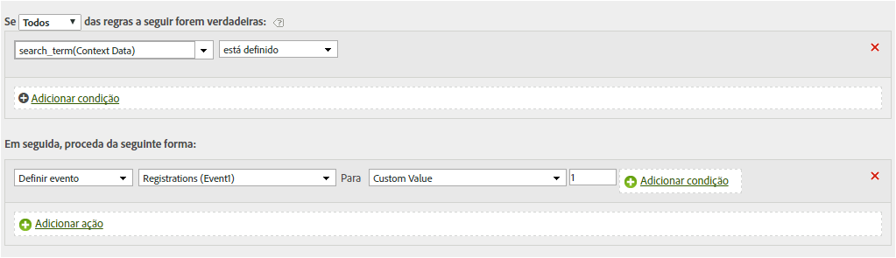

# Definir um evento usando uma variável de dados de contexto

As regras de processamento podem acionar eventos com base em variáveis de Dados de contexto.

As variáveis de dados de contexto são especificadas no AppMeasurement, no seguinte formato:

```
 s.contextData['search_term']
```

A lista de [!UICONTROL variáveis de contexto] contém todas as variáveis que foram enviadas para o conjunto de relatórios nos últimos 30 dias. If you know the context data variable name but have not sent it into the current report suite, you can add a value by typing the variable name and clicking **[!UICONTROL Add variable name context data]**:


The following rule definition expands on the Copy a Context Data Variable to an eVar rule to also set an event on every hit that contains a specific context data variable:[](../../../../admin/admin/c-processing-rules/processing-rules-examples/processing-rules-copy-context-data.md#concept_43AA4980A2D847D6A3BEC50BCC0780E7)

| Conjunto de regras | Valor |
|---|---|
| Condição | Se os dados de contexto de 'pesquisar_termo' estiver definido |
| Ação | Definir "pesquisas" de evento |

Por exemplo:



Consulte [Variáveis de dados de contexto](https://marketing.adobe.com/resources/help/en_US/sc/implement/context_data_variables.html) na Ajuda de implementação.
