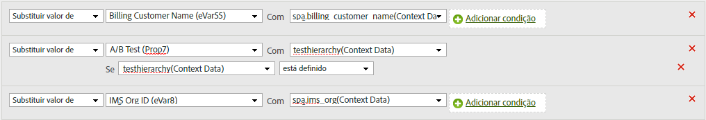

# Copiar uma variável de dados de contexto para uma eVar

As regras de processamento são usadas para mover valores das variáveis de Dados de contexto para props e eVars. Sem as regras de processamento, as variáveis de dados de contexto não têm significado e não preenchem nenhum relatório no Analytics.

A lista de [!UICONTROL variáveis de contexto] contém todas as variáveis que foram enviadas para o conjunto de relatórios nos últimos 30 dias. Se você sabe o nome da variável de dados de contexto, mas não a enviou para o conjunto de relatórios atual, é possível adicionar um valor digitando o nome da variável e clicando em **[!UICONTROL Adicionar dados de contexto do nome da variável]**:

O exemplo a seguir pega a variável de dados de contexto `search_term` e coloca seu valor em `eVar3`:

O exemplo acima funciona perfeitamente quando há apenas algumas eVars a serem preenchidas. Se sua organização tiver centenas de variáveis de dados de contexto em que cada uma precisa de sua própria eVar, você poderá usar declarações condicionais. Dezenas de declarações condicionais podem se encaixar em uma única regra de processamento, permitindo que sua organização preencha todas as eVars em um conjunto de relatórios sem entrar no limite de regras de processamento de 150 regras.

O exemplo a seguir é preenchido `prop7` com a variável de dados de contexto `testhierarchy`, mas somente se `testhierarchy` for definido:

Para obter mais informações sobre como implementar variáveis de dados de contexto, consulte [Variáveis de dados de contexto](/help/implement/vars/page-vars/contextdata.md) no guia Implementar usuário.
