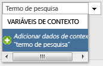
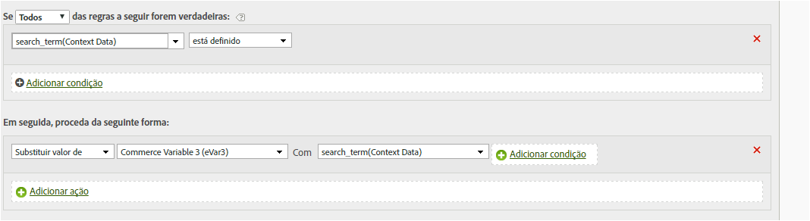

# Copiar uma variável de dados de contexto para uma evar

As regras de processamento são usadas para mover valores das variáveis de Dados de contexto para props e eVars.

As variáveis de dados de contexto são especificadas no AppMeasurement, no seguinte formato:

```
 s.contextData['search_term']
```

A lista de [!UICONTROL variáveis de contexto] contém todas as variáveis que foram enviadas para o conjunto de relatórios nos últimos 30 dias. If you know the context data variable name but have not sent it into the current report suite, you can add a value by typing the variable name and clicking **[!UICONTROL Add variable name context data]**:



A definição da regra a seguir preenche uma eVar a cada ocorrência que contém uma variável de dados de contexto específica:

| Conjunto de regras | Valor |
|---|---|
| Condição | Se os dados de contexto de 'pesquisar_termo' estiver definido |
| Ação | Substituir o valor do eVar3 por 'pesquisar_termo' |

Por exemplo:



Consulte [Variáveis de dados de contexto](https://marketing.adobe.com/resources/help/en_US/sc/implement/index.html?f=context_data_variables) na Ajuda de implementação.
