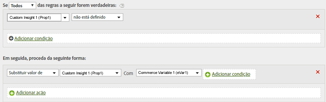

# Determine um caminho copiando um valor de evar para uma prop

Você pode copiar o valor de uma eVar em um prop para ativar a definição de caminho.

Quando valores são definidos, a variável à esquerda recebe o valor da variável à direita (mesmo que esteja vazia).

| Conjunto de regras | Valor |
|---|---|
| Condição | Nenhuma (sempre excluir) |
| Ação | Substituir o valor de Prop1 por eVar1 |

É possível modificar essa regra para definir o valor de Prop1 apenas se ele ainda não tiver um valor, semelhante ao exposto a seguir:

| Conjunto de regras | Valor |
|---|---|
| Condição | Se Prop1 não estiver definido |
| Ação | Substituir o valor de Prop1 por eVar1 |

Por exemplo:

