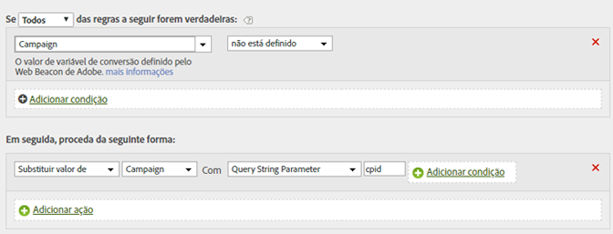

# Preencher uma ID de campanha a partir de um parâmetro da string de consulta

É possível preencher uma variável usando um parâmetro da string de consulta

Na maioria dos casos, você usa um plug-in para preencher variáveis a partir da string de consulta. Se um erro de digitação ou problema semelhante impedir o preenchimento do valor, a variável poderá ser preenchida por regras de processamento.

Você deve sempre conferir se um valor está vazio ou se contém o valor esperado antes de sobrescrevê-lo.

| Conjunto de regras | Valor |
|---|---|
| Condição | A campanha não foi definida |
| Ação | Substitui o valor da campanha por um parâmetro da string de consulta cpid |

Por exemplo:

