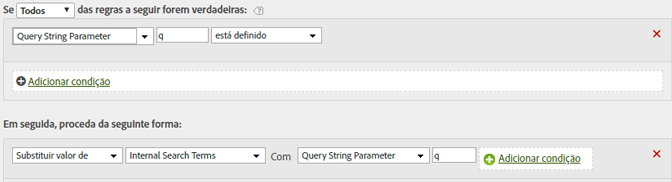

# Preencher termos de pesquisa interna usando um parâmetro da string de consulta

Se você usar uma variável comum, como q, para preencher termos de pesquisa, poderá usar regras de processamento para preencher o eVar de termos de pesquisa interna com esses valores.

Os valores de sequência de consulta precisam estar codificados em unicode ou UTF-8 para serem lidos pelas regras de processamento.

| Conjunto de regras | Valor |
|---|---|
| Condição | Se o parâmetro da string de consulta q estiver definido |
| Ação | Substitui o valor dos temos de pesquisa interna por parâmetro da string de consulta q |

Por exemplo:

