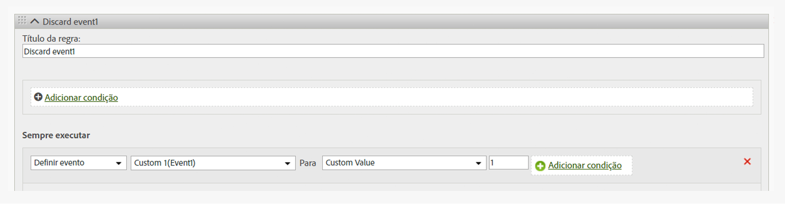

# Remover um evento de uma ocorrência

Mostra como remover/descartar um evento de uma ocorrência com o uso de uma Regra de processamento, sem implementar uma alteração na página.

## Remove an event from a hit {#topic_9548385BFE344FC08CA99718A24FC093}

Mostra como remover/descartar um evento de uma ocorrência com o uso de uma Regra de processamento, sem implementar uma alteração na página.

Configure uma Regra de processamento para definir o evento com um valor personalizado = 0 como mostrado na imagem abaixo:

