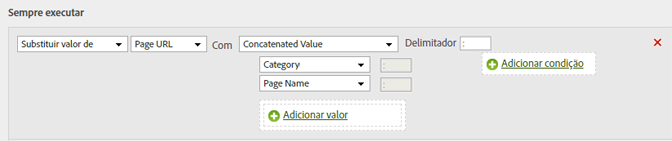

# Adicionar uma subcategoria pela concatenação da categoria e do nome da página

Você pode usar a opção de concatenar para preencher valores combinando outros valores.

<table id="table_FF761C2011CD456B9A466C054A54FC30"> 
 <thead> 
  <tr> 
   <th colname="col1" class="entry"> Conjunto de regras </th> 
   <th colname="col2" class="entry"> Valor </th> 
  </tr> 
 </thead>
 <tbody> 
  <tr> 
   <td colname="col1"> Condição </td> 
   <td colname="col2"> Nenhuma (sempre excluir) </td> 
  </tr> 
  <tr> 
   <td colname="col1"> Ação </td> 
   <td colname="col2">Substituir o valor da subcategoria com valor concatenado 
Categoria 
 
Nome da página 
 </td> 
  </tr> 
 </tbody> 
</table>

Por exemplo:

