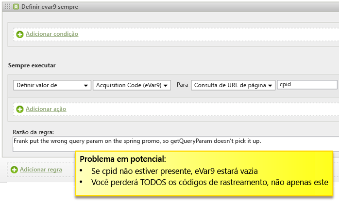
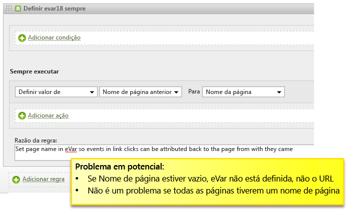
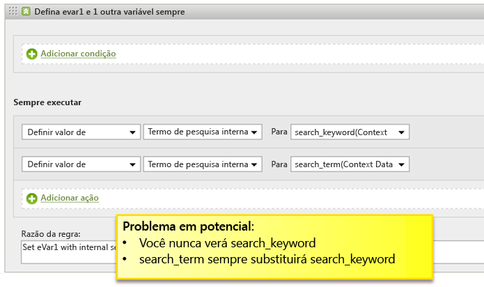
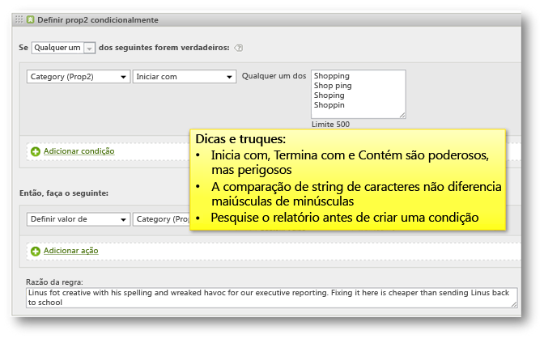

# Dicas e truques para regras de processamento

Esta seção contém orientações para testar as regras de processamento e uma lista de erros comuns que devem ser evitados.

## Testar regras de processamento {#section_F092D2FECDE24082AE9FC6F8BE87F29F}

Esta seção contém algumas orientações que ajudam a testar as regras de processamento antes de serem implantadas na produção.

**Teste das regras que leem os termos de pesquisa**

Para todos os critérios baseados em uma pesquisa, por exemplo, se prop1 contém "notícias", vá para o relatório prop 1, pesquise "notícias" e veja se há correspondências que você não esperava.

**Teste das regras que leem variáveis**

Create a blank HTML page on your desktop, include the s_code from your site, and set the `s.account` variable to a dev report suite. Se suas regras se baseiam em referenciador, domínio de referência etc., use algumas URLs de exemplo a partir do relatório dos referenciadores live, defina a variável `s.referrer` com um daqueles valores e carregue a página. Da mesma forma, se a regra se baseia no valor do URL da página, é possível definir `s.pageURL`. Esse mesmo processo pode ser usado para qualquer variável.

**Uso de um conjunto de relatórios dev**

Recomendamos a configuração das regras de processamento em um conjunto de relatórios dev para ter certeza de que estão funcionando corretamente. Se possível, recomendamos copiar as regras em um conjunto de relatórios de produção pequeno antes de uma implantação mais abrangente.

## Verificar a existência de valores vazios {#section_EE84A5525E26415787930723B0CAAE0F}

Ao criar uma regra, considere o caso de um valor vazio. Se você não adicionar uma condição que verifica a existência de valores vazios, você pode, inadvertidamente, substituir variáveis com valores vazios.

Também é importante considerar a ordem de processamento. No exemplo a seguir, parece que a eVar personalizada do Pagename Anterior será definida como o URL se o Nome da página não estiver presente. No entanto, o URL é colocado no nome da página após a aplicação das regras de processamento, então, nesse caso, o Nome da página fica vazio se não for definido na página.

## Evitar a substituição de valores {#section_49FCCA31E31A433EA2EF5EAF91443DAF}

No exemplo a seguir, duas variáveis de dados de contexto são usadas no site para capturar termos de pesquisa: search_keyword e search_term. No entanto, com base na configuração, o valor de search_keyword é sempre substituído, mesmo se o search_term estiver vazio.

Essa regra deve ser reconfigurada para testar cada variável dos dados de contexto para obter um valor antes de preencher o termo de pesquisa interna e, opcionalmente, concatenar os dois valores, se houver caso de uso para manter os dois.

## Codificar os termos de pesquisa em UTF-8 ou Unicode {#section_3BBBE1FB8FEA48589362452DE51DB575}

Os termos de pesquisa extraídos de uma sequência de consulta devem ser corretamente codificados, caso contrário, as regras de processamento não encontrarão correspondência neles.

## Começa com, Contém e Termina com {#section_80CE853244FC435B844A09EA51868D8D}

Selecione a condição de correspondência certa para encontrar a condição mais restritiva que corresponda corretamente. É possível pesquisar valores em um relatório antes de criar uma regra, para ter certeza de que não há correspondências indesejadas. Por exemplo, você deve pesquisar o relatório Prop2 para encontrar todos os locais em que há correspondência com essa condição antes de habilitar essa regra.

