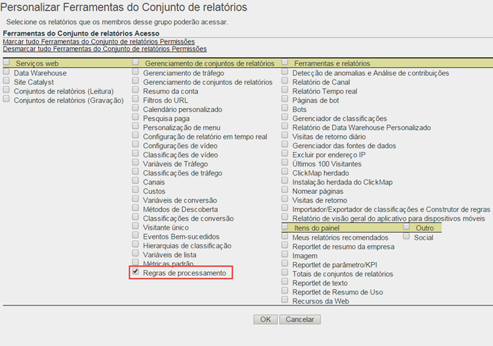

# Visão geral das regras de processamento

O processamento de regras simplifica a coleta de dados e o gerenciamento do conteúdo conforme é enviado para os relatórios. As regras de processamento ajudam a simplificar a interação com grupos de TI e desenvolvedores da Web por fornecerem uma interface para:

* Definir um evento na página de visão geral do produto
* Preencher a campanha com um parâmetro de string de consulta
* Concatenar categoria e nome de página em um prop para facilitar o relatório
* Copiar uma eVar em um prop para ver novos caminhos
* Limpar seções do site com erros de ortografia
* Puxar termos de pesquisa internos ou uma ID de campanha da string de consulta para uma eVar

>[!VIDEO](https://tv.adobe.com/embed/1181/16506/)

*Assista à visão geral das Regras de processamento e o treinamento do Adobe Summit para saber por que você deve utilizar as regras de processamento.*

## Receber autorização para utilizar as regras de processamento {#section_8A4846688050453784DAE4D89355169A}

Antes de 20 de abril de 2017, todos os usuários (incluindo administradores) tinham que ser aprovados em uma prova e receber autorização do Atendimento ao cliente da Adobe para usar as regras de processamento.

Agora, os administradores têm direito de usar as regras de processamento **por padrão**. A prova não é mais necessária. Os administradores também podem conceder esses direitos a outros usuários através da interface de Ferramentas administrativas. Veja como:

1. Caso ainda não tenha feito, [crie um grupo](../../../admin/user-management2/c-user-groups/groups.md) que inclua apenas aqueles não administradores que devem ter autorização para usar as regras de processamento.
1. [Adicione os não administradores a esse grupo](../../../admin/user-management2/c-user-management/t-add-user-to-group.md).
1. Then go to **[!UICONTROL Analytics]** &gt; **[!UICONTROL Admin]** &gt; **[!UICONTROL User Management]** &gt; **[!UICONTROL Groups]** &gt; **[!UICONTROL[group name]]** &gt; **[!UICONTROL Edit]** &gt; **[!UICONTROL Report Access]** &gt; **[!UICONTROL Report Suite Tools]** &gt; **[!UICONTROL Customize]** &gt; **[!UICONTROL Report Suite Management]**.
1. Marque a caixa ao lado de [!UICONTROL Regras de processamento] e clique em **[!UICONTROL OK]**.

>[!IMPORTANT]
>
>Because processing rules permanently affect Analytics data, we strongly recommend that processing rules administrators receive certification training in Adobe Analytics, and be familiar with all sources of data for your report suites (standard web sites, mobile sites, mobile apps, Data Insertion API, and so on). O conhecimento das variáveis de dados de contexto e as variáveis padrão preenchidas em várias plataformas ajudará a impedir a exclusão ou alteração acidental dos dados.

## Usar dados de contexto para simplificar a coleção de dados {#section_09EEA03612D24C15839631AA9E9668D8}

As variáveis de dados de contexto configuram um novo tipo de variável, disponível somente para regras de processamento. Para utilizar as variáveis de dados de contexto, os pares de dados chave/valor são enviados por meio da sua implementação e as regras de processamento são utilizadas para capturar esses valores nas variáveis padrão do Analytics. Isso dispensa os programadores de compreender exatamente qual prop e/ou eVar deve conter qual valor.

Consulte [Variáveis de dados de contexto](https://marketing.adobe.com/resources/help/en_US/sc/implement/context_data_variables.html) na Ajuda de implementação.

## Usar regras de processamento para transformar dados de ocorrência e eventos de acionador {#section_8284E72E999244E091CD7FB1A22342B6}

Regras de processamento podem monitorar valores recebidos para transformar erros de ortografia comuns e definir eventos com base nos dados relatados. Props podem ser copiados em eVars, valores podem ser concatenados para relatórios e eventos podem ser definidos.

## Uso das variáveis de dados de contexto em relatórios {#section_BD098BC503024A0B8703596628071134}

Após definir os dados de contexto na implementação, é necessário copiá-los para variáveis, como eVars para uso em relatórios.

Para obter mais informações, acesse [here](../../../admin/admin/c-processing-rules/processing-rules-examples/processing-rules-copy-context-data.md#concept_43AA4980A2D847D6A3BEC50BCC0780E7) and [here](../../../admin/admin/c-processing-rules/processing-rules-examples/processing-rules-copy-context-data-event.md#concept_359B4E165ED442938A8EB6A55A725682).
