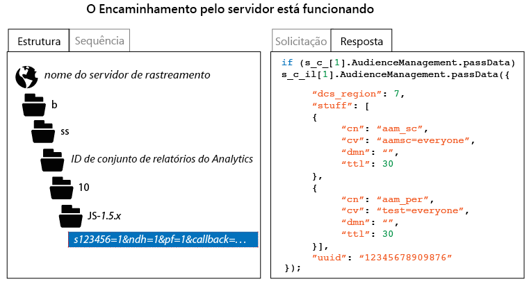

# Como verificar a implementação do encaminhamento pelo lado do servidor

Para verificar se o encaminhamento pelo lado do servidor está corretamente habilitado, será preciso inspecionar a resposta HTTP enviada pela solicitação de rastreamento do Analytics. Isso pode ser feito usando as ferramentas de desenvolvimento de um navegador ou usando uma ferramenta de proxy, como o Charles Web Debugger. As instruções a seguir ilustram quais indicadores devem estar presentes para garantir que o encaminhamento pelo lado do servidor seja habilitado corretamente.

Para verificar o status do encaminhamento pelo lado do servidor:

1. Carregue uma página de teste que contenha o código AppMeasurement atualizado.
1. Nas ferramentas de depuração do seu navegador ou usando seu software proxy, inspecione a resposta HTTP da solicitação de rastreamento do Analytics (você pode facilmente filtrar isso, selecionando qualquer caminho contendo “b/ss”).
1. Inspecione a resposta HTTP. Se a resposta contiver dados do Audience Manager (conforme ilustrado abaixo), o encaminhamento pelo lado do servidor está funcionando.

>[!CAUTION]
>
>If the response contains the key value pair `"status":"SUCCESS"` or a 2 x 2 image, then server-side forwarding * is not* configured correctly. Certifique-se de que o Serviço de identidade esteja corretamente implantado, que tenha implantado o módulo App Measurement, que o conjunto de relatórios aplicável tenha sido mapeado à Organização IMS correta e que o encaminhamento pelo lado do servidor tenha sido ativado no Admin Console do Analytics.

>[!MORE_LIKE_THIS]
>
>* [Charles Web Debugger](https://www.charlesproxy.com/)

