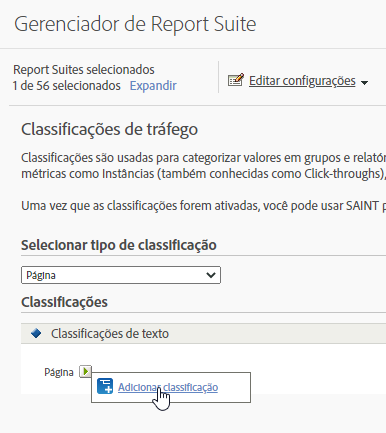

# Classificações de tráfego

As classificações de tráfego permitem que você classifique variáveis de tráfego (props). As classificações de tráfego podem usar somente classificações de texto.

## Classificações de tráfego {#concept_028079B29A9C412AA68910A87E11176F}

As classificações de tráfego permitem que você classifique variáveis de tráfego (props). As classificações de tráfego podem usar somente classificações de texto.

A página Classificações de tráfego permite criar classificações para os conjunto de relatórios selecionados. Depois de classificado, qualquer relatório que você puder gerar usando o dado-chave também poderá ser gerado com os atributos associados.

Após ativar as classificações, consulte [Importador de classificações](/help/components/classifications/importer/c-working-with-saint.md) para atribuir valores específicos à classificação apropriada.

## Adicionar uma classificação de tráfego {#task_4DB49CCB1D764483907BC33A5CEB7315}

<!-- 

t_classification_add_traffic.xml

 -->

Etapas que descrevem como adicionar ou editar classificações para os conjuntos de relatórios selecionados.

1. Clique em **[!UICONTROL Admin]** > **[!UICONTROL Conjuntos de relatórios]** no cabeçalho do Suite.
1. Selecione um conjunto de relatórios.
1. No campo **[!UICONTROL Selecionar tipo de classificação]**, selecione a variável à qual deseja adicionar uma classificação.
1. Clique em **[!UICONTROL Editar configurações]** > **[!UICONTROL Tráfego]** > **[!UICONTROL Classificações de tráfego]**.

   

1. Passe o mouse sobre o ícone **[!UICONTROL Editar classificação]** e, em seguida, selecione **[!UICONTROL Adicionar classificação]** ou **[!UICONTROL Editar classificação]**.
1. Na caixa de diálogo **[!UICONTROL Classificação de texto]**, configure a classificação como desejado:

   **[!UICONTROL Nome]**: especifique o nome da classificação.

   **[!UICONTROL Descrição]**: forneça uma descrição mais detalhada.
1. Clique em **[!UICONTROL Salvar]**.
