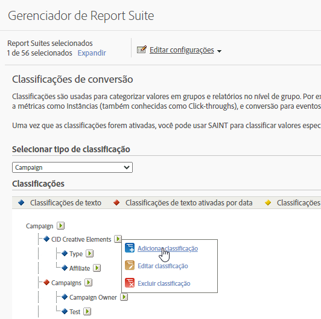

# Classificações de conversão

Classificações são usadas para categorizar valores em grupos e relatórios no nível de grupo. Por exemplo, você pode classificar todas as campanhas de Pesquisa paga em uma categoria como *termos de música pop* e relatar o sucesso dessa categoria com relação a métricas como Instâncias (click-throughs) e conversão para eventos bem-sucedidos.

As classificações de conversão permitem que você classifique as variáveis de conversão. Depois de classificado, qualquer relatório que você puder gerar usando o dado-chave também poderá ser gerado com as propriedades de dados associadas.

Depois de habilitar as classificações, utilize o [Importador de classificações](/help/components/classifications/importer/c-working-with-saint.md) para atribuir valores específicos à classificação apropriada.

## Descrições de classificações de conversão

| Elemento | Descrição |
| --- | --- |
| Nome | O nome da classificação |
| Ativado por data (somente texto) | Indica se a classificação de texto é um intervalo de datas para variáveis de campanha. |
| Opções (somente texto) | Cria uma lista de valores de classificação disponíveis para esta classificação. Use as opções com variáveis de campanha para fornecer aos usuários uma lista dos valores suportados com a classificação no Gerenciador de campanhas. |
| Tipo de número (somente numérico) | Especifica o tipo de número na classificação numérica. As opções incluem Numérico, Porcentagem e Moeda. |

## Adicionar classificações de conversão

Etapas que descrevem como adicionar classificações de conversão na Administração.

1. Clique em **[!UICONTROL Admin]** > **[!UICONTROL Conjuntos de relatórios]**.
1. Selecione um conjunto de relatórios.
1. Clique em **[!UICONTROL Editar configurações]** > **[!UICONTROL Conversão]** > **[!UICONTROL Classificações de conversão]**.
1. Na lista suspensa **[!UICONTROL Selecionar tipo de classificação]**, selecione a variável à qual deseja adicionar uma classificação.

   

1. Passe o mouse sobre o ícone **[!UICONTROL Editar classificação]**, em seguida **[!UICONTROL Adicionar classificação]**.
1. No campo **[!UICONTROL Selecionar tipo]**, selecione o tipo de classificação que deseja adicionar à variável.

   As opções incluem **[!UICONTROL Texto]** e **[!UICONTROL Numérico]**. Para obter mais informações sobre tipos de classificação, consulte [Sobre as classificações](/help/components/classifications/c-classifications.md).
1. Na caixa de diálogo **[!UICONTROL Classificações de texto]**, configure a classificação como desejado.

1. Na caixa de diálogo **[!UICONTROL Lista suspensa]**, adicione ou remova opções.

   Adicionar Opções cria uma lista com os valores de classificação disponíveis para essa classificação. Você pode usar esta opção com variáveis de Campanha para fornecer aos usuários uma lista dos valores suportados para a classificação no Gerenciador de campanhas. Utilize isso para dimensões de classificação nas quais há uma pequena quantidade de valores permitidos que mudam raramente ou quase nunca. Por exemplo, você pode executar campanhas diferentes direcionadas para os diferentes níveis de fidelidade do cliente: Silver, Gold e Platinum. É possível utilizar a lista suspensa para garantir que os valores aceitos sejam apenas os que correspondem aos três níveis. Se alguém tentar utilizar um valor diferente, este será descartado.

1. Clique em **[!UICONTROL Salvar]**.

## Excluir uma classificação de conversão

Exclua uma classificação de conversão quando ela não for mais necessária.

1. Abra o Gerenciador de conjunto de relatórios clicando em **[!UICONTROL Admin]** > **[!UICONTROL Conjuntos de relatórios]** no cabeçalho do Suite.
1. Selecione um conjunto de relatórios.
1. Clique em **[!UICONTROL Editar configurações]** > **[!UICONTROL Conversão]** > **[!UICONTROL Classificações de conversão]**.
1. Na lista suspensa **[!UICONTROL Selecionar tipo de classificação]**, selecione a variável da qual deseja excluir uma classificação.
1. Passe o mouse sobre o ícone **[!UICONTROL Editar classificação]**, em seguida selecione **[!UICONTROL Excluir classificação]**.
1. Na caixa de diálogo Excluir classificação, clique em **[!UICONTROL Excluir]**.
