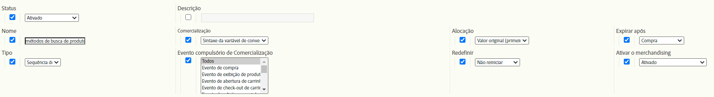

# eVars de merchandising e métodos de descoberta de produtos

Este documento detalhado explica os conceitos por trás das eVars de comercialização, que processam e alocam dados de forma diferente das eVars padrão. Ele também explica como as eVars de merchandising estão relacionadas aos métodos de descoberta de produtos.

Embora a maioria dos sites de varejo tenha muitas maneiras de encontrar produtos, o Adobe considera que os seguintes são os métodos fundamentais para encontrar produtos que cada cliente de varejo deve rastrear no Adobe Analytics:

* Palavras-chave de pesquisa interna
* Códigos de rastreamento de campanha interna
* Categorias de merchandising/navegação
* Links de venda cruzada

Para os fins deste documento, vamos mapear algumas eVars para as soluções da seguinte maneira:

* eVar2: Palavras-chave de pesquisa interna
* eVar3: Códigos de rastreamento de campanha interna
* eVar4: Categorias de merchandising/navegação
* eVar5: Links de venda cruzada

Podemos usar um eVar adicional para medir o desempenho de todos os métodos de busca de produtos em relação uns aos outros. Além dos métodos de descoberta descritos acima, o eVar inclui outros métodos de descoberta em sua comparação, como links para páginas de detalhes do produto de sites externos.

* eVar1: Métodos para encontrar produtos

Em vez de configurar qualquer uma dessas variáveis para serem eVars padrão, configure-as para serem eVars de merchandising. Usar eVars de merchandising permite alocar qualquer atividade bem-sucedida nos valores capturados pelas eVars em um nível *por produto* em vez de um nível *por visita/por pedido*. Este documento esclarece a diferença entre a alocação por produto e por pedido em todo o processo.

Para demonstrar como definir essas variáveis, aqui está um exemplo em que um visitante decide usar as &quot;sandálias&quot; internas de pesquisa de palavra-chave para localizar um produto no site. Na página de resultados da pesquisa por palavra-chave, você deve capturar dados em pelo menos duas eVars:

* `eVar2` é igual à palavra-chave que foi usada na pesquisa (&quot;sandals&quot;)
* `eVar1` é igual ao método de descoberta de produto usado (&quot;pesquisa interna de palavra-chave&quot;).

Quando você define essas duas variáveis iguais a esses valores específicos, você sabe que o visitante está usando o termo de pesquisa interno de palavra-chave &quot;sandals&quot; para localizar um produto. Ao mesmo tempo, você sabe que o visitante não está usando os outros métodos de busca de produtos para localizar produtos (por exemplo, o visitante não está navegando pelas categorias de produtos exatamente ao mesmo tempo em que está realizando uma pesquisa de palavra-chave). Para garantir que a alocação adequada por produto ocorra, esses métodos não utilizados não devem receber crédito pela localização de um produto encontrado por meio de uma pesquisa interna por palavra-chave. Portanto, você deve inserir lógica no código (como AppMeasurement, AEP Web SDK e assim por diante) que define automaticamente as eVars associadas a esses outros métodos de descoberta como um valor de &quot;método que não seja de conclusão&quot;.

Por exemplo, quando um usuário pesquisa produtos usando a palavra-chave &quot;sandals&quot;, a lógica do código do Analytics deve definir as variáveis iguais às seguintes na página de resultados da pesquisa interna por palavra-chave:

* eVar2=&quot;sandals&quot;: a palavra-chave &quot;sandals&quot; foi usada na pesquisa interna da palavra-chave
* eVar1=&quot;pesquisa interna de palavra-chave&quot;: o método de descoberta &quot;pesquisa interna de palavra-chave&quot; foi usado
* eVar3=&quot;campanha não interna&quot;: uma campanha interna não foi usada para acessar a página de resultados da pesquisa
* eVar4=&quot;não navegado&quot;: uma categoria de navegação não foi acessada na página de resultados da pesquisa
* eVar5=&quot;venda não cruzada&quot;: um link de venda cruzada não foi clicado na página Resultados da pesquisa

## Configurações de eVars de merchandising

Antes de continuar com o exemplo de &quot;sandálias&quot;, veja as diferentes configurações que você pode usar com suas eVars de merchandising.  A seguinte captura de tela é do Gerenciador de conjunto de relatórios. Acesse-o acessando Analytics > Admin > Conjuntos de relatórios > Editar configurações > Conversão > Variáveis de conversão > Adicionar novo > Ativar merchandising.



As seções abaixo da tabela contêm mais detalhes sobre essas configurações.

| Configuração | Descrição |
|--- | --- |
| Nome | O Nome ou a dimensão de relatório à qual a variável deve ser associada. Se `eVar1` for destinado a capturar os Métodos de descoberta de produto, o campo Nome para `eVar1` deverá ser definido como &quot;Métodos de descoberta de produto&quot;. |
| Merchandising | O tipo de sintaxe que será usada para capturar os valores de eVar de comercialização |
| Alocação | Ajuda a determinar o valor do eVar de merchandising que deve receber crédito quando um evento bem-sucedido ocorrer. |
| Expirar após | Determina quando os vínculos de eVar de produto e merchandising existentes não devem mais estar em vigor. |
| Tipo | O tipo de dados que está sendo coletado no eVar de comercialização |
| Evento compulsório de merchandising | Os eventos que determinam quando um produto deve ser vinculado a um valor de eVar de comercialização |
| Redefinir | Um acionador que redefinirá todos os dados de back-end do eVar nesse ponto |
| Ativar o merchandising | Um sinalizador que precisa ser definido como &quot;Ativado&quot; para transformar o eVar de um eVar padrão em um eVar de comercialização |

### Ativar o merchandising

Quando a configuração &quot;Ativar merchandising&quot; estiver definida como &quot;Ativado&quot;, todas as configurações conforme descrito abaixo serão exibidas no Gerenciador de conjunto de relatórios. Quando a configuração &quot;Ativar merchandising&quot; estiver definida como &quot;Desativado&quot;, somente as configurações de eVar padrão estarão disponíveis.

### Merchandising

Essa opção não está disponível para eVars comuns. A configuração [!UICONTROL Merchandising] permite selecionar [!UICONTROL Sintaxe de variável de conversão] ou [!UICONTROL Sintaxe de produto] como o método para capturar o valor do eVar de merchandising.

**[!UICONTROL A]** sintaxe da variável de conversão significa que você definiu o valor do eVar em sua própria variável. Por exemplo, com a Sintaxe de variável de conversão, o valor `eVar1` de &quot;pesquisa interna de palavra-chave&quot; é definido da seguinte maneira no código da página (ou no código AppMeasurement, código AEP Web SDK e assim por diante):

`s.eVar1="internal keyword search";`

Com **[!UICONTROL Sintaxe de produto]**, no entanto, o eVar é definido somente na variável de produtos do Adobe Analytics. A variável de produtos do Analytics é dividida em seis partes diferentes por produto:

`s.products="[category];[productID];[quantity];[revenue];[events];[eVars]"`

*  A categoria é um recurso obsoleto e não é mais recomendada como uma opção viável para rastrear o desempenho da categoria do produto.  Sua mera existência demonstra por que, na maioria das implementações da variável products , um único ponto e vírgula precede a parte productID do valor da variável.
*  Quantidade e   receita são úteis quando uma compra de produto está sendo rastreada.
*  Os eventos são úteis para registrar valores de evento de moeda ou incremental personalizados que não devem ser contados como receita (como frete, descontos etc.)

As eVars de merchandising configuradas para usar a Sintaxe de produto são definidas na parte final da variável products. Por exemplo, suponha que um visitante tenha usado uma pesquisa interna de palavra-chave para encontrar a ID de produto &quot;12345&quot;. A maneira baseada em sintaxe de produto de configurar o eVar1 neste exemplo seria semelhante a:

`s.products=";12345;;;;eVar1=internal keyword search";`

Observe que ainda temos espaços reservados delimitados por ponto e vírgula para a quantidade, receita e partes do evento da variável products.  Sem esses espaços reservados, a configuração `eVar1` da pesquisa interna de palavra-chave seria completamente ignorada.

### Alocação

O termo &quot;Alocação&quot; para eVars de comercialização é enganoso, especialmente para eVars de comercialização que usam Sintaxe de variável de conversão. Todas as eVars padrão podem ter sua própria configuração de alocação individual. No entanto, eVars de merchandising com Sintaxe de variável de conversão usam somente a configuração de alocação &quot;Mais recente (último)&quot;, independentemente das configurações de alocação no Gerenciador de conjunto de relatórios mostradas.

Entender o que essa configuração faz significa entender a diferença entre a alocação de eVar e a vinculação de eVar de comercialização. Para eVars de merchandising, &quot;Vínculo de eVar de merchandising&quot; é um nome mais apropriado para essa configuração de &quot;Alocação&quot;.

**Configuração padrão de alocação de eVar**

Sempre que qualquer eVar com sintaxe padrão é coletado de uma solicitação de imagem, os servidores de processamento da Adobe Analytics inserem dados em outra coluna de banco de dados, chamada de coluna `post_evar`. Como as eVars devem ser persistentes, elas expiram em algum ponto além da ocorrência atual na maioria dos casos, os servidores definem essa coluna `post_evar` em cada solicitação de imagem subsequente. É definido como igual ao último valor passado para o eVar correspondente. Para eVars padrão, quando um evento bem-sucedido ocorre, o Adobe Analytics usa a coluna `post_evar` em vez da coluna de eVar regular para determinar o valor do eVar que deve receber crédito pelo evento.

Para eVars padrão, a configuração Alocação determina se o primeiro ou o último valor de eVar coletado durante um determinado período será inserido na coluna `post_evar` . Se a configuração Alocação de um eVar padrão for igual ao &quot;Valor original (primeiro)&quot;, o primeiro valor de eVar coletado do visitante será inserido na coluna `post_evar` para todas as solicitações de imagem subsequentes. Isso continua para todas as solicitações futuras enviadas do navegador do visitante até que o eVar expire de acordo com a configuração &quot;Expirar após&quot;.

Se a configuração Alocação de um eVar padrão for igual a &quot;Mais recente (último)&quot;, o valor de eVar mais recente coletado do visitante será preenchido na coluna `post_evar` para todas as solicitações de imagem subsequentes. A alocação &quot;Mais recente (último)&quot; implica que o valor `post_evar` muda sempre que o eVar correspondente é definido como um novo valor em qualquer solicitação de imagem. A alocação &quot;Valor original (primeiro)&quot; implica que a coluna `post_evar` não é alterada entre ocorrências, mesmo que seu eVar correspondente possa ser definido com um valor diferente em uma solicitação de imagem futura.

**Configuração de alocação de eVar de merchandising (compulsório)**

Como mencionado anteriormente, todas as eVars de merchandising com Sintaxe de variável de conversão têm somente a alocação &quot;Mais recente (último)&quot;.  É o que a configuração &quot;Alocação&quot; realmente significa para eVars de comercialização: Como implicado anteriormente, essa configuração não determina quais valores são inseridos na coluna `post_evar`, pois um visitante continua a usar o site. Em vez disso, a configuração Alocação de eVars de comercialização determina qual valor de eVar se vincula a um produto e como esses produtos alocam seus eventos de sucesso de volta aos valores de eVar aos quais estão vinculados.

Vamos discutir o que acontece se a configuração Alocação de um eVar de merchandising (ou seja, vinculação) for definida como &quot;Valor original (primeiro)&quot;. Quaisquer produtos definidos ao lado da coluna `post_evar` e que não tenham sido anteriormente vinculados ao eVar &quot;pré-processado&quot; correspondente da coluna post_evar serão vinculados ao valor contido na coluna `post_evar`. Esse vínculo entre o valor do eVar e o produto nunca será alterado até que o eVar expire de acordo com as configurações de configuração &quot;Expirar após&quot; nas configurações do Conjunto de relatórios.

Sempre que uma solicitação de imagem atender aos critérios que, de outra forma, vinculariam um produto já vinculado ao valor do eVar definido mais recentemente, a configuração &quot;Valor original (primeiro)&quot; força os servidores de coleta de dados da Adobe Analytics a ignorar quaisquer tentativas adicionais. O oposto acontece com eVars de merchandising com a configuração Alocação (vinculação) igual a &quot;Mais recente (último)&quot;. Sempre que uma solicitação de imagem atender aos critérios que vinculam um produto a um eVar de merchandising, o produto se vinculará (e se tornará) ao valor mais recente passado para o eVar ou ao valor que está (sempre) contido na coluna `post_evar`.

Como mencionado anteriormente, eVars de merchandising permitem alocar eventos bem-sucedidos para valores de eVar em uma base por produto, em vez de uma base por visita/por pedido. Assim, sempre que um produto vinculado tiver um evento bem-sucedido (como uma adição ou compra de carrinho) associado a ele, o evento bem-sucedido dará seu crédito ao produto e aos valores de eVar de comercialização aos quais o produto está vinculado no momento.

### Expirar após

A configuração de expiração de um eVar de merchandising permite escolher quando os vínculos de produto/eVar devem expirar e quando a coluna post_evar não deve mais ser preenchida automaticamente depois que um eVar for passado para uma solicitação de imagem. A expiração de um eVar pode ocorrer quando um evento bem-sucedido (de sua escolha) é registrado ou um determinado período de tempo - novamente, de sua escolha - é aprovado. O Adobe Analytics permite somente uma configuração de Expiração por vez por eVar.

Para a solução Método de descoberta de produto, a prática recomendada para definir a expiração de um eVar de merchandising deve ser configurá-lo com o mesmo tempo em que um produto é mantido no carrinho de compras de um site antes que o site o remova automaticamente do carrinho OU quando o evento de compra ocorre. Com qualquer configuração de expiração, quaisquer produtos comprados por um visitante terão o crédito de pedido/unidade/receita alocado para os valores de eVar de merchandising aos quais os produtos estavam vinculados no momento.

### Tipo

A configuração do tipo de eVar determina o tipo de dados que é inserido no eVar. Na maioria dos casos, se não em todos, ao configurar um eVar de comercialização, esse valor deve ser igual a &quot;Texto&quot;. É raro usar um tipo de &quot;Contador&quot; para um eVar de merchandising, mas, dependendo das necessidades de rastreamento, pode ser usado de maneira eficaz para alocar o sucesso aos valores de eVar do Contador com base no produto.  Discutir soluções com um tipo de &quot;Contador&quot; está fora do escopo deste documento.

### Evento compulsório de merchandising

A configuração Evento de vinculação de merchandising permite especificar as condições que fazem com que um produto seja vinculado ao valor de um eVar de merchandising. Essas condições estão limitadas ao acionamento de eventos bem-sucedidos específicos ou eVars somente; o acionamento de variáveis de tráfego (por exemplo, props) não afeta os vínculos de merchandising.

Um dos recursos mais úteis sobre a configuração Evento de vinculação de merchandising é a capacidade de vincular um produto a um valor de eVar por meio de mais de um evento. Por exemplo, a configuração poderia permitir que os produtos fossem vinculados a um valor de eVar de merchandising por meio de um evento de exibição de produto, de um evento de adição de carrinho ou de um evento de compra. A configuração pode mesmo - e faz por padrão - vincular um produto a um valor de eVar de merchandising sempre que qualquer outro evento/eVar - merchandising ou de outra forma - estiver contido na mesma solicitação de imagem que o produto.

### Redefinir

A configuração Redefinir permite que você &quot;expire&quot; imediatamente todos os valores de eVar para todos os visitantes que atualmente têm um valor `post_evar` no banco de dados de back-end do Adobe Analytics. Também elimina todos os vínculos atuais de produto/eVar.

>[!IMPORTANT]
>O Adobe não recomenda usar a configuração Redefinir, a menos que você pretenda que o eVar recomece completamente com uma &quot;tabulação limpa&quot; de dados a partir do momento em que a redefinição ocorre.

## Quais configurações você deve usar?

Entre as muitas combinações de configurações disponíveis, você pode se perguntar quais configurações são &quot;prática recomendada&quot;.

Se você quiser vincular &quot;pesquisa interna de palavra-chave&quot; à ID de produto 12345, a variável products será definida da seguinte maneira:

`s.products=";12345;;;;eVar1=internal keyword search";`

Quaisquer eventos bem-sucedidos (inclusões ao carrinho, compras) capturados ao mesmo tempo que productID 12345 são creditados à ID de produto 12345 e ao valor `eVar1` de &quot;pesquisa interna de palavra-chave&quot;. A única maneira de um valor `eVar1` diferente receber crédito por eventos bem-sucedidos associados à ID de produto 12345 é se `eVar1` foram posteriormente definidos como um valor **diferente** na variável products (junto com a ID de produto 12345). Exemplo:

`s.products=";12345;;;;eVar1=internal campaign";`

Essa configuração altera o vínculo da ID de produto 12345 do valor `eVar1` de &quot;pesquisa interna de palavra-chave&quot; para o valor `eVar1` de &quot;campanha interna&quot;. Esse revínculo ocorre sempre que a Sintaxe do produto é usada e a configuração Alocação (vínculo) do eVar é definida como &quot;Mais recente (último)&quot;. O que acontece se a configuração Alocação (vínculo) for definida como &quot;Valor original (primeiro)&quot;? Em seguida, a configuração eVar1 igual a &quot;campanha interna&quot; ao lado da ID de produto 12345 não combina a ID de produto 12345 com o valor eVar1 de &quot;campanha interna&quot;. O vínculo permanece com o valor vinculado originalmente - &quot;pesquisa interna de palavra-chave&quot;.

### Desafios de usar a sintaxe do produto

Sem um planejamento cuidadoso, vários problemas podem surgir com o uso da Sintaxe do produto. Considere o caso de usar várias eVars para rastrear os métodos de descoberta de produtos no site. Aqui, cada eVar do método de descoberta de produto individual deve ser definido ao mesmo tempo para dar um crédito específico ao eVar do método de descoberta (e as outras eVars do método de descoberta não recebem crédito). A Sintaxe do produto pode ser usada em tais cenários, mas o código resultante para implantação é mais complicado.

Se usarmos nosso exemplo original de &quot;sandálias&quot; e o adaptarmos para usar a Sintaxe de produto (supondo que o visitante tenha encontrado um produto com a ID de &quot;sandal123&quot; usando o termo de palavra-chave de &quot;sandals&quot;), a variável de produtos resultante deverá ser definida da seguinte maneira:

`s.products=";sandal123;;;;eVar2=sandals|eVar1=internal search|eVar3=non-internal campaign|eVar4=non-browse|eVar5=non-cross-sell";`

Embora a sintaxe da variável products seja longa neste exemplo, ela vinculará cada um dos valores de eVar vistos à ID de produto de &quot;sandal123&quot;. A partir de então, todos os eventos bem-sucedidos (por exemplo, inclusões de carrinho, compras) capturados ao mesmo tempo que o produto &quot;sandal123&quot; são creditados aos valores de eVar que foram vinculados por último ao produto.  Este exemplo de código mostra se uma compra de 1 unidade do produto &quot;sandal123&quot; (por $79,95) ocorre depois que as eVars acima foram vinculadas ao produto &quot;sandal123&quot;:

```
s.products=";sandal123;1;79.95";
s.events="purchase";
```

Os seguintes valores teriam 1 ordem, 1 unidade e US$ 79,95 da receita atribuída a eles:

* eVar2 valor de &quot;sandals&quot;
* Valor do eVar 1 de &quot;pesquisa interna de palavra-chave&quot;
* eVar3 valor de &quot;campanha não interna&quot;
* eVar4 valor de &quot;não navegação&quot;

Essa é a atribuição correta, que não é um problema. Em vez disso, o grande dilema com essa abordagem é determinar como e quando definir as eVars de método de descoberta de produto.

Na maioria dos casos com Sintaxe de produto, as eVars de método de descoberta de produto precisariam ser definidas em uma página de detalhes do produto, em vez de na página em que o método de descoberta foi realmente usado (por exemplo, na página de resultados de pesquisa de palavra-chave, na página de navegação, na página de aterrissagem da campanha interna etc.). É razoável supor que um produto não foi realmente &quot;encontrado&quot; até que um visitante interaja com um produto em algum grau. Dessa forma, essas eVars (usando Sintaxe de produto) não devem ser definidas na página de método de descoberta, pois vários produtos são (geralmente) exibidos nessas páginas. Queremos vincular o valor do método de descoberta somente aos produtos com os quais o visitante interagiu.

Além disso, ao visualizar uma página de método de descoberta, os visitantes podem ter a capacidade de clicar em um link que os traz para uma página de detalhes do produto individual ou adicionar um produto individual ao carrinho diretamente da página de método de descoberta. Usando nosso exemplo de palavra-chave de pesquisa &quot;sandals&quot;, se um visitante adicionar o produto &quot;sandal123&quot; ao carrinho diretamente de uma página de resultados de pesquisa por palavra-chave, o código para capturar a adição do carrinho (por meio do evento onClick do botão Adicionar ao carrinho etc.) precisaria ser gerado dinamicamente no momento em que a adição do carrinho ocorre ou &quot;codificado&quot; diretamente por meio do código da página ou de um sistema de gerenciamento de tags.  Independentemente disso, o código a ser acionado em tais casos seria semelhante a:

```
s.linkTrackVars="products,events";
s.linkTrackEvents=s.events="scAdd";
s.products=";sandal123;;;;eVar2=sandals|eVar1=internal keyword search|eVar3=non-internal campaign|eVar4=non-browse|eVar5=non-cross-sell";
s.tl(true,"o","Cart Add")
```

Esse código vincula corretamente os valores de eVar vistos acima ao produto &quot;sandal123&quot;. No entanto, para definir esses valores adequadamente quando o evento de clique ocorrer, o desenvolvedor deve:

* Adicione a lógica do lado do servidor à página de resultados da pesquisa que determina os valores que devem ser inseridos nas eVars de método de descoberta do produto e
* Assemble toda a variável products vista acima sem erros de sintaxe.

Além disso, se um visitante decidir &quot;encontrar&quot; o produto clicando em um link para a página de detalhes do produto, o desenvolvedor deverá:

* Passe os detalhes do método de descoberta do produto (como visto acima) da página de método de descoberta para a página de detalhes do produto e * Assemble o mesmo valor de variável de produtos dos itens que foram passados da página anterior.

Essa solução requer um alto nível de complexidade que pode não ser viável.

### Onde a Sintaxe do produto é útil

A Sintaxe do produto ainda é útil quando

* Vários produtos com as mesmas IDs de produto recebem interação ao mesmo tempo e
* As eVars a serem vinculadas a esses produtos precisam ter valores diferentes por ID de produto.

Por exemplo, muitos produtos de roupas têm &quot;SKUs secundárias&quot;, que designam o tamanho, a cor, o estilo e quaisquer outros atributos. Esses atributos separam um único produto filho de outros produtos irmãos que pertencem ao mesmo produto pai. Digamos que você decida comprar uma camiseta azul e uma camiseta vermelha grande. Suponha que ambas as camisas tenham a ID de produto principal &quot;tshirt123&quot; e o eVar10 tenha sido configurado para capturar SKUs secundárias. As variáveis definidas na página de confirmação de compra seriam definidas da seguinte maneira:

```
s.events='purchase';
s.products=';tshirt123;1;20;;eVar10=tshirt123-m-blue,;tshirt123;1;20;;eVar10=tshirt123-l-red"
```

Nesse caso, ambos os valores `eVar10` (childSKU) de &quot;tshirt123-m-blue&quot; e &quot;tshirt123-l-red&quot; obtêm crédito pela compra das respectivas instâncias da ID de produto &quot;tshirt123&quot;.

### Desafios com a alocação &quot;mais recente&quot;

Você pode enfrentar problemas adicionais usando a configuração Alocação (vínculo) de &quot;Mais recente (último)&quot;. Em muitas experiências de navegação na Web, os visitantes &quot;encontram novamente&quot; um produto que já visualizaram e/ou adicionaram ao carrinho. Isso geralmente acontece por meio de uma visita subsequente ou antes de eles decidirem concluir uma compra. Suponha que durante sua primeira visita ao site, eles encontraram o produto &quot;sandal123&quot; por meio da pesquisa por palavras-chave de &quot;sandals&quot;. Eles imediatamente o adicionaram ao carrinho pela página de resultados de pesquisa de palavra-chave. O código que captura a adição do carrinho seria definido da seguinte maneira:

```
s.linkTrackVars="products,events";
s.linkTrackEvents=s.events="scAdd";
s.products=";sandal123;;;;eVar2=sandals|eVar1=internal keyword search|eVar3=non-internal campaign|eVar4=non-browse|eVar5=non-cross
```

Como resultado, cada valor de eVar visto nessa solicitação de imagem é vinculado ao produto &quot;sandal123&quot;.

Agora, imagine que o visitante não compra o produto durante essa visita, mas retorna ao site três dias depois. Eles sabem que já adicionaram o produto &quot;sandals123&quot; ao carrinho. Mas eles ainda querem saber mais sobre isso antes de fazer a compra. Em vez de usar uma pesquisa por palavra-chave para encontrar o produto, o visitante navega pelo site. Eles acabam na seção de navegação de comercialização &quot;mulheres > sapatos > sandálias&quot; logo antes de &quot;encontrar novamente&quot; o produto. Quando elas terminam por &quot;encontrar novamente&quot; a página de detalhes do produto para o produto &quot;sandal123&quot;, as variáveis são definidas da seguinte maneira (no carregamento da página):

```
s.events="prodView";
s.products=";sandal123;;;;eVar4=womens > shoes > sandals|eVar1=browse|eVar3=non-internal campaign|eVar2=non-search|eVar5=non-cross-sell";
```

Com uma configuração de Alocação (vínculo) de &quot;Mais recente (último)&quot;, o produto &quot;sandal123&quot; se vincula a valores de eVar completamente diferentes do que foi originalmente vinculado. Além disso, se o visitante concluir a compra de &quot;sandal123&quot;, todo o crédito de compra será dado a esses valores de eVar recém-vinculados, em vez dos valores originalmente vinculados!

A questão aqui é: Quais valores de eVar devem receber crédito pela compra?&quot; Lembre-se de que o visitante encontrou inicialmente o produto &quot;sandal123&quot; por meio de uma pesquisa interna de palavra-chave. Em seguida, eles o adicionaram ao carrinho diretamente da página de resultados de pesquisa. Portanto, o valor de eVar1 de &quot;pesquisa interna de palavra-chave&quot; (e o valor de eVar2 de &quot;sandals&quot;) deve receber crédito pela compra. No entanto, as configurações de Alocação (vínculo) foram definidas como &quot;Mais recente (último)&quot;. Portanto, o valor de eVar1 de &quot;browse&quot; (e o valor de eVar4 de &quot;womens > shoes > sandals&quot;) obteria o crédito de compra em vez disso. O motivo é que foram os últimos valores vinculados a &quot;sandal123&quot; antes do visitante concluir a compra.

Uma solução para esse problema é alterar a configuração Alocação (vinculação) do eVar de comercialização de &quot;Mais recente (último)&quot; para &quot;Valor original (primeiro)&quot;. Dessa forma, os valores do eVar original vinculados ao produto &quot;sandal123&quot; recebem crédito quando a compra ocorre, independentemente de quantas vezes o visitante &quot;encontra novamente&quot; o produto.

Se o visitante adicionar um produto ao carrinho, mas nunca comprá-lo, a expiração do eVar permitirá que um novo valor do método de descoberta seja vinculado ao produto. A expiração do eVar deve ser igual ao tempo em que um site permite que o produto permaneça no carrinho de compras antes de ser removido automaticamente.

### Uso da sintaxe da variável de conversão

Vamos retornar para a &quot;Sintaxe do produto&quot; vs. Pergunta &quot;Sintaxe de variável de conversão&quot;. O Adobe descobriu um método mais fácil para coletar eVars de comercialização do método de descoberta de produtos e vincular seus valores a produtos encontrados pelos visitantes: Usar a Sintaxe de variável de conversão reduz o trabalho de implementação pelo qual os desenvolvedores do cliente são responsáveis. Ele ainda oferece as mesmas - ou melhores - informações que o método da Sintaxe do produto. Os desenvolvedores simplesmente precisam seguir as instruções de implantação fornecidas e o restante do código pode ser colocado no arquivo Adobe AppMeasurement/AEP Web SDK.

Por exemplo, vamos examinar a solução recomendada para rastrear o desempenho interno da pesquisa de palavras-chave. Ela diz que, na página de resultados da pesquisa por palavra-chave, o código captura a palavra-chave pesquisada por meio de uma prop (por exemplo, prop4) e outra prop (por exemplo, prop5). Essas props rastreiam o número de resultados mostrados na pesquisa. Sempre que uma solicitação de imagem do Adobe Analytics é gerada na página de resultados da pesquisa, ela usava os objetos da camada de dados (ou código de página) implantados pelos desenvolvedores para preencher as variáveis acima (as props).

A lógica adicional contida no arquivo AppMeasurement/AEP Web SDK pode preencher o restante das variáveis (eVars/dimensões de merchandising) que precisam ser definidas ao mesmo tempo.\
Por exemplo, se um novo visitante fizesse uma pesquisa por palavra-chave por &quot;sandals&quot;, que retornava 25 resultados na página de resultados da pesquisa, o código a ser acionado (por meio do código da página OU da captura da camada de dados) seria semelhante a:

```
s.prop4="sandals";
s.prop5="25";
```

A lógica no arquivo SDK do AppMeasurement/Analytics poderia transformar automaticamente esse trecho de código no seguinte:

```
s.prop4="sandals";
s.prop5="25";
s.eVar2="sandals";
s.eVar1="internal keyword search";
s.eVar3="non-internal campaign";
s.eVar4="non-browse";
s.eVar5="non-cross sell";
```

Não há necessidade de se preocupar com a transmissão de dados de página para página e com a tentativa de criar uma sequência de caracteres bastante grande e difícil de ser inserida na variável products . Em vez disso, os desenvolvedores podem implementar sua parte das soluções de rastreamento - o que está inserido nas props - e deixar o restante da implementação para o código personalizado fornecido pela Adobe Consulting.

Como explicado anteriormente, todas as eVars de comercialização que usam a Sintaxe de variável de conversão têm a configuração Alocação de &quot;Mais recente (último)&quot;. Depois que um eVar é definido como qualquer valor, esse valor persiste em todas as ocorrências subsequentes (por meio da coluna post_evar). Ela persiste até ser definida como um valor diferente ou até que o eVar expire. Assim, qualquer produto com o qual qualquer pessoa interage depois que as eVars são definidas, se ainda não tiverem sido vinculadas a essas eVars, vincule-se aos valores &quot;Mais recente (último)&quot; passados ao eVar.

Usando nosso exemplo acima, o valor `eVar2` de &quot;sandals&quot; e o valor de eVar1 de &quot;pesquisa interna de palavra-chave&quot;, etc. persiste em todas as páginas visualizadas depois que a pesquisa por palavra-chave ocorreu. Eles persistem até que as eVars sejam substituídas por outros valores. Digamos que um visitante clique em um link para a página de detalhes do produto da ID de produto &quot;sandal123&quot; na página de resultados da pesquisa por palavra-chave.  Em seguida, a ID de produto &quot;sandal123&quot; (se ainda não tiver sido vinculada) é vinculada a cada um dos valores contidos nas colunas post_evar ou aos valores de eVar que foram coletados da página anterior (resultados de pesquisa).

Há mais uma coisa a ser reconsiderada com a Sintaxe de variável de conversão. É que os eventos de vinculação devem ser configurados para vincular um valor de eVar a um produto. Simplesmente definir um eVar de merchandising (em sua própria variável) juntamente com um produto (na variável products ) em uma solicitação de imagem do Adobe Analytics não vincula necessariamente o valor do eVar ao produto.  Em vez disso, a configuração Evento de vinculação de merchandising, que é definida no Gerenciador de conjunto de relatórios, determina os critérios que vinculam um valor de eVar a um produto

Como queremos vincular os valores de eVar do Método de descoberta de produto aos produtos sempre que uma interação de produto ocorrer - o que significa que um produto foi &quot;encontrado&quot; - é seguro assumir que as interações mais comuns &quot;produto encontrado&quot; que podem ocorrer são uma exibição de produto (quando os visitantes vão para uma página de detalhes do produto) ou um anúncio de carrinho (quando os visitantes adicionam um produto ao carrinho diretamente de uma página de método de descoberta de produto).  Assim, podemos escolher esses dois eventos (prodView, scAdd) como os eventos &quot;fundamentais&quot; compulsórios de merchandising.
Sempre que qualquer um desses eventos de vinculação estiver contido em uma solicitação de imagem, quaisquer IDs de produto que estejam contidas na mesma solicitação (dentro da variável products ) e ainda não tenham sido vinculadas a um eVar de comercialização serão vinculadas aos valores mais recentes passados para o eVar de comercialização (como contido nas colunas post_evar ). Qualquer tentativa de retornar esses produtos após essa vinculação original ocorrer será ignorada quando a configuração Alocação (vinculação) for definida como &quot;Valor original (primeiro)&quot;.

### Configurações de prática recomendada

Veja a seguir as configurações de práticas recomendadas. Eles implementam o método de descoberta de produtos da maneira mais fácil possível com o conjunto de resultados mais avançado. A Adobe recomenda que os clientes configurem cada uma de suas eVars de comercialização de método de descoberta de produto (em geral) da seguinte maneira:

* Merchandising ativado: Ativado
* Sintaxe [de merchandising]: Sintaxe de variável de conversão
* Alocação [ligação]: Valor original (primeiro)
* Expirar após: O tempo que um produto permanece em um carrinho antes de ser removido automaticamente (por exemplo, 14 dias, 30 dias, etc.).  Se esse tempo não existir, Expirar após o evento &quot;compra&quot;
* Tipo: Texto
* Eventos compulsórios de merchandising:  Exibição do produto, adição ao carrinho e compra

## O que os Eventos de vinculação realmente fazem?

Quando um evento compulsório está contido na mesma chamada do servidor que a variável products , os valores de eVar Merchandising (usando a Sintaxe de variável de conversão) em sua coluna posterior vinculam-se à variável products . Com base no exemplo anterior, suponha que uma chamada de servidor contenha os seguintes valores de eVar de Merchandising:

```
s.eVar2="sandals";
s.eVar1="internal keyword search";
s.eVar3="non-internal campaign";
s.eVar4="non-browse";
s.eVar5="non-cross sell";
```

Como explicado anteriormente, as eVars acima persistem além da ocorrência atual por meio de sua respectiva coluna post_evar. Portanto, servidores Adobe transformam as eVars acima no seguinte:

```
post_eVar2="sandals";
post_eVar1="internal keyword search";
post_eVar3="non-internal campaign";
post_eVar4="non-browse";
post_eVar5="non-cross sell";
```

Essas colunas de publicação são armazenadas no banco de dados Adobe e persistem além da ocorrência atual, na qual foram inicialmente definidas. Isso pressupõe que não ocorra nenhuma expiração ou redefinição de variável.  Os servidores Adobe têm esses valores post_evar &quot;disponíveis&quot; no momento em que processam quaisquer chamadas futuras do servidor que contenham a variável e os produtos.

O vínculo que ocorre é apenas entre esses valores post_evar e o conteúdo da variável products. O evento de vinculação não é necessariamente &quot;vinculado&quot; às eVars ou à variável de produtos. É o &quot;catalisador&quot; que informa aos servidores do Adobe para vincular os valores de post_evar aos produtos.

Suponha que, em uma ocorrência futura, as seguintes variáveis estejam definidas:

```
s.products=";sandals123"
s.events="prodView";
```

Considerando as colunas post_evar , os servidores de processamento de Adobe veem essa ocorrência da seguinte maneira:

```
s.products=";sandals123"
s.events="prodView";
post_eVar2="sandals";
post_eVar1="internal keyword search";
post_eVar3="non-internal campaign";
post_eVar4="non-browse";
post_eVar5="non-cross sell";
```

Suponha que eVar1, eVar2, eVar3, eVar4 e eVar5 tenham sido configurados para usar `prodView` como um evento de vinculação. Se qualquer uma dessas eVars não estiver configurada para usar prodView como um evento compulsório, o vínculo entre esse eVar (configurado incorretamente) e a variável products não ocorrerá.

O vínculo produz alguns resultados muito interessantes, que podem ser vistos no valor da coluna post_products . O vínculo transforma o código acima e define mais algumas colunas de publicação, da seguinte maneira:

```
post_events="prodView"
post_products=";sandals123;;;;eVar2=sandals|eVar1=internal keyword search|eVar3=non-internal campaign|eVar4=non-browse|eVar5=non-cross-sell"
```

O valor contido na coluna post_products pode ser familiar para você. Role para cima neste documento e compare esse valor de post_products com o valor de s.products , como mostrado em .  Você observará que a coluna post_products está definida usando a Sintaxe de variável do produto! Isso significa que o Vínculo &quot;copia&quot; os valores do eVar da Sintaxe de variável de conversão para a variável products por meio da Sintaxe de produto. Essa ação de cópia ocorre somente quando a variável products e um evento compulsório (definido por meio da configuração de eVar) estão contidos na mesma solicitação. Nesse ponto, os valores contidos nas colunas post_eVar são vinculados ao produto. Esse Vínculo é representado por meio da Sintaxe do produto, conforme armazenado na coluna post_products .
