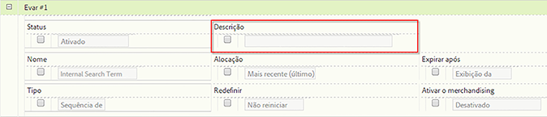

# Descrições do relatório personalizado

Você pode fornecer descrições personalizadas de relatórios para eVars, props, classificações e eventos. As descrições ficam visíveis para todos os usuários finais.

**[!UICONTROL Analytics]** &gt; **[!UICONTROL Administrador]** &gt; **[!UICONTROL Conjuntos de relatórios]** &gt; **[!UICONTROL Editar configurações]** &gt; **[!UICONTROL *Variável*]**

>[!NOTE]
>
>A adição de descrições está disponível para a maioria das classificações tradicionais, mas não para classificações móveis.

1. Forneça uma descrição para o relatório. O número máximo de caracteres é de 255.
1. Clique em **[!UICONTROL Salvar]**.

A descrição está visível em dois lugares:

* Na barra de título do relatório:

   

* Como uma dica de ferramenta quando o usuário passa o cursor em cima do relatório na navegação à esquerda:

   

