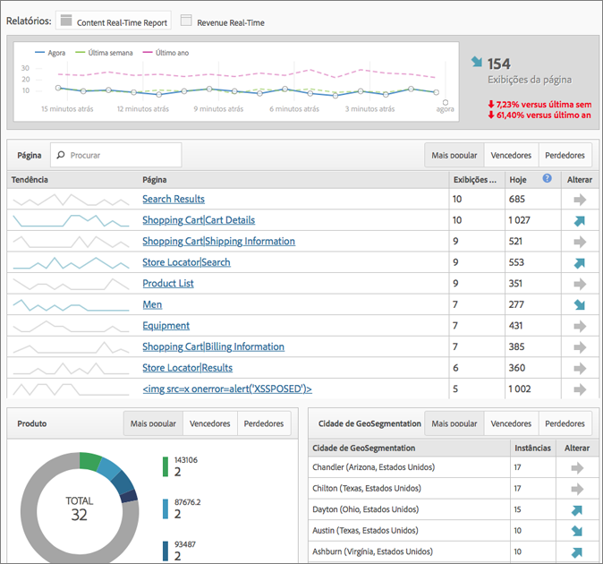

# Relatórios em Tempo real

Exibe o tráfego da página da Web e classifica as visualizações da página em tempo real. Oferece dados acionáveis para basear suas decisões comerciais.

>[!NOTE] O relatório Tempo real não requer implementações ou marcações adicionais. Ele impulsiona sua implantação já existente do Adobe Analytics. Para configurar relatórios em tempo real, veja [Configuração de relatórios em tempo real](/help/admin/admin/realtime/t-realtime-admin.md).

**[!UICONTROL Site Metrics]** > **[!UICONTROL Real-Time]**

O Tempo real responde às seguintes perguntas: Quais são as tendências no meu site, e por quê? Ele permite que você, como profissional de marketing, responda e gerencie ativamente o desempenho de seu conteúdo de marketing e campanhas. Os dados em tempo real reportados estão menos de dois minutos latentes e são atualizados automaticamente por minuto.

O painel inclui métricas de alta frequência e análises do site do Adobe Analytics para relatar visualmente o tráfego e as tendências de visualização de páginas de notícias dinâmicas e sites de varejo. O tempo real entende as tendências em seus dados de minuto a minuto, segundos após a coleta. Ele coleta e envia dados para uma interface de usuário de atualização automática, usando correlação em tempo real e rastreamento de conteúdo e conversão.

Dois dos cenários de uso mais comuns incluem editores que desejam promover/rebaixar histórias como mudanças de atividade do usuário e profissionais de marketing que gostariam de rastrear o lançamento de uma nova linha de produtos.

Como administrador, você pode

* Crie até 3 relatórios em tempo real por conjunto de relatórios, usando dimensões ou classificações e métricas existentes. Use as dimensões secundárias para correlacionar com (ou dividir) a principal.
* Adicione 3 dimensões (ou classificações) por relatório (uma primária e duas secundárias), além de 1 métrica do site inteiro.
* Use qualquer evento personalizado, evento do carrinho de compras ou instância.
* Visualização de até 2 horas de dados históricos em tempo real e modifique essa configuração:

   * Últimos 15 minutos: Granularidade de 1 minuto
   * Últimos 30 minutos: Granularidade de 1 minuto
   * Última hora: granularidade de 2 minutos
   * Últimas 2 horas: granularidade de 4 minutos

* Compare, por exemplo, os valores da semana passada com os valores do ano anterior (bem como com o total de hoje).

Lembre-se de que as eVars (métricas de conversão) não são compatíveis, pois não há conceito de persistência. Embora seja possível selecionar métricas de conversão, elas só funcionarão se estiverem definidas na mesma página que as dimensões. Para obter mais informações, consulte a mensagem de aviso capturada em [Configuração de relatórios em tempo real](/help/admin/admin/realtime/t-realtime-admin.md).

A configuração e a visualização de relatórios em tempo real está restrita a Administradores ou qualquer usuário nos grupos de permissão &quot;Todo acesso ao relatório&quot; e &quot;Relatórios avançado&quot;. No entanto, o Tempo real respeita as permissões. Por exemplo, se você não tiver direitos para ver a receita, não poderá visualização um relatório em tempo real que inclui dados de receita.

## Latência dos dados como resultado da configuração A4T {#section_806CE36354FC4C539A0DED9266A5C704}

Depois que a integração A4T estiver ativada no Adobe Público alvo, você experimentará uma latência adicional de 5 a 10 minutos no Adobe Analytics. Esse aumento de latência permite que os dados do Analytics e do Público alvo sejam armazenados na mesma ocorrência, permitindo que você detalhe os testes por página e seção do site.

Esse aumento é refletido em todos os serviços e ferramentas do Adobe Analytics, incluindo o fluxo ao vivo e o relatórios em tempo real, e se aplica nos seguintes cenários:

* Para transmissão ao vivo, relatórios em tempo real e solicitações de API e dados atuais para variáveis de tráfego, somente as ocorrências com uma ID de dados adicional são atrasadas.
* Para dados atuais sobre métricas de conversão, dados finalizados e feeds de dados, todas as ocorrências são atrasadas de 5 a 7 minutos.

Esteja ciente de que o aumento da latência começa após a implementação do Identity Service, mesmo que essa integração não tenha sido integralmente implementada.
