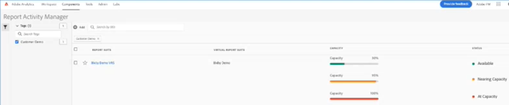

# Gerenciador de Atividades de relatórios

>[!NOTE]
>
>Essa funcionalidade está atualmente no teste beta.

O Gerente de atividade de relatórios permite visualizar a capacidade de geração de relatórios para cada conjunto de relatórios na organização. Ele oferece a você, como Administrador, visibilidade detalhada do consumo de relatórios e ajuda a diagnosticar e corrigir problemas de capacidade facilmente durante os horários de pico de relatórios. Quando sua organização atinge a capacidade de solicitação de relatórios e apresenta uma degradação no desempenho dos relatórios, você agora tem uma maneira de autodiagnosticar problemas de relatórios sem a intervenção do Atendimento ao cliente do Adobe ou da engenharia. Você pode gerenciar facilmente as filas de relatórios em uma única interface e agir imediatamente &#x200B; &#x200B; para melhorar a experiência dos usuários. Esta ferramenta:

* Informa sobre sua capacidade atual de geração de relatórios em seus conjuntos de relatórios.
* Fornece informações detalhadas de consulta de relatório sobre solicitações de relatórios atuais, estejam na fila e em andamento.
* Permite otimizar a fila de relatórios, priorizando algumas e cancelando outras solicitações de relatórios para liberar capacidade. Em outras palavras, você pode perguntar em tempo real: este relatório é necessário neste momento ou posso anulá-lo a favor de relatórios mais urgentes?

## Acessar o Gerenciador de atividade de relatórios

No Adobe Analytics, os administradores vão para **[!UICONTROL Administrador]** > **[!UICONTROL Gerente de atividade de relatórios]**.

## Gerenciar a fila de relatórios

Ao abrir o Gerenciador de atividade de relatórios, você verá uma lista de conjuntos de relatórios base. Os conjuntos de relatórios virtuais não estão incluídos nessa visualização.

Os conjuntos de relatórios virtuais adicionam complexidade às solicitações de relatórios devido a níveis adicionais de filtragem e segmentação aplicadas. Todas as solicitações provenientes dos conjuntos de relatórios virtuais são combinadas e desistem para o conjunto de relatórios base. Portanto, se você tem 10 solicitações provenientes de 5 VRSs, são 50 solicitações no conjunto de relatórios base. Dessa forma, você pode atingir rapidamente a capacidade.

Esta é uma exibição de um VRS cuja capacidade de relatório é mostrada em tempo real:

Atualize a página para alterar os resultados.

## Implicações de relatórios do Workspace

