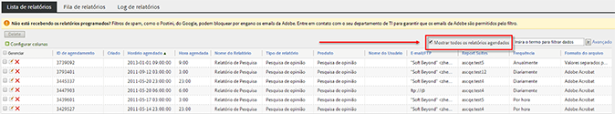
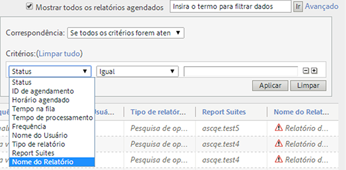
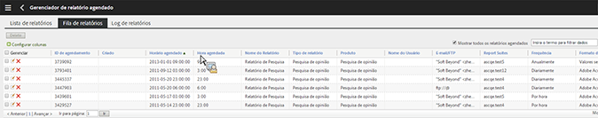
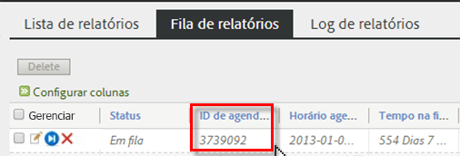

# Relação de relatórios agendados

Permite que os usuários de nível administrativo vejam e gerenciem relatórios agendados dentro da organização.

**[!UICONTROL Analytics]** > **[!UICONTROL Componentes]** > **[!UICONTROL Relatórios agendados]**

Os recursos de nível administrativo no Gerenciador de relatórios agendados incluem:

* A opção para [Mostrar todos os relatórios agendados](/help/admin/admin/scheduled-reports-admin.md#section_3F167CAAEEC24140B476CF95B7402690) na sua organização.
* [Recursos de filtragem avançada](/help/admin/admin/scheduled-reports-admin.md#section_206A52A85DE84947AAB3AD082FBF6275) dentro na sua organização.
* A nova aba [Fila de relatórios](/help/admin/admin/scheduled-reports-admin.md#section_03C866115D354BB182E90BF4D52F1E0B), que lista todos os relatórios em fila para execução nos servidores de relatório.
* Exposição da [ID de agendamento](/help/admin/admin/scheduled-reports-admin.md#section_568B70F4228C4229977CB85D2DCD53A1) na interface da Fila de relatórios.

## Mostrar todos os relatórios agendados {#section_3F167CAAEEC24140B476CF95B7402690}

Na guia **[!UICONTROL Lista de relatórios]**, você pode **[!UICONTROL Mostrar todos os relatórios agendados]** na organização, além daqueles que você agendou pessoalmente.

> [!NOTE] A coluna **[!UICONTROL Nome do relatório]** exibe o nome do relatório que está sendo agendado, e a coluna **[!UICONTROL Nome do arquivo]** exibe qualquer nome de arquivo personalizado definido por você nas Opções de entrega avançadas. Como resultado, se você agendar vários relatórios de um mesmo tipo de relatório e especificar nomes personalizados para cada um, o Gerente de relatórios agendados exibe várias entradas com o mesmo Nome de relatório, mas com nomes de arquivo diferentes. Isso ocorre porque o relatório de back end agendado é o mesmo. Por esse motivo, a coluna Nome do relatório teria os mesmos nomes de relatório para todos os nomes de arquivo personalizados (como definido).

## Recursos de filtragem avançada {#section_206A52A85DE84947AAB3AD082FBF6275}

Por exemplo, se você deseja filtrar em todos os relatórios agendados por hora, você deve especificar a **[!UICONTROL Frequência de hora em hora]** no filtro **[!UICONTROL Avançado]** e clicar em **[!UICONTROL Aplicar]**:

## Fila de relatórios {#section_03C866115D354BB182E90BF4D52F1E0B}

Essa relação permite que você gerencie e até exclua qualquer relatório agendado que estiver &quot;obstruindo&quot; a relação. (Geralmente, o relatório expira depois de 4 horas.)

A Relação de relatório também possibilita &quot;Pular um relatório agendado uma vez&quot;. Basta clicar no ícone azul na coluna **[!UICONTROL Gerenciar]**.

## ID de agendamento {#section_568B70F4228C4229977CB85D2DCD53A1}

Ter a **[!UICONTROL ID de agendamento]** na interface da Relação de relatório é útil quando é necessário entrar em contato com o Atendimento ao cliente da Adobe para solucionar um problema com relatórios agendados.

