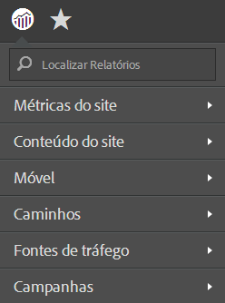
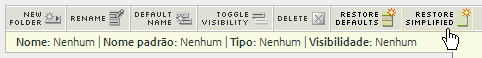

# Menu Relatórios simplificado

Etapas para implantar o menu de relatórios simplificados no Reports and Analytics.

O menu simplificado do Reports &amp; Analytics da Adobe permite que você opte por aplicar um menu simplificado e alternativo, com pastas reestruturadas logo abaixo. O menu simplificado exibe, por padrão, as opções abaixo:

> [!NOTE] Esteja ciente de que a aplicação do menu simplificado remove toda a personalização que você fez na estrutura do menu principal. Ela também implanta a estrutura de menu simplificado para todos os usuários dos Relatórios e análises de marketing em sua empresa. Pense bem sobre as ramificações (tais como o treinamento desenvolvido na sua estrutura de menu já existente) antes de implantar esse novo menu, pois não será possível reverter qualquer personalização na estrutura.

1. Navegue até **[!UICONTROL Analytics]** &gt; **[!UICONTROL Administrador]** &gt; **[!UICONTROL Conjuntos de relatórios]** para abrir o Gerenciador do Conjunto de relatórios.
1. Selecione o conjunto de relatórios no qual você deseja implantar a estrutura simplificada de menu.
1. Acesse **[!UICONTROL Editar configurações]** &gt; **[!UICONTROL Geral]** &gt; **[!UICONTROL Personalizar menus]**.
1. Clique em **[!UICONTROL Restauração simplificada]** para implantar a estrutura simplificada de menu.

   

1. Volte para o menu padrão (não personalizado) e clique em **[!UICONTROL Restaurar padrões]**.
