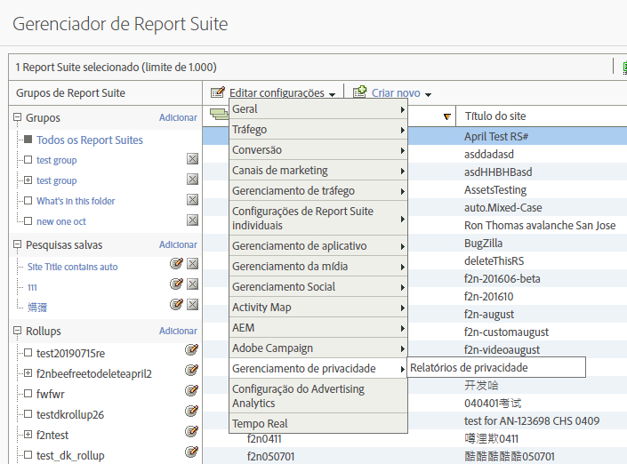
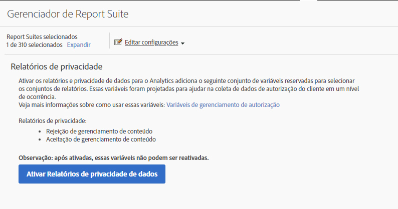
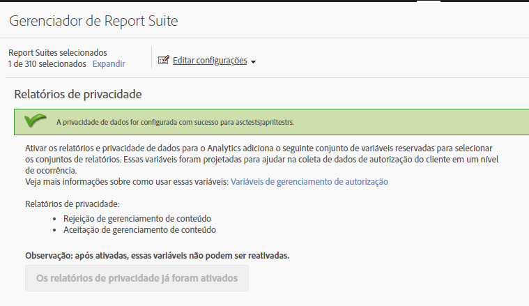
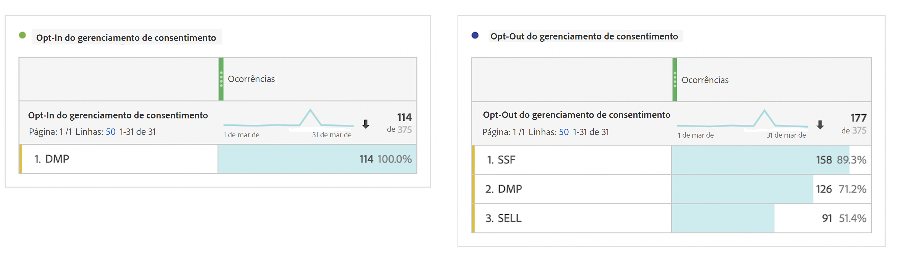

# Variáveis dos relatórios de privacidade

Para fornecer assistência adicional no gerenciamento de dados de privacidade, um conjunto de variáveis reservadas está disponível para uso junto com variáveis de dados de contexto específicas.
Essas variáveis de relatórios de privacidade fornecem uma estrutura fácil de usar para capturar o status de privacidade em cada ocorrência de análise.

## Variáveis

* Recusa no gerenciamento de consentimento
   * Variável reservada: List Prop
   * Tipo: cadeia de caracteres delimitada por vírgulas
   * Contém:
      * `contextData.['cm.ssf']=1` exibido como SSF
      * `contextData.['opt.dmp']=N` exibido como DMP
      * `contextData.['opt.sell']=N` exibido como SELL

* Aceitação no gerenciamento de Consentimento
   * Variável reservada: List Prop
   * Tipo: cadeia de caracteres delimitada por vírgulas
   * Contém:
      * `contextData.['opt.dmp']=Y` exibido como DMP
      * `contextData.['opt.sell']=Y` exibido como SELL

## Relatórios

É possível ativar as Variáveis de relatórios de privacidade por meio de uma nova configuração de Privacidade disponível no Admin Console do Analytics.

Cada conjunto de relatórios pode ser configurado da seguinte maneira:
1. Em Relatórios e análises, clique em **[!UICONTROL Admin > Report Suites]**.
1. Select the report suite(s) where you are collecting media data and click **[!UICONTROL Edit Settings > Privacy Management]**.

   

1. Click the **[!UICONTROL Enable Data Privacy Reports]** button.

   > [!NOTE] Após ativadas, essas variáveis não podem ser desativadas.

   

1. Depois de habilitadas, você verá uma mensagem de confirmação.

   

1. As variáveis reservadas agora estão disponíveis para análise em Relatórios e análises e na Workspace. Consulte Participação e não participação no gerenciamento de consentimento.

   

## Implementação

Três variáveis de dados de contexto foram predefinidas para funcionar com as variáveis reservadas do gerenciamento de relatórios de privacidade.  Cabe a cada engenheiro de implementação determinar como gerenciar e manter a configuração dessas variáveis.

Consulte [Variáveis de dados de contexto ](https://docs.adobe.com/help/en/analytics/implementation/javascript-implementation/variables-analytics-reporting/context-data-variables.html)para obter uma orientação geral sobre como implementar variáveis de dados de contexto.

### SSF

* Dados de contexto: `contextData.['cm.ssf']`
* Valores aceitos:
   * 1 - Ao enviar o valor &quot;1&quot;, isso indica que o encaminhamento pelo lado do servidor está em um estado de não participação. O valor &quot;1&quot; emparelhado com essa variável bloqueará o compartilhamento dessa ocorrência com o Adobe Audience Manager. Consulte [Conformidade com a privacidade eletrônica do AAM](https://docs.adobe.com/help/en/analytics/integration/audience-analytics/audience-analytics-workflow/ssf-gdpr.html).
   * 0 - Opcional. Use o valor &quot;0&quot; para clientes que consentiram com o marketing direcionado. Se você não definir a variável, os mesmos resultados também serão gerados.

### DMP

* Dados de contexto: `contextData.['opt.dmp']`
* Valores aceitos:
   * N - Ao enviar o valor &quot;N&quot;, isso indica que o consumidor está optando por não participar do compartilhamento nas plataformas de gerenciamento de dados.  **Observação**: A partir de 15 de janeiro de 2020, definir essa variável como &quot;N&quot; bloqueia o compartilhamento dessa ocorrência pelo lado do servidor para o AAM.
   * Y - Ao enviar o valor &quot;Y&quot;, isso indica que o consumidor está optando por participar do compartilhamento nas plataformas de gerenciamento de dados.

### SELL

* Dados de contexto: `contextData.['opt.sell']`
* Valores aceitos:
   * N - Ao enviar o valor &quot;N&quot;, isto indica que o consumidor está a optando por não participar do compartilhamento ou venda dos dados a terceiros.
   * Y - Ao enviar o valor &quot;Y&quot;, isto indica que o consumidor está a optando por participar do compartilhamento ou venda dos dados a terceiros.
