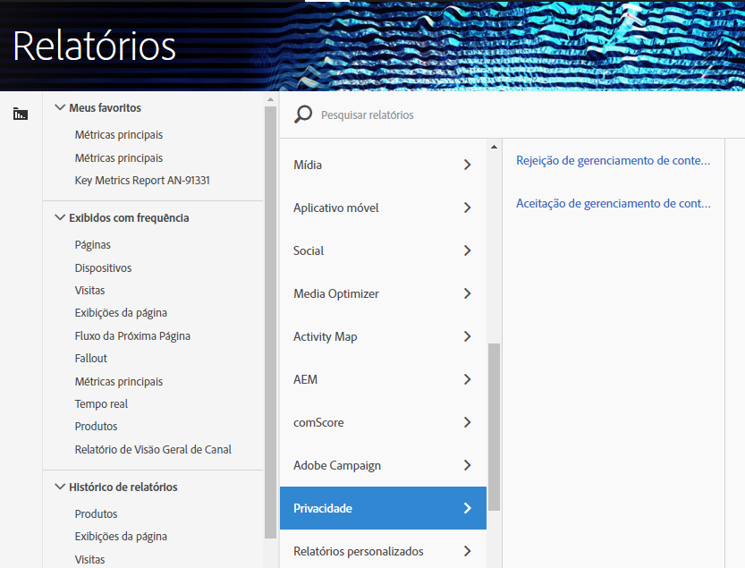

# Variáveis de relatórios de privacidade

Para fornecer assistência adicional no gerenciamento de dados de privacidade, um conjunto de variáveis reservadas está disponível para ser usado junto com variáveis de dados de contexto específicas.
Essas variáveis de relatórios de privacidade fornecem uma estrutura fácil de usar para capturar o status de privacidade em cada ocorrência de análise.

## Variáveis

* Recusa no gerenciamento de consentimento
   * Variável reservada: List Prop
   * Tipo: String delimitada por vírgulas
   * Contém:
      * `contextData.['cm.ssf']=1` exibido como SSF
      * `contextData.['opt.dmp']=N` exibido como DMP
      * `contextData.['opt.sell']=N` exibido como SELL

* Aceitação no gerenciamento de Consentimento
   * Variável reservada: List Prop
   * Tipo: String delimitada por vírgulas
   * Contém:
      * `contextData.['opt.dmp']=Y` exibido como DMP
      * `contextData.['opt.sell']=Y` exibido como SELL

## Relatórios

Você pode ativar as Variáveis de relatórios de privacidade por meio de uma nova configuração de Privacidade disponível no Admin Console do Analytics.

Cada conjunto de relatórios pode ser configurado da seguinte maneira:
1. In Reports &amp; Analytics click **[!UICONTROL Admin &gt; Report Suites.]**
1. Select the report suite(s) where you are collecting media data and click **[!UICONTROL Edit Settings &gt; Privacy Management.]**

   

1. Clique no botão **[!UICONTROL Ativar relatórios]** de privacidade de dados. **** Observação: Uma vez ativadas, essas variáveis não poderão ser desativadas.

   

1. Depois de habilitada, você verá uma mensagem de confirmação.

   

1. As variáveis reservadas agora estão disponíveis para relatório.  Consulte Aceitação do gerenciamento de consentimento e Aceitação do gerenciamento de consentimento.

   

## Implementação

Três variáveis de dados de contexto foram predefinidas para funcionar com as variáveis reservadas do gerenciamento de relatórios de privacidade.  Cabe a cada engenheiro de implementação determinar como gerenciar e persistir na configuração dessas variáveis.

Consulte Variáveis [de dados de](https://docs.adobe.com/help/en/analytics/implementation/javascript-implementation/variables-analytics-reporting/context-data-variables.html) contexto para obter orientação geral sobre como implementar variáveis de dados de contexto.

### SSF

* Dados de contexto: contextData.['cm.ssf']
* Valores aceitos:
   * 1 - Ao enviar o valor "1", isso indica que o encaminhamento pelo lado do servidor está em um estado de não participação. O valor "1" emparelhado com essa variável bloqueará o compartilhamento dessa ocorrência com o Adobe Audience Manager. Consulte Conformidade com [privacidade eletrônica do AAM.](https://docs.adobe.com/help/en/analytics/integration/audience-analytics/audience-analytics-workflow/ssf-gdpr.html)
   * Nenhum outro valor é aceito para este parâmetro.

### DMP

* Dados de contexto: contextData.['opt.dmp']
* Valores aceitos:
   * N - Ao enviar o valor "N", isso indica que o consumidor está optando por não compartilhar nas plataformas de gerenciamento de dados. **** Observação: No momento, a configuração dessa variável como "N" não bloqueia o compartilhamento com o AAM; no entanto, o bloqueio de chamadas para a funcionalidade do AAM será adicionado no início de 2020. Por enquanto, a Adobe recomenda configurar `c.cm.ssf=1` e `c.opt.dmp=N` bloquear o envio de ocorrências para o AAM.
   * Y - Ao enviar o valor "Y", isso indica que o consumidor está optando por compartilhar com plataformas de gerenciamento de dados.

### VENDER

* Dados de contexto: contextData.['opt.sell']
* Valores aceitos:
   * N - Ao enviar o valor "N", isto indica que o consumidor está a optar por não partilhar ou vender os dados a terceiros.
   * Y - Ao enviar o valor "Y", isso indica que o consumidor está optando por compartilhar ou vender os dados para terceiros.
