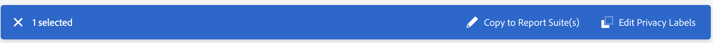

# Rotular dados do conjunto de relatórios

>[!NOTE]
>
>Essa interface do usuário atualizada está atualmente em testes limitados.

Rotular os dados do conjunto de relatórios significa que você atribui os rótulos de identidade, sensibilidade e governança de dados a cada variável em um determinado conjunto de relatórios. Certifique-se de se familiarizar primeiro com o [rótulos e suas definições](/help/admin/c-data-governance/data-labeling/gdpr-labels.md).

>[!NOTE]
>
>Lembre-se de que a Rotulagem precisa ser analisada sempre que um novo conjunto de relatórios for criado ou quando uma nova variável for ativada em um conjunto de relatórios existente. Você também pode analisar a rotulagem quando novas integrações da solução forem ativadas, pois elas podem expor novas variáveis que podem exigir rótulos. A reimplementação de aplicativos ou sites móveis pode alterar como as variáveis existentes são usadas, o que também pode exigir atualizações nos rótulos.

## Atribuir ou editar rótulos de privacidade do conjunto de relatórios {#assign-edit}

**Exemplo**: você, como controlador de dados, planeja coletar endereços de email e IDs de cookies de titulares de dados para processar suas solicitações de Privacidade de dados. Essas IDs de cookies são armazenadas em um conjunto de relatórios no Adobe Analytics. Para criar um rótulo para endereços de email e IDs de cookies, você deve usar a estrutura DULE (Label Usage Labeling &amp; Enforcement) da Plataforma Adobe Experience Cloud no Analytics.

1. No Adobe Analytics, navegue até **[!UICONTROL Administrador]** > **[!UICONTROL Todos os administradores]** > **[!UICONTROL Configuração e coleta de dados]** > **[!UICONTROL Governança de dados]**.

   

1. Selecione um conjunto de relatórios no **[!UICONTROL Conjuntos de relatórios]** na parte superior.

1. Na seção de filtro à esquerda, selecione quais grupos de variáveis você deseja rotular. Você pode rotular somente um grupo de variáveis por vez.

   * **Componentes padrão** - Os componentes padrão são dimensões e métricas do Analytics prontas para uso que são coletadas por padrão em uma implementação do Analytics.
   * **Variáveis de conversão** - A variável de conversão do Custom Insight (ou eVar) é colocada no código do Adobe em páginas da Web selecionadas do site. Seu propósito principal é segmentar métricas de sucesso de conversão em relatórios de marketing personalizados. Um eVar pode ser baseado em visitas e funcionar de forma semelhante aos cookies. Os valores passados para variáveis eVar seguem o usuário por um período predeterminado.
   * **Variáveis da lista** - As variáveis de lista são variáveis personalizadas que podem ser usadas da maneira que você desejar. Elas funcionam de forma semelhante às eVars, mas podem conter vários valores na mesma ocorrência. As variáveis de lista não têm limite de caracteres.
   * **Variáveis de tráfego** - As Variáveis de tráfego do Custom Insight (ou props) permitem correlacionar dados personalizados com eventos relacionados a tráfego. As variáveis de prop estão incluídas no código de implementação de cada página do site.
   * **Eventos bem-sucedidos** - Eventos bem-sucedidos (também conhecidos como eventos de conversão ou eventos personalizados) são ações que podem ser rastreadas. Você determina o que é um evento bem-sucedido. Por exemplo, se um visitante comprar um item, o evento de compra pode ser considerado o evento bem-sucedido.
   * **Classificações** - Divisões de classificação são usadas para mapear dados de relatórios do Analytics para propriedades relacionadas. Classificações podem ser usadas para uma variedade de finalidades, mas são usadas mais comumente para classificar códigos de rastreamento de campanha (internos e externos) e IDs de produto.

1. Selecione uma variável clicando na caixa de seleção e, em seguida, clique em **[!UICONTROL Editar rótulos de privacidade]** na barra azul que aparece na parte inferior da tela.

   

   Esta tela mostra os rótulos aplicados no momento e permite que você aplique rótulos adicionais. Não será possível aplicar ou modificar todos os rótulos, dependendo do componente.

   

   >[!NOTE]
   >
   >A estrutura DULE (Label Usage Labeling &amp; Enforcement) foi criada para fornecer uma maneira uniforme em todas as soluções/serviços/plataformas para capturar, comunicar e usar metadados sobre dados na Adobe Experience Cloud. Os metadados ajudam os controladores de dados a indicar quais dados são informações pessoais, quais dados são sensíveis e quais restrições de contrato estão associadas aos dados.

1. Clique em **[!UICONTROL Aplicar]** após concluir toda a rotulagem.

