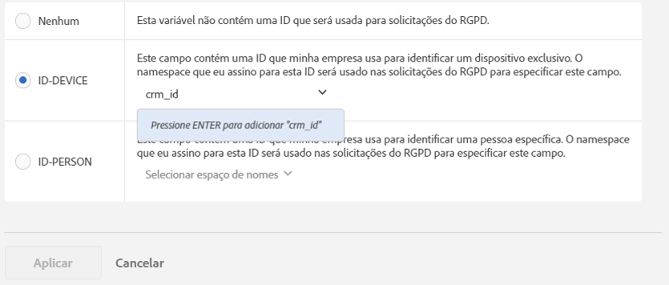

# Rótulos de privacidade de dados para variáveis do Analytics

## Por que rotular os dados? {#section_A075CDF3AD0744BD8CEB41CE3FB7BFB3}

Muitos clientes da Adobe têm equipes legais que revisaram as leis de Privacidade de dados (GDPR, CCPA etc) e que tiraram suas próprias conclusões sobre como os dados devem ser tratados para estarem em conformidade com as leis de Privacidade de dados. As interpretações legais podem diferir entre as empresas e as configurações de manuseio de dados desejadas também podem diferir entre os clientes. Como os clientes têm preferências diferentes para o processamento de dados da Privacidade de dados e diferentes conjuntos de dados, a Adobe está permitindo que seus clientes, como controladores de dados, personalizem as configurações desejadas para o processamento de dados da Privacidade de dados em seus dados exclusivos. Isso permite que cada cliente único processe solicitações de Privacidade de dados da maneira mais adequada para sua marca e conjunto de dados exclusivo.

O Adobe Analytics fornece ferramentas para rotular dados de acordo com sua sensibilidade e restrições contratuais. As etiquetas são importantes e úteis para ajudar: (1) identificar as pessoas em causa, (2) determinar quais dados devem ser retornados como parte de um pedido de acesso e (3) identificar os campos de dados que devem ser eliminados como parte de um pedido de eliminação.

Antes de descobrir quais rótulos devem ser aplicados a quais campos/variáveis, é necessário [compreender as IDs](/help/admin/c-data-governance/gdpr-analytics-ids.md) que você está capturando nos dados do Analytics e decidir quais serão usadas nas solicitações de Privacidade de dados.

A implementação da Privacidade de dados do Adobe Analytics oferece suporte aos seguintes rótulos para dados de identidade, dados sensíveis e governança de dados.

## Rótulos de DULE {#section_B2E78130957647338495EF37DE21D6BC}

>[!NOTE] A estrutura DULE (Data Usage Labeling &amp; Enforcement, Rotulagem e aplicação de uso de dados) foi criada para fornecer uma maneira uniforme em todas as soluções/serviços/plataformas da Adobe para capturar, comunicar e usar metadados sobre dados na Adobe Experience Cloud. Os metadados ajudam os controladores de dados a indicar quais dados são informações pessoais, quais dados são sensíveis e quais restrições de contrato estão associadas aos dados. Nesta versão inicial, o Analytics está apresentando apenas os rótulos de DULE que são relevantes para a Privacidade de dados. À medida que outros produtos da Adobe implementarem o suporte a rótulos de DULE, serão apresentadas versões futuras de rótulos de dados confidenciais adicionais, bem como rótulos contratuais, que ajudarão a garantir que os dados compartilhados entre produtos sejam usados apenas de maneiras juridicamente permitidas.

## Rótulos de dados de identidade (DULE) {#identity-data-labels}

As etiquetas de dados de identidade “I” são usadas para categorizar os dados que podem identificar ou entrar em contato com uma pessoa específica.

<table id="table_6B5368D714424E52835D5DFE189BD080"> 
 <thead> 
  <tr> 
   <th colname="col1" class="entry"> Rótulo </th> 
   <th colname="col2" class="entry"> Definição </th> 
   <th colname="col3" class="entry"> Outros requisitos </th> 
  </tr>
 </thead>
 <tbody> 
  <tr> 
   <td colname="col1"> <p>I1 </p> </td> 
   <td colname="col2"> <p><b>Diretamente identificáveis</b>: Dados que podem identificar ou habilitar especificamente o contato direto com um indivíduo, como um nome ou um endereço de email. </p> </td> 
   <td colname="col3"> 
    <ul id="ul_4E2AD59D119E40D28B869D0BB63B9FD9"> 
     <li id="li_AC3E99B57E3A4AE2A12BE219680AFC58">Não é possível definir em eventos </li> 
     <li id="li_BB66992863C8402F8D58656293F31E71">Não é possível definir em eVars de comercialização </li> 
    </ul> </td> 
  </tr> 
  <tr> 
   <td colname="col1"> <p>I2 </p> </td> 
   <td colname="col2"> <p><b>Indiretamente identificável</b>: Dados que podem ser usados em combinação com quaisquer outros dados para identificar ou habilitar o contato direto com um indivíduo ou dispositivo. </p> <p>Não permite a identificação de um indivíduo por si só, mas pode ser combinado com outras informações (que podem estar ou não na sua posse) para identificar alguém. Os exemplos incluem um número de fidelidade do cliente ou uma ID usada por um sistema CRM da empresa que é exclusiva para cada um de seus clientes. </p> </td> 
   <td colname="col3"> 
    <ul id="ul_A0EF0F3DC5804D4FBE228946D697ABEB"> 
     <li id="li_A592EA6DA82C4D8C80E03F02ADF4E20E">Não é possível definir em eventos </li> 
     <li id="li_46CE7B1E84884CDAB356A6DF89397849">Não é possível definir em eVars de comercialização </li> 
    </ul> </td> 
  </tr> 
 </tbody> 
</table>

## Rótulos de dados sensíveis (DULE) {#sensitive-data-labels}

Os rótulos “S” de dados sensíveis são usados para classificar dados sensíveis, como dados geográficos. No futuro, serão introduzidos rótulos de dados sensíveis adicionais para identificar outros tipos de informações confidenciais.

<table id="table_A778A508620545CCB37830E5CF1C75B7"> 
 <thead> 
  <tr> 
   <th colname="col1" class="entry"> Rótulo </th> 
   <th colname="col2" class="entry"> Definição </th> 
  </tr>
 </thead>
 <tbody> 
  <tr> 
   <td colname="col1"> <p>S1 </p> </td> 
   <td colname="col2"> <p> Dados precisos de localização geográfica relacionados à latitude e longitude que podem ser usados para determinar a localização exata de um dispositivo (dentro de 100 metros ou menos). </p> </td> 
  </tr> 
  <tr> 
   <td colname="col1"> <p>S2 </p> </td> 
   <td colname="col2"> <p> Dados de localização geográfica que podem ser usados para determinar uma área de cerca geográfica amplamente definida. </p> </td> 
  </tr> 
 </tbody> 
</table>

## Rótulos de governança de dados (Privacidade de dados) {#data-governance-labels}

Os rótulos de Governança de dados oferecem aos usuários a capacidade de classificar dados que refletem considerações relativas à privacidade e às condições contratuais para manter a conformidade com os regulamentos e as políticas corporativas.

**Rótulos de acesso à privacidade de dados**

<table id="table_663EFF43A454498386F7F3E60875E0F8"> 
 <thead> 
  <tr> 
   <th colname="col1" class="entry"> Rótulo </th> 
   <th colname="col2" class="entry"> Definição </th> 
   <th colname="col3" class="entry"> Outros requisitos </th> 
  </tr>
 </thead>
 <tbody> 
  <tr> 
   <td colname="col1"> <p>Nenhum </p> </td> 
   <td colname="col2"> <p>Selecione esta opção se essa variável não contiver dados que devem ser incluídos nos dados retornados ao titular de dados, como parte de uma solicitação de acesso da Privacidade de dados. </p> </td> 
   <td colname="col3"> </td> 
  </tr> 
  <tr> 
   <td colname="col1"> <p>ACC-ALL </p> </td> 
   <td colname="col2"> <p>Os valores neste campo devem ser incluídos em <u>todas</u> as solicitações de acesso da Privacidade de dados. </p> <p>Se essa ocorrência vier de um dispositivo compartilhado por vários indivíduos, ao aplicar esse rótulo, você, como controlador de dados, estará indicando que é aceitável compartilhar os dados desse campo com qualquer pessoa que tenha acesso ao dispositivo compartilhado. </p> </td> 
   <td colname="col3"> <p>Os campos com este rótulo serão retornados para todas as solicitações de Privacidade de dados. </p> </td> 
  </tr> 
  <tr> 
   <td colname="col1"> <p>ACC-PERSON </p> </td> 
   <td colname="col2"> <p> Os valores neste campo devem ser incluídos somente para solicitações de acesso da Privacidade de dados quando tivermos certeza de que a ocorrência originou-se de um titular de dados, como determinado pela ID de solicitação de Privacidade de dados correspondente a um valor do campo ID-PERSON. </p> </td> 
   <td colname="col3"> <p>Você também deve ter um rótulo ID-PESSOA definido em alguma variável dentro deste conjunto de relatórios e enviar solicitações usando essa ID, caso contrário esse rótulo nunca será aplicado. </p> </td> 
  </tr> 
 </tbody> 
</table>

Embora poucas variáveis recebam qualquer um dos outros rótulos, espera-se que os rótulos de acesso sejam aplicados em muitas de suas variáveis. No entanto, depende de você, em consulta com sua equipe Jurídica, decidir quais dados você coletou devem ser compartilhados com as pessoas em questão.

**Rótulos de exclusão da privacidade de dados**

<table id="table_59DFCE4D90214CB5972BDDE5B7391B4D"> 
 <thead> 
  <tr> 
   <th colname="col1" class="entry"> Rótulo </th> 
   <th colname="col2" class="entry"> Definição </th> 
   <th colname="col3" class="entry"> Outros requisitos </th> 
  </tr>
 </thead>
 <tbody> 
  <tr> 
   <td colname="col1"> </td> 
   <td colname="col2"> <p>Ao contrário dos outros rótulos, esses rótulos de Exclusão não são mutuamente exclusivos. Você pode selecionar ambos ou nenhum. Não é necessário um rótulo Nenhum separado, pois Nenhum é indicado simplesmente por não verificar nenhuma das opções Excluir. </p> </td> 
   <td colname="col3"> <p>Uma etiqueta de exclusão é necessária somente para campos que contenham um valor que permita que uma ocorrência seja associada à pessoa de dados (isto é, que permita a identificação da pessoa de dados). </p> <p> Outras informações pessoais (favoritos, histórico de navegação/compras, condições de saúde, etc.) não necessita de ser eliminada, uma vez que a associação com a pessoa em causa será cancelada. </p> </td> 
  </tr> 
  <tr> 
   <td colname="col1"> <p>EXCL-DISPOSITIVO </p> </td> 
   <td colname="col2"> <p>Para solicitações de exclusão da Privacidade de dados, os valores nesse campo devem ser anonimizados apenas para as solicitações em que uma ID-DEVICE especificada esteja presente na ocorrência. </p> <p>Se o mesmo valor ocorrer em outras ocorrências, que não estão sendo excluídas, essas outras instâncias não serão alteradas. Isso resultará na alteração de contagens para relatórios que calculam contagens exclusivas neste campo. Em dispositivos compartilhados, isso pode remover identificadores para outros indivíduos, além apenas da pessoa em questão. </p> <p>As contagens não são alteradas se esse campo também tiver um rótulo ID-DEVICE e o valor nele for usado como uma ID na solicitação de Privacidade de dados. </p> </td> 
   <td colname="col3"> 
    <ul id="ul_45C3A09E1F05492B97C3F3DEA7C78FBC"> 
     <li id="li_BAB277F92F284ADE9D7B6839BDD716E2">Também exige etiqueta I1 ou I2 ou S1 </li> 
     <li id="li_6DDFC0571457489CBA9D76F547247F20">Não é possível definir em eventos </li> 
     <li id="li_E79C6DFC6C58478EAA1504E3820D512C">Não é possível definir em eVars de comercialização </li> 
     <li id="li_B78E273212E447D49D0707E174B66DEC">Não pode ser definido em Classificações </li> 
     <li id="li_F0F52D0DE7454557A6A97063C1FBC372">Você deve enviar solicitações usando um ID-DEVICE ou definir ExpandirIDs como true, ou esse rótulo nunca será aplicado. </li> 
    </ul> </td> 
  </tr> 
  <tr> 
   <td colname="col1"> <p>DEL-PERSON </p> </td> 
   <td colname="col2"> <p>Para solicitações de exclusão da Privacidade de dados, os valores nesse campo devem ser anonimizados apenas para as solicitações em que uma ID-PERSON especificada esteja presente na ocorrência. </p> <p>Se o mesmo valor ocorrer em outras ocorrências, que não estão sendo excluídas, esses outros valores não serão alterados. Isso resultará na alteração de contagens para relatórios que calculam contagens exclusivas neste campo. As contagens não são alteradas se esse campo também tiver um rótulo ID-PERSON e o valor nele for usado como uma ID na solicitação de Privacidade de dados. </p> </td> 
   <td colname="col3"> 
    <ul id="ul_6722E42E036E47B4B5E17DC213636D51"> 
     <li id="li_6C1A64FF68AF428A827D8C6C33E22970">Também exige etiqueta I1 ou I2 ou S1 </li> 
     <li id="li_8053533FFE874EE795C8B6043A4F73B3">Não é possível definir em eventos </li> 
     <li id="li_D6700CF4D03E44DDA83C4DDBB5B70CC3">Não é possível definir em eVars de comercialização </li> 
     <li id="li_B6C2B15484B344889DBF29B62E2EA8FD">Não pode ser definido em Classificações </li> 
     <li id="li_3BBD0C27D9644C2B9618457A0BFC15EF">Você também deve ter um rótulo ID-PESSOA definido em alguma variável dentro deste conjunto de relatórios e enviar solicitações usando essa ID, ou esse rótulo nunca será aplicado. </li> 
    </ul> </td> 
  </tr> 
 </tbody> 
</table>

**Rótulos de identidade da privacidade de dados**

<table id="table_F6BBC868457443A19A7B693BD6C55B4B"> 
 <thead> 
  <tr> 
   <th colname="col1" class="entry"> Rótulo </th> 
   <th colname="col2" class="entry"> Definição </th> 
   <th colname="col3" class="entry"> Outros requisitos </th> 
  </tr>
 </thead>
 <tbody> 
  <tr> 
   <td colname="col1"> <p>Nenhum </p> </td> 
   <td colname="col2"> <p>Esta variável não contém uma ID que será usada para solicitações de Privacidade de dados. </p> </td> 
   <td colname="col3"> <p>Você precisa definir um desses outros rótulos somente se esse campo contiver uma ID que será usada ao enviar as solicitações de acesso ou exclusão por meio da API da Privacidade de dados ou da interface do usuário. </p> </td> 
  </tr> 
  <tr> 
   <td colname="col1"> <p>ID-DEVICE </p> </td> 
   <td colname="col2"> <p>Este campo contém uma ID que pode ser usada para identificar um dispositivo para uma solicitação de Privacidade de dados, mas não pode distinguir entre usuários diferentes de um dispositivo compartilhado. </p> <p>Você não precisa especificar este rótulo para todas as variáveis que contenham IDs (os rótulos I1/I2 são destinados a isso). Use esse rótulo se enviar solicitações de Privacidade de dados usando IDs armazenadas nessa variável e quiser pesquisá-la para a ID especificada. </p> </td> 
   <td colname="col3"> 
    <ul id="ul_618019CB8FCA4A5C94C47636240197B2"> 
     <li id="li_0E5ADED36FF24A348FDD434E2CC8C8EE">Também exige etiqueta I1 ou I2 </li> 
     <li id="li_20BCFF07B2BF468C8E0D477C10B2EF9F">Não é possível definir em eventos </li> 
     <li id="li_0BD73EEF4184475D8E97878CF8DBEB90">Não é possível definir em eVars de comercialização </li> 
     <li id="li_129851035C4A4BF0922296B4C3BEE39B">Não pode ser definido em Classificações </li> 
    </ul> </td> 
  </tr> 
  <tr> 
   <td colname="col1"> <p>ID-PESSOA </p> </td> 
   <td colname="col2"> <p>Este campo contém uma ID que pode ser usada para identificar um usuário autenticado (uma pessoa específica) em uma solicitação de Privacidade de dados. </p> <p>Você não precisa especificar este rótulo para todas as variáveis que contenham IDs (os rótulos I1/I2 são destinados a isso). Use esse rótulo se for enviar solicitações de Privacidade de dados usando IDs armazenadas nessa variável e quiser pesquisá-la para a ID especificada. </p> </td> 
   <td colname="col3"> 
    <ul id="ul_0C7EEC8FCB5C4BCDA5D48F3C98770A67"> 
     <li id="li_2E781AE8D7A046A7996C7300CA854B86">Também exige etiqueta I1 ou I2 </li> 
     <li id="li_EB4C6430C218405DAAE81DEE010DCAA2">Não é possível definir em eventos </li> 
     <li id="li_05AA67B45974474F9DA520E8B877BA11">Não é possível definir em eVars de comercialização </li> 
     <li id="li_8A6BF4B40ED249289EAD46FE1C755FB0">Não pode ser definido em Classificações </li> 
    </ul> </td> 
  </tr> 
 </tbody> 
</table>

## Fornecer um namespace ao rotular uma variável como ID-DEVICE ou ID-PERSON {#section_F0A47AF8DA384A26BD56032D0ABFD2D7}

Ao rotular uma variável como ID-DEVICE ou ID-PERSON, você receberá uma solicitação para fornecer um namespace. Você pode usar uma namespace definida anteriormente ou definir uma nova.

**Usar uma Namespace definida anteriormente**

Se você atribuiu anteriormente um rótulo de ID a outras variáveis em qualquer um dos conjuntos de relatórios na empresa de logon, será possível selecionar um desses namespaces existentes. Você deve reutilizar a namespace se essa variável contiver o mesmo tipo de IDs que outras variáveis já rotuladas com essa namespace e você quiser pesquisar todas elas ao enviar uma solicitação.

1. Click **[!UICONTROL Select Namespace]** and select one of the existing namespaces.
1. Clique em **[!UICONTROL Apply]**.


**Definir uma nova Namespace**

Você também pode definir um novo namespace. Recomendamos que as sequências de caracteres do namespace sejam limitadas a caracteres alfanuméricos, além de caracteres com sublinhado, traço e espaço. Eles serão convertidos em todas minúsculas.

1. Click **[!UICONTROL Select Namespace]** and type in the namespace title.

   

1. Pressione **[!UICONTROL Enter]** para adicionar este namespace. O botão Aplicar será ativado somente agora.
1. Clique em **[!UICONTROL Apply]**.

A sequência de caracteres especificada como namespace é a mesma que deve ser usada ao enviar solicitações por meio da API da Privacidade de dados como o valor do parâmetro “namespace”. A solicitação fará com que o Adobe Analytics pesquise todas as variáveis em todos os conjuntos de relatórios que compartilham essa namespace pela ID especificada com a solicitação.

Você não precisa especificar os rótulos de ID-DEVICE ou ID-PERSON para todas as variáveis que contenham IDs (os rótulos I1/I2 são destinados a isso). Use esse rótulo se for enviar solicitações de Privacidade de dados usando IDs armazenadas nessa variável e quiser pesquisá-la para a ID especificada. Por exemplo, se eVar1 puder conter um endereço de email e eVar2 um nome de usuário de logon, mas as solicitações serão enviadas usando somente o nome de usuário, será possível rotular eVar1 como I1, ACC-PERSON, DEL-PERSON, mas eVar2 como I2, ACC-PERSON, DEL-PERSON, ID-PERSON com o namespace &quot;nome de usuário&quot;. Você pode enviar uma solicitação com um bloco JSON de seção do usuário, como:

```
{
     "namespace": "user name",
     "type": "analytics",
     "value": "rocketman123"
}
```

É aceitável usar o mesmo namespace para variáveis diferentes no mesmo conjunto de relatórios. Por exemplo, algumas implementações personalizadas armazenam uma ID do CRM em uma prop e uma eVar. Se a ID do CRM sempre ocorrer em uma delas (como o eVar) e, ocasionalmente, na outra (o prop), nunca nas duas ao mesmo tempo, então apenas a eVar exigirá um rótulo de ID e um namespace, já que a Adobe poderá pesquisar a ID apenas nessa eVar. No entanto, se a ID do CRM ocorrer às vezes em uma variável e, ocasionalmente, na outra, as duas deverão ter o mesmo namespace e a Adobe pesquisará em ambas por ocorrências da ID especificada, como parte de uma solicitação de Privacidade de dados com esse namespace. Você ainda deve ter rótulos DEL em todas essas variáveis, para que o valor seja anônimo, independentemente de onde ocorra.

Como outro exemplo, você pode ter uma ID do CRM que, às vezes, é enviada pela eVar1 e outras pela prop7. Em seguida, você tem uma regra de processamento que copia o valor da eVar1, se existir, para a eVar3. Caso contrário, ela copia o valor da prop7 para a eVar3. Nesse cenário, a eVar3 sempre conterá a ID do CRM se for conhecida, portanto, somente a eVar3 requer uma etiqueta ID-PESSOA.

>[!CAUTION] Os namespaces &quot;visitorId&quot; e &quot;customVisitorId&quot; são reservados para identificar o cookie de rastreamento herdado do Analytics e a ID de visitante do cliente do Analytics. Não use esses namespaces para tráfego personalizado ou variáveis de conversão.

## Tipos de variáveis e rótulos Privacidade de dados/DULE compatíveis {#section_CE7C3EDE1344466A98BC45E394B40762}

O rútulo Privacidade de dados/DULE afeta quatro grandes classes de variáveis do Analytics. Nem todas as variáveis suportam todos os rótulos. Esta tabela mostra quais variáveis suportam ou não suportam quais rótulos.

<table id="table_95D4416B3A8A40C28B2610D0003456E6"> 
 <thead> 
  <tr> 
   <th colname="col1" class="entry"> Tipo de variável </th> 
   <th colname="col2" class="entry"> Etiquetas suportadas </th> 
   <th colname="col3" class="entry"> Etiquetas não suportadas </th> 
  </tr>
 </thead>
 <tbody> 
  <tr> 
   <td colname="col1"> 
    <ul id="ul_0615B545A5AD43F2A6F25698A47AAD3E"> 
     <li id="li_A4B3E8E241B149C99F2A71B21227AD72">Eventos bem-sucedidos personalizados </li> 
     <li id="li_8AEF688AE9B8426C82D199E4B195330D">eVars de comercialização </li> 
     <li id="li_DFFCA65DCC6146AEB6D47476B4D4CC3B">Variáveis de vários valores (mvVars) </li> 
     <li id="li_3192D08B12C249D1AAA8AAEEDE2FD7D7">Variáveis de hierarquia </li> 
    </ul> </td> 
   <td colname="col2"> <p>S1/S2 </p> <p>ACC-ALL, ACC-PERSON </p> </td> 
   <td colname="col3"> <p>I1/I2 </p> <p>ID-DEVICE, ID-PESSOA </p> <p>DEL-DEVICE, DEL-PERSON </p> </td> 
  </tr> 
  <tr> 
   <td colname="col1"> <p>Classificações </p> </td> 
   <td colname="col2"> <p>I1/I2, S1/S2 </p> <p>ACC-ALL, ACC-PESSOA, </p> </td> 
   <td colname="col3"> <p>ID-DEVICE, ID-PESSOA </p> <p>DEL-DEVICE, DEL-PERSON </p> </td> 
  </tr> 
  <tr> 
   <td colname="col1"> 
    <ul id="ul_1C2FD4D606664965A88F10818E1C11A9"> 
     <li id="li_590975F5C7304317B22C80B20718E914">Variáveis de tráfego (props) </li> 
     <li id="li_6E614B7036994434BFDA71A4424529A0">Variáveis de comércio (eVars que não são de comercialização) </li> 
    </ul> </td> 
   <td colname="col2"> <p>Todos os rótulos </p> </td> 
   <td colname="col3"> - </td> 
  </tr> 
  <tr> 
   <td colname="col1"> <p>Muitas outras variáveis </p> <p><i>(Consulte a tabela abaixo para ver as exceções)</i> </p> </td> 
   <td colname="col2"> <p>ACC-ALL, ACC-PERSON </p> </td> 
   <td colname="col3"> <p>I1/I2, S1/S2 </p> <p>ID-DEVICE, ID-PESSOA </p> <p>DEL-DEVICE, DEL-PERSON </p> </td> 
  </tr> 
 </tbody> 
</table>

## Variáveis às quais rótulos diferentes de ACC-ALL/ACC-PERSON podem ser atribuídos/modificados {#section_4FA003003D1B4E2EBCFCDB1A7CD4A824}

<table id="table_0972910DB2D7473588F23EA47988381D"> 
 <thead> 
  <tr> 
   <th colname="col1" class="entry"> Grupo </th> 
   <th colname="col2" class="entry"> Variáveis </th> 
   <th colname="col3" class="entry"> Etiquetas modificáveis </th> 
   <th colname="col4" class="entry"> Comentários </th> 
  </tr>
 </thead>
 <tbody> 
  <tr> 
   <td colname="col1" morerows="1"> 
    <ul id="ul_62FA1BAA3B9245909509566D8C03F900"> 
     <li id="li_38F7C4E18ECB42C292370713F502B8EB">Dimensões de conversão </li> 
     <li id="li_41CB61F927CB4402AAB4A62E219CD153">Dimensões de tráfego personalizadas </li> 
    </ul> </td> 
   <td colname="col2"> <p>Todos, exceto classificações </p> </td> 
   <td colname="col3"> <p>Tudo </p> </td> 
   <td colname="col4"> </td> 
  </tr> 
  <tr> 
   <td colname="col2"> <p>Classificações </p> </td> 
   <td colname="col3"> <p>Nenhum / I1 / I2 </p> <p>Nenhum / S1 / S2 </p> </td> 
   <td colname="col4"> </td> 
  </tr> 
  <tr> 
   <td colname="col1"> <p>Eventos de conversão </p> </td> 
   <td colname="col2"> <p>Tudo </p> </td> 
   <td colname="col3"> <p>Nenhum / S1 / S2 </p> </td> 
   <td colname="col4"> </td> 
  </tr> 
  <tr> 
   <td colname="col1"> <p>Dimensões e eventos da solução </p> </td> 
   <td colname="col2"> <p>Link do Activity Map, </p> <p>Página do Activity Map </p> </td> 
   <td colname="col3"> <p>Nenhum / I1 / I2 </p> <p>Nenhum / DEL-DEVICE / DEL-PERSON </p> </td> 
   <td colname="col4"> <p>As variáveis podem conter parâmetros de URL, que podem incluir dados direta ou indiretamente identificáveis. Se a sua implementação não coletar dados direta ou indiretamente identificáveis nessas variáveis, elas não precisarão de rótulos de identidade ou de exclusão. </p> <p>Observe que a exclusão limpa os parâmetros de URL, mas preserva o URL de base. </p> </td> 
  </tr> 
  <tr> 
   <td colname="col1"> <p>Dimensões do processamento de dados </p> </td> 
   <td colname="col2"> <p>ID de visitante personalizada </p> </td> 
   <td colname="col3"> <p>ID-DISPOSITIVO/ID-PESSOA </p> <p>DEL-DEVICE/DEL-PERSON </p> </td> 
   <td colname="col4"> <p>Não é possível remover os rótulos de ID ou DEL (definidos como Nenhum), mas você pode alterá-los para as variantes DEVICE ou PERSON, dependendo da implementação da ID personalizada. </p> <p>Se você não usar a ID de visitante personalizada, a configuração não será importante. </p> </td> 
  </tr> 
  <tr> 
   <td colname="col1" morerows="1"> 
    <ul id="ul_5EB0193732D44A20AEA08CE9DFE01DBD"> 
     <li id="li_F70D969F83314A94BD8567449968EE2F">Dimensões padrão </li> 
     <li id="li_6046764B19FF4679B51E55671C2C0ADB">Dimensões do processamento de dados </li> 
    </ul> </td> 
   <td colname="col2"> <p>Endereço IP </p> <p>Endereço IP 2 </p> </td> 
   <td colname="col3"> <p>DEL-DEVICE/DEL-PERSON </p> </td> 
   <td colname="col4"> <p>Não é possível remover a etiqueta DEL, mas é possível alterá-la para DEL-DEVICE ou DEL-PERSON, ou ambos. </p> </td> 
  </tr> 
  <tr> 
   <td colname="col2"> <p>Ação do ClickMap (herdado), </p> <p>Contexto do ClickMap (herdado), </p> <p>Página, </p> <p>URL da página, </p> <p>URL da página de entrada original, </p> <p>Referenciador, </p> <p>Visite o URL da página inicial </p> </td> 
   <td colname="col3"> <p>Nenhum / I1 / I2 </p> <p>Nenhum / DEL-DEVICE / DEL-PERSON </p> </td> 
   <td colname="col4"> <p>As variáveis podem conter parâmetros de URL, que podem incluir dados direta ou indiretamente identificáveis. Se a sua implementação não coletar dados direta ou indiretamente identificáveis nessas variáveis, elas não precisarão de rótulos de identidade ou de exclusão. </p> <p>Observe que a exclusão limpa os parâmetros de URL, mas preserva o URL de base. </p> </td> 
  </tr> 
 </tbody> 
</table>

## Lidar com exclusões {#section_F3DEE591671A4B16A8E043F91C137ECB}

O suporte do Adobe Analytics para solicitações de exclusão da Privacidade de dados foi projetado para minimizar os impactos a relatórios. Na maioria dos casos, as métricas exibidas nos relatórios não devem ser alteradas. Um relatório histórico que foi executado antes de uma exclusão da Privacidade de dados corresponderá ao mesmo relatório executado depois da exclusão. Isso é feito ao desvincular completamente os dados excluídos do titular dos dados, deixando os dados não-identicáveis no lugar, de forma que os valores relatados permaneçam consistentes.

A tabela a seguir descreve como as variáveis são &quot;excluídas&quot;. Esta não é uma lista completa.

<table id="table_A329C2E2645F4685BC208826D070A5F6"> 
 <thead> 
  <tr> 
   <th colname="col1" class="entry"> Variáveis </th> 
   <th colname="col2" class="entry"> Método de exclusão </th> 
  </tr>
 </thead>
 <tbody> 
  <tr> 
   <td colname="col1"> <p>・ Variáveis de tráfego (props) </p> <p>・ Variáveis de comércio (eVars) </p> </td> 
   <td colname="col2"> <p>O valor existente é substituído por um novo valor com a forma "Data Privacy-356396D55C4F9C7AB3FBB2F2FA223482", onde o valor hexadecimal de 32 dígitos que procede o prefixo "Data Privacy-" é um número aleatório de 128 bits criptograficamente forte. Como será substituído por uma sequência de caracteres aleatória, não há como determinar o valor original a partir desse novo valor, nem como derivar o novo valor sabendo o valor original. </p> <p>Para uma determinada variável, se o valor idêntico ao que está sendo substituído estiver presente em outras ocorrências que também estão sendo excluídas como parte da mesma solicitação de Privacidade de dados, todas as instâncias desse valor serão substituídas pelo mesmo valor novo. </p> <p>Se algumas instâncias de um valor forem substituídas por uma solicitação de exclusão, e uma solicitação posterior excluir outras (novas) instâncias do valor original, o novo valor de substituição será diferente do valor de substituição original. </p> </td> 
  </tr> 
  <tr> 
   <td colname="col1"> <p>ID de compra </p> </td> 
   <td colname="col2"> <p>O valor existente é substituído por um novo valor de forma "G-7588FCD8642718EC50", onde os 18 dígitos hexadecimais que procedem o prefixo "G-" são os primeiros 18 dígitos de um número aleatório de 128 bits criptograficamente forte. Todos os comentários que se aplicam à exclusão de variáveis de tráfego e comércio também se aplicam aqui. </p> <p>A ID de compra é uma ID de transação cuja finalidade principal é garantir que uma compra não seja creditada duas vezes, por exemplo quando alguém atualizar a página de confirmação da compra. A ID propriamente dita pode vincular a compra a uma linha em seu próprio DB, onde a compra é registrada. Na maioria dos casos, não é necessário excluir essa ID, portanto ela não é excluída por padrão. Caso ainda seja possível vincular a compra a um usuário depois da solicitação de exclusão da Privacidade de dados de seus dados, pode ser necessário excluir este campo, para que os dados do Analytics referentes ao visitante não possam ser vinculados ao comprador. </p> </td> 
  </tr> 
  <tr> 
   <td colname="col1"> <p>ID de visitante </p> </td> 
   <td colname="col2"> <p>O valor é um inteiro de 128 bits e é substituído por um número aleatório de 128 bits criptograficamente forte. </p> </td> 
  </tr> 
  <tr> 
   <td colname="col1"> <p>• MCID </p> <p>• ID de visitante personalizada </p> <p>• Endereço IP </p> <p>• Endereço IP 2 </p> </td> 
   <td colname="col2"> <p>O valor é limpo (definido como a cadeia de caracteres vazia ou 0, dependendo do tipo da variável). </p> </td> 
  </tr> 
  <tr> 
   <td colname="col1"> <p>• Ação do ClickMap (herdado) </p> <p>• Contexto do ClickMap (herdado) </p> <p>• Página </p> <p>• URL da página </p> <p>• URL da página de entrada original </p> <p>• Referenciador </p> <p>• Visite o URL da página inicial </p> </td> 
   <td colname="col2"> <p>Os parâmetros de URL são apagados/removidos. Se o valor não se parece com um URL, então o valor é apagado (definido para a string vazia). </p> </td> 
  </tr> 
  <tr> 
   <td colname="col1"> <p>• Latitude </p> <p>• Longitude </p> </td> 
   <td colname="col2"> <p>A precisão é reduzida para um máximo de 1 km. </p> </td> 
  </tr> 
 </tbody> 
</table>

## Variáveis não compatíveis com os rótulos de exclusão esperados {#section_956B766EFFEC427E87E6CFF3A4217E86}

Esta seção pretende esclarecer informações sobre as variáveis do Analytics que não oferecem suporte à exclusão. Às vezes, essas variáveis são excluídas por usuários que não usam o Analytics (como a equipe jurídica) que não compreendem o tipo de dados contidos na variável e fazem suposições incorretas com base no nome da variável. Veja a seguir uma lista de algumas dessas variáveis e por que elas não exigem exclusão ou por que elas não exigem um rótulo de exclusão específico.

<table id="table_6FECF3D654514862912D371E6BE4143B"> 
 <thead> 
  <tr> 
   <th colname="col1" class="entry"> Variável </th> 
   <th colname="col2" class="entry"> Comentários </th> 
  </tr>
 </thead>
 <tbody> 
  <tr> 
   <td colname="col1"> <p>Nova ID de visitante </p> </td> 
   <td colname="col2"> <p>A ID de novo visitante é um Booliano marcado como true na primeira vez que vemos uma certa ID de visitante. Não é necessário excluí-la depois que a ID do visitante for anônima. Após o anonimato, isso corresponderá à primeira vez que nós virmos essa ID anônima. </p> </td> 
  </tr> 
  <tr> 
   <td colname="col1"> <p>Código Postal </p> <p>CEP geográfico </p> </td> 
   <td colname="col2"> <p>Os códigos postais são definidos somente para ocorrências originárias dos EUA. Não estão previstas para as ocorrências provenientes da UE. Mesmo quando estabelecidos, só proporcionam uma ampla área geográfica que dificulta a reidentificação do sujeito dos dados. </p> </td> 
  </tr> 
  <tr> 
   <td colname="col1"> <p>Latitude geográfica </p> <p>Longitude geográfica </p> </td> 
   <td colname="col2"> <p>Eles fornecem um local bruto derivado do endereço IP. A precisão é geralmente semelhante à de um código postal, dentro de algumas dezenas de quilômetros da localização real. </p> </td> 
  </tr> 
  <tr> 
   <td colname="col1"> <p>Agente do usuário </p> </td> 
   <td colname="col2"> <p>O Agente do Usuário identifica a versão do navegador que foi usada. </p> </td> 
  </tr> 
  <tr> 
   <td colname="col1"> <p>ID de usuário </p> </td> 
   <td colname="col2"> <p> Especifica o conjunto de relatórios do Analytics (como um número) que contém os dados. </p> </td> 
  </tr> 
  <tr> 
   <td colname="col1"> <p>ID do conjunto de relatórios </p> </td> 
   <td colname="col2"> <p> Especifica o nome do conjunto de relatórios do Analytics que contém os dados. </p> </td> 
  </tr> 
  <tr> 
   <td colname="col1"> <p>ID de visitante </p> <p>MCID / ECID </p> </td> 
   <td colname="col2"> <p> Elas têm um rótulo DEL-DEVICE, mas o rótulo DEL-PERSON não pode ser adicionado. Se especificar <a href="/help/admin/c-data-governance/gdpr-id-expansion.md"> Expansão de ID</a> com cada solicitação, essas IDs serão automaticamente excluídas para todas as solicitações de exclusão, mesmo aquelas que usam um ID-PERSON. </p> <p>Se você não usar a Expansão de ID, mas desejar que essas IDs de cookie sejam anonimizadas em ocorrências que contenham uma ID correspondente em uma prop ou eVar, poderá contornar essa limitação de rotulação, modificando a prop ou eVar com um rótulo ID-DEVICE, mesmo que realmente identifique uma pessoa (todos os rótulos DEL-PERSON também precisam ser alterados para rótulos DEL-DEVICE). Nesse caso, como apenas algumas instâncias da ID do visitante ou da ECID estão sendo anônimas, contagens de visitantes exclusivas serão alteradas no relatórios histórico. </p> </td> 
  </tr> 
  <tr> 
   <td colname="col1"> <p>ID do AMO </p> </td> 
   <td colname="col2"> <p> A Adobe Advertising Cloud ID é uma variável de solução que tem um rótulo DEL-DEVICE não modificável. Ele é preenchido a partir de um cookie da mesma forma que a ID do Visitante e a MCID são. Ela deve ser excluída das ocorrências sempre que essas outras IDs forem excluídas. Consulte a descrição dessas variáveis para obter mais detalhes. </p> </td> 
  </tr> 
 </tbody> 
</table>

## Campos de data para solicitações de acesso {#section_6678FB4FF42B481C9B78E64F61782397}

Há cinco variáveis padrão que contêm carimbos de data e hora:

<table id="table_49A9255366254F799E1682C30CBD98EB"> 
 <thead> 
  <tr> 
   <th colname="col1" class="entry"> Carimbo de data e hora </th> 
   <th colname="col2" class="entry"> Definição </th> 
  </tr>
 </thead>
 <tbody> 
  <tr> 
   <td colname="col1"> <p>Horário da ocorrência (UTC) </p> </td> 
   <td colname="col2"> <p>A hora em que o Adobe Analytics recebeu a ocorrência. </p> </td> 
  </tr> 
  <tr> 
   <td colname="col1"> <p>Horário da ocorrência personalizada (UTC) </p> </td> 
   <td colname="col2"> <p>A hora em que a ocorrência ocorreu, que para alguns aplicativos móveis e outras implementações podem ser anteriores à hora em que foi recebida. Por exemplo, se uma conexão de rede não estiver disponível quando ocorreu, o aplicativo pode manter a ocorrência e enviá-la quando uma conexão estiver disponível. </p> </td> 
  </tr> 
  <tr> 
   <td colname="col1"> <p>Data e hora </p> </td> 
   <td colname="col2"> <p>Mesmo valor de Horário personalizado da ocorrência em UTC, mas no fuso horário do conjunto de relatórios, em vez de GMT.</p> </td> 
  </tr> 
  <tr> 
   <td colname="col1"> <p>Horário da primeira ocorrência (GMT) </p> </td> 
   <td colname="col2"> <p>O valor UTC de Tempo de Ocorrência Personalizado para a primeira ocorrência recebida para o valor de ID de visitante para esta ocorrência. </p> </td> 
  </tr> 
  <tr> 
   <td colname="col1"> <p>Horário da primeira visita (UTC) </p> </td> 
   <td colname="col2"> <p>O valor de Horário personalizado da ocorrência em UTC referente à primeira ocorrência recebida para a visita atual para esta ID de visitante.</p> </td> 
  </tr> 
 </tbody> 
</table>

O código para geração de arquivos retornados por solicitações de Privacidade de dados de acesso exige que pelo menos uma das primeiras três variáveis de carimbo de data e hora sejam incluídas na solicitação de acesso (tenham um rótulo ACC aplicável ao tipo de solicitação). Se não forem incluídas, o Horário personalizado da ocorrência em UTC será tratado como se tivesse um rótulo ACC-ALL.

O arquivo CSV a nível de ocorrência retornado para solicitações de Privacidade de dados de acesso converterá os valores nesses campos de carimbos de data e hora unix em campos de data e hora no formato AAAA-MM-DD HH:MM:SS (por exemplo, 2018-05-01 13:49:22). No arquivo HTML de resumo, esses valores de carimbos de data e hora serão truncados para incluir somente a data, AAAA-MM-DD, para reduzir o número de valores únicos que ocorrem para tais campos.
