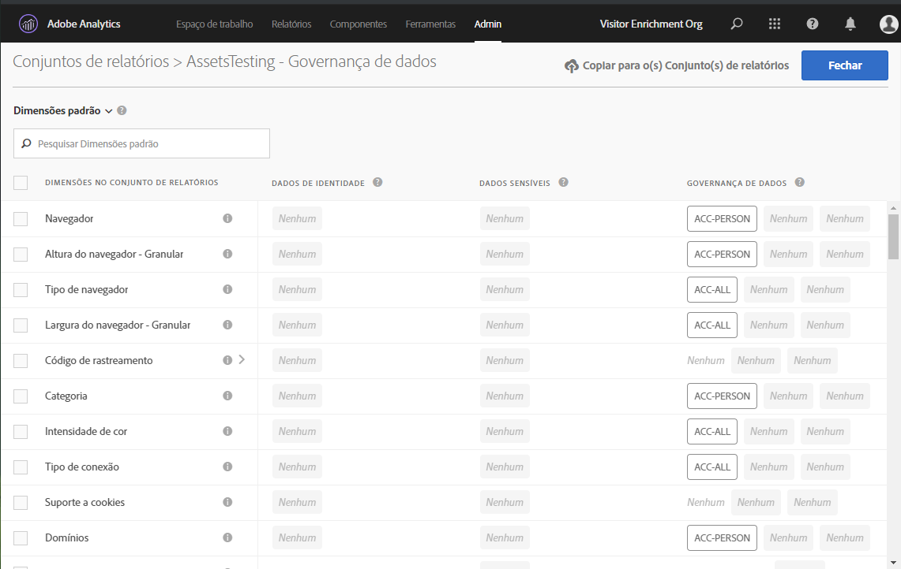
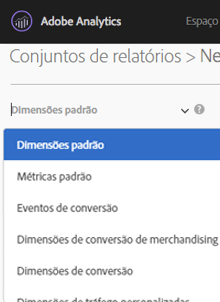
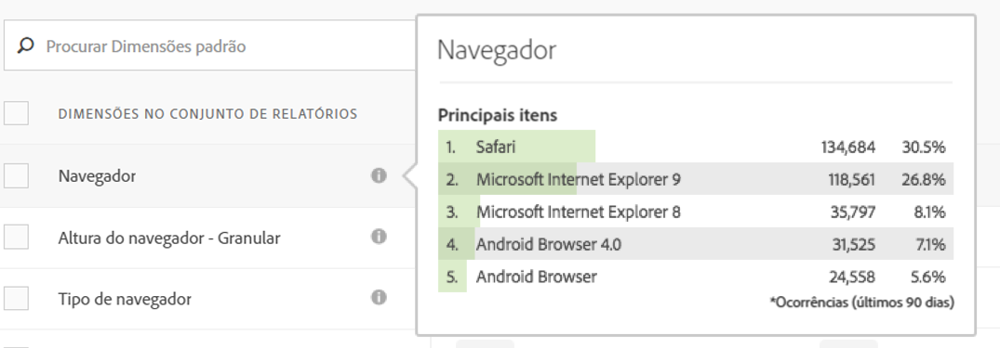
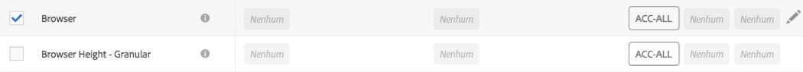
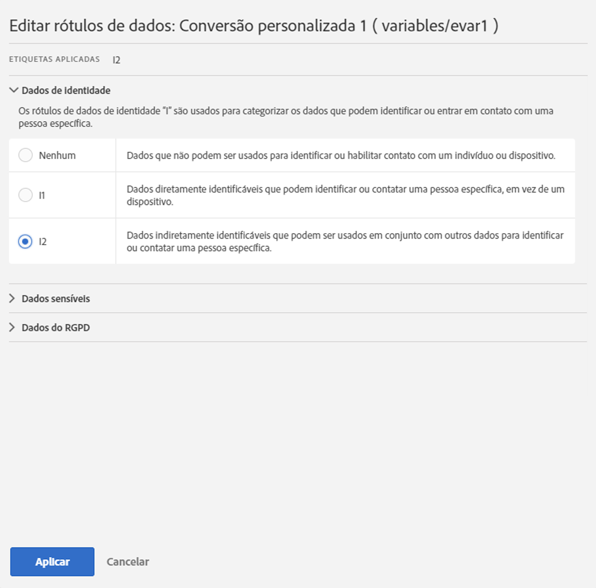
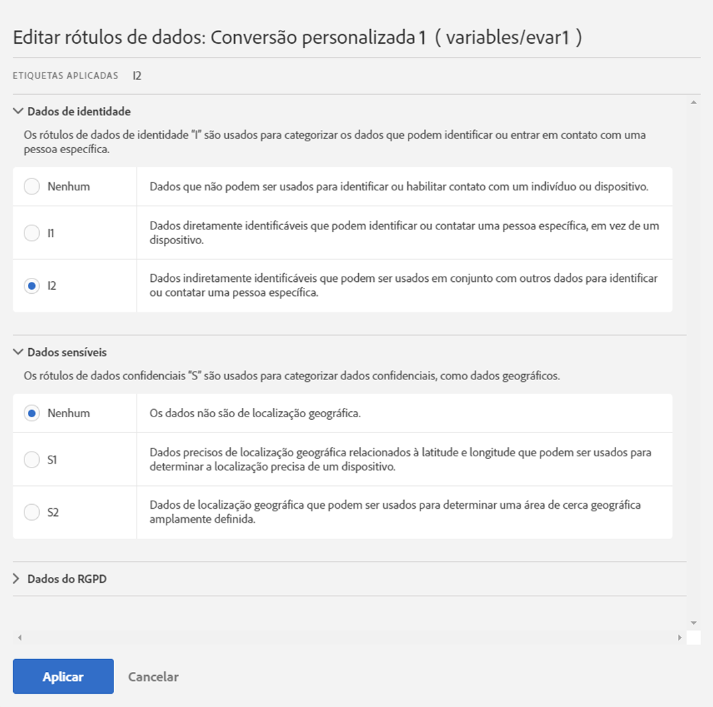
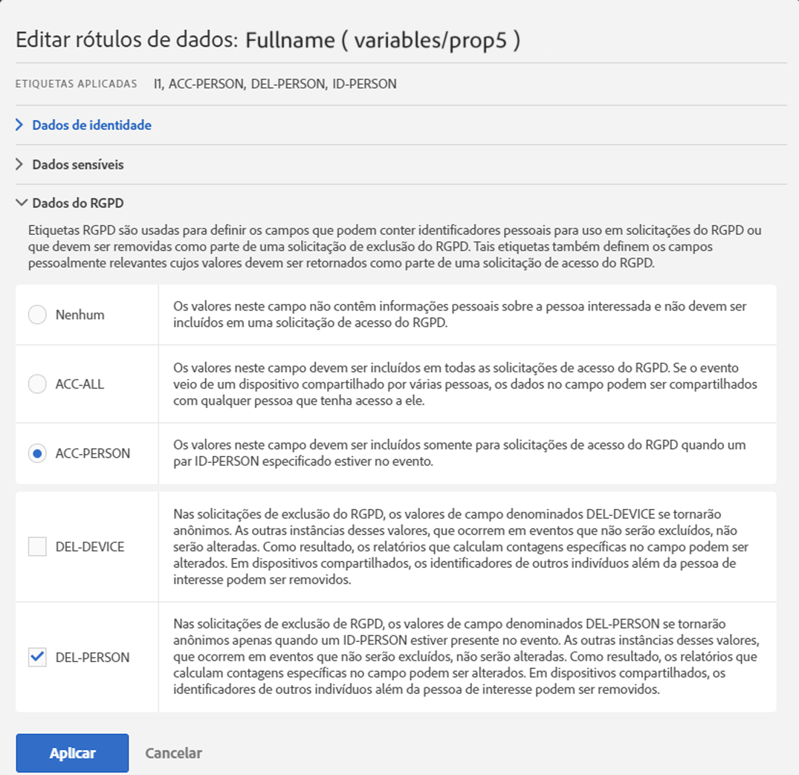
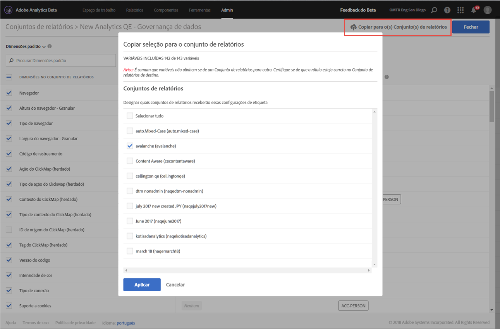

# Rotular dados do conjunto de relatórios

Rotular dados do conjunto de relatórios significa que você atribui rótulos de identidade, sensibilidade e controle de dados a cada variável em um determinado conjunto de relatórios. Familiarize-se primeiro com os rótulos e suas definições.

>[!NOTE] Lembre-se de que a Rotulagem precisa ser revisada sempre que um novo conjunto de relatórios for criado ou quando uma nova variável for ativada em um conjunto de relatórios existente. Você também pode analisar a rotulagem quando novas integrações da solução forem ativadas, pois elas podem expor novas variáveis que podem exigir rótulos. Uma reimplementação de seus aplicativos móveis ou sites pode alterar a forma como as variáveis existentes são usadas, o que também pode exigir atualizações de rótulos.

## Atribuir ou editar rótulos do conjunto de relatórios {#section_39F829F35A274EACA532E2F6FF392996}

**Exemplo**: você, como controlador de dados, planeja coletar endereços de email e IDs de cookies de titulares de dados para processar suas solicitações de Privacidade de dados. Essas IDs de cookie são armazenadas em um conjunto de relatórios no Adobe Analytics. Para criar uma etiqueta para endereços de email e IDs de cookie, você deve usar a estrutura DULE (Data Usage Labeling &amp; Implantação) da plataforma Adobe Cloud no Analytics.

1. No Analytics, navegue até **[!UICONTROL Admin]** > **[!UICONTROL Data Governance]** > **[!UICONTROL (select report suite)]**

1. Selecione o grupo de variáveis que deseja rotular.

   

   * **Dimensões** padrão (dimensões prontas para uso do Adobe Analytics)
   * **Métricas** padrão (métricas inovadoras do Adobe Analytics)
   * **Eventos de conversão** (eventos bem-sucedidos personalizados)
   * **Dimensões de conversão de merchandising** (eVar de merchandising)
   * **Dimensões** de conversão (eVars que não são de comercialização)
   * **Dimensões** de tráfego personalizadas (props)
   * **Dimensões e Eventos** da solução (dimensões/eventos relacionados a soluções como Mobile, Video, Mapa de Atividade etc., e integrações com soluções como Adobe Campaign, Adobe Experience Manager, Advertising Cloud etc.)
   * **Dimensões** de processamento de dados (variáveis não expostas diretamente no relatórios por meio da interface do usuário do Adobe Analytics, mas disponíveis para você por meio de Feeds de dados e/ou solicitações do Data Warehouse)

1. (Opcional) Clique no ícone de informações (i) ao lado de cada variável para entender melhor seus valores mais comuns nos últimos 90 dias. Essa funcionalidade não está disponível para Dimensões de processamento de dados, pois não estão disponíveis na interface do usuário do Analytics.

   

1. Select one or more variables by clicking their checkbox, then select the **[!UICONTROL Edit]** icon (to the right) to edit one or more variable(s).

   

1. A caixa de diálogo **Dados de identidade** é exibida automaticamente. Esses rótulos classificam os dados que podem ser usados isolados ou em combinação com outros dados para identificar ou permitir o contato direto com um indivíduo. Para obter mais informações sobre essas opções, consulte [Rótulos de dados de identidade (DULE).](/help/admin/c-data-governance/gdpr-labels.md#identity-data-labels)

   >[!NOTE]
   >
   >A estrutura DULE (Label Usage Labeling &amp; Enforcement) foi criada para fornecer uma maneira uniforme em todas as soluções/serviços/plataformas para capturar, comunicar e usar metadados sobre dados na Adobe Experience Cloud. Os metadados ajudam os controladores de dados a indicar quais dados são informações pessoais, quais dados são sensíveis e quais restrições de contrato estão associadas aos dados.

   

1. Abra a seção **Dados sensíveis** para definir os Rótulos de dados confidenciais que categorizam os dados de localização geográfica. Para obter mais informações sobre essas opções, consulte [Rótulos de dados sensíveis (DULE).](/help/admin/c-data-governance/gdpr-labels.md#sensitive-data-labels)

   

1. Abra a seção Privacidade de dados para definir os rótulos da **Governança de dados**. Use esta seção para instruir a Adobe sobre como lidar com cada variável das solicitações de acesso e exclusão da Privacidade de dados, bem como para definir quais variáveis devem ser verificadas para encontrar as IDs do titular de dados dessas solicitações. Para obter mais informações sobre essas opções, consulte [Rótulos de governança de dados (Privacidade de dados).](/help/admin/c-data-governance/gdpr-labels.md#data-governance-labels)

   

1. Click **[!UICONTROL Apply]** once you have completed all labeling.

## Copiar rótulos para os conjuntos de relatórios {#section_7C6FDAFF049F4126B84F6261F72668EE}

Se você quiser aplicar as mesmas configurações DULE/Privacidade de dados a mais de um conjunto de relatórios, poderá seguir estas etapas:

1. Selecione o grupo de variáveis (Dimensões padrão, Dimensões de conversão etc.) que contém a variável que você deseja copiar. Observe que você só pode copiar os rótulos de um grupo de variáveis por vez.
1. Selecione algumas ou todas as variáveis neste grupo.
1. Clique **[!UICONTROL Copy Labels to Report Suite(s)]** na parte superior direita da caixa de diálogo Controle de dados.

   

1. Either check **[!UICONTROL Select All]** to copy labels for the selected variables to all report suites or select the individual report suites that you want to copy the labels to.

   >[!IMPORTANT]
   >
   >Lembre-se de que todos os conjuntos de relatórios selecionados precisam ser mapeados para a organização da Experience Cloud.

   Ao copiar os rótulos de uma variável ou um conjunto de variáveis para um conjunto de relatórios diferente, a cópia é encaminhada para a variável na posição correspondente do conjunto de relatórios de destino. Para Dimensões padrão, Métricas padrão, Dimensões e Eventos da solução e Dimensões de processamento de dados, os rótulos serão copiados para a variável com o **mesmo nome** no conjunto de relatórios de destino.

   No entanto, para as Variáveis de conversão (eVars), Dimensões de conversão de merchandising e Dimensões de tráfego personalizadas (props), a cópia será para a variável com o **mesmo número** no conjunto de relatórios de destino. Por exemplo, eVar12 será copiada para eVar12 em todos os conjuntos de relatórios de destino. Os nomes dessas variáveis serão ignorados ao determinar o destino da cópia. Se a variável correspondente não estiver ativada no conjunto de relatórios de destino, a cópia falhará para essa variável.

   Ao copiar os rótulos de classificações definidos para uma variável, eles serão copiados para uma classificação na variável correspondente do conjunto de relatórios de destino (como eVar7 a eVar7) que tenha um nome idêntico à classificação copiada. Caso contrário, a cópia dos rótulos dessa classificação falhará.

   Uma mensagem de status é exibida depois que um conjunto de rótulos é aplicado. A mensagem de status incluirá os nomes de quaisquer variáveis de destino ou classificações e seus conjuntos de relatórios nos quais a cópia falhou.

   >[!IMPORTANT]
   >
   >Você sempre deve verificar os conjuntos de relatórios de destino para garantir que os rótulos sejam copiados corretamente. Isso é especialmente importante para variáveis com rótulos de ID ou DEL.

1. Clique em **[!UICONTROL Apply]**.

