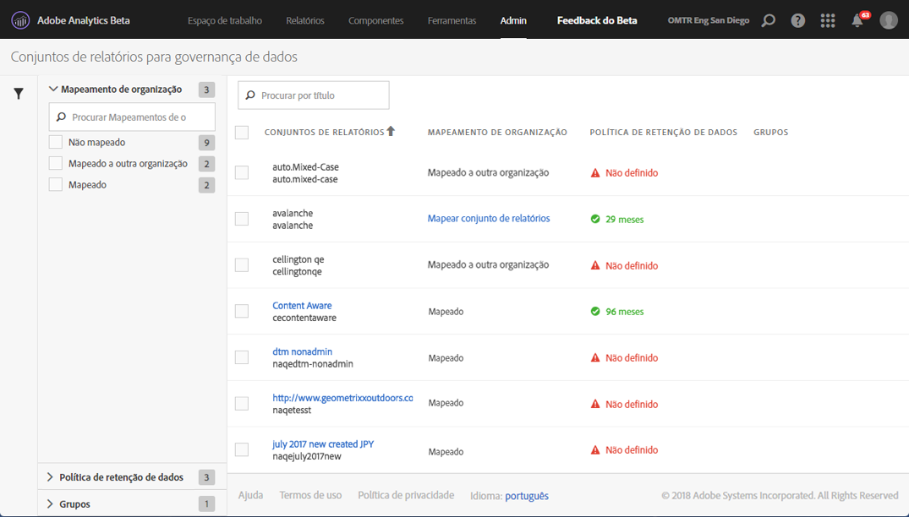
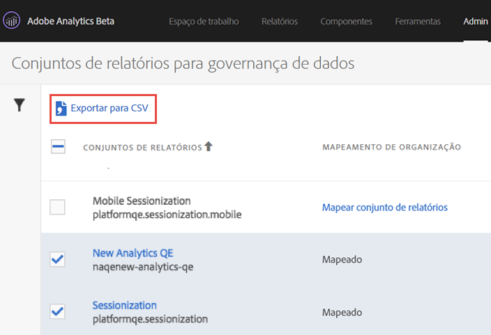

# Exibir/gerenciar as configurações de governança de dados do conjunto de relatórios

A caixa de diálogo Governança de dados nas Ferramentas administrativas fornece uma visão geral de quais conjuntos de relatórios foram configurados para a governança de dados, se foram mapeados para uma organização da Experience Cloud e se uma política de retenção de dados está em vigor para este conjunto de relatórios.

1. Faça logon na Adobe Experience Cloud.
1. Navigate to  **[!UICONTROL Analytics]** &gt; **[!UICONTROL Admin]** &gt; **[!UICONTROL Data Governance]** .

   Você verá todos os conjuntos de relatórios que fazem parte da empresa de logon:

   

<table id="table_448292730FF0475E9DCB731882F9A29B"> 
 <thead> 
  <tr> 
   <th colname="col1" class="entry"> Configuração </th> 
   <th colname="col2" class="entry"> Descrição </th> 
  </tr> 
 </thead>
 <tbody> 
  <tr> 
   <td colname="col1"> 
Conjuntos de relatórios 
 </td> 
   <td colname="col2"> 
A primeira linha lista o nome amigável do conjunto de relatórios. A segunda linha contém o nome interno do conjunto de relatórios. Se você tiver permissão para definir rótulos para um conjunto de relatórios, a primeira linha será um link clicável que encaminhará você à página de rotulagem. 
 </td> 
  </tr> 
  <tr> 
   <td colname="col1"> 
Mapeamento da organização 
 </td> 
   <td colname="col2"> 
    <ul id="ul_EF8F613B0C5E42D19DB60BD0C89C114B"> 
     <li id="li_B35EE88555F547EFBF55ADE9D0C9EC3B"><b>Mapeado</b>: esse conjunto de relatórios já foi mapeado para a mesma organização da Experience Cloud que a empresa de logon do Analytics na qual você está conectado. Somente conjuntos de relatórios com essa configuração podem ser rotulados. </li> 
     <li id="li_4E800BF80CFF477BAA091EF272D9071C"><b>Mapear conjunto de relatórios</b>: ao clicar neste link, você <a href="https://marketing.adobe.com/resources/help/en_US/mcloud/report-suite-mapping.html" format="html" scope="external">mapeia um conjunto de relatórios</a> para uma organização da Experience Cloud. 
Isso significa que você será redirecionado para a organização da Experience Cloud - Mapeamento do conjunto de relatórios, onde é necessário encontrar o conjunto de relatórios e atribuí-lo à organização apropriada. Feito isso, retorne a essa interface do usuário de Governança de dados. 
 </li> 
     <li id="li_FF825A65D089487BBF5FCB0D74D41CD7"><b>Mapeado para outra organização</b>: outra organização da Experience Cloud já mapeou esse conjunto de relatórios para uma organização. </li> 
    </ul> </td> 
  </tr> 
  <tr> 
   <td colname="col1"> 
Política de retenção de dados 
 </td> 
   <td colname="col2"> 
A implementação do GDPR do Analytics exige que você tenha uma política de retenção de dados em vigor. 
 
Esta configuração mostra se 
 
    <ul id="ul_AC1F0827293B47E39BFEC4B1766A0CAC"> 
     <li id="li_3AAD93EA92B94C6180E5AEBC5E4D10FB">uma política de retenção de dados está em vigor para este conjunto de relatórios e </li> 
     <li id="li_2E8D71905C734F8BB3245FEEDA953B3E">por quanto tempo os dados ficam retidos pela Adobe antes de serem excluídos. O período de retenção de dados padrão é de 25 meses. </li> 
    </ul> 
Observação: o Adobe Analytics não pode ajudá-lo com o processamento de solicitações da API do GDPR (ou seja, com o processamento de solicitações de acesso ou de exclusão recebidas dos usuários finais), se um período de retenção de dados não tiver sido definido. Entre em contato com o gerente de sucesso do cliente para definir o período de retenção de dados. 
 </td> 
  </tr> 
  <tr> 
   <td colname="col1"> 
Grupos 
 </td> 
   <td colname="col2"> 
Atualmente, o recurso de agrupamento não está implementado. 
 </td> 
  </tr> 
  <tr> 
   <td colname="col1"> 
Barra à esquerda 
 </td> 
   <td colname="col2"> 
Clique no ícone de funil para abrir ou fechar a barra lateral. 
 
A seção Mapeamento da organização exibe o número de conjuntos de relatórios que se enquadram em cada uma das categorias descritas. 
 
A seção Política de retenção de dados exibe cada política de retenção de dados exclusiva, atualmente em vigor para a sua organização, e o número de conjuntos de relatórios atribuídos a mesma. 
 </td> 
  </tr> 
  <tr> 
   <td colname="col1"> 
Exportar para CSV 
 </td> 
   <td colname="col2"> 
Se você marcar a caixa de seleção próxima de um ou mais conjuntos de relatórios, a opção Exportar para CSV será exibida. Essa opção permite baixar um arquivo CSV que contenha todas as definições de rótulo atuais de todas as variáveis para todos os conjuntos de relatórios selecionados. 
 
Recomendamos que a sua equipe jurídica analise as escolhas de rotulagem e essa opção facilita a análise. Em vez de precisar executar a análise enquanto estiver conectado à interface do usuário na Governança de dados, você pode compartilhar o arquivo CSV com a equipe. 
 
 
 </td> 
  </tr> 
 </tbody> 
</table>

