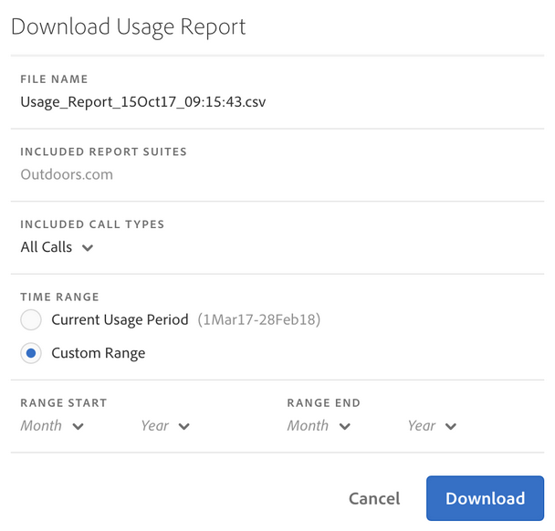
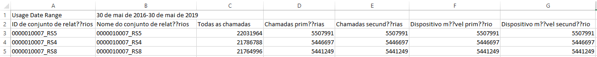

# Exibir uso do conjunto de relatórios

A guia de Uso de conjuntos de relatórios proporciona dados de uso do servidor referentes a cada conjunto de relatórios em todas as empresas de Logon vinculadas à sua empresa de Faturamento, para o período de uso atual.

**[!UICONTROL Analytics]** &gt; **[!UICONTROL Administrador]** &gt; **[!UICONTROL Uso de chamada de servidor]** &gt; **[!UICONTROL Uso do conjunto de relatórios]**

>[!IMPORTANT]
>
>If a report suite is not [linked to an Experience Cloud Organization](https://marketing.adobe.com/resources/help/en_US/mcloud/report-suite-mapping.html), its usage data will not be reflected in this dashboard. Além disso, uma ID de faturamento pode ser vinculada a várias Organizações da Experience Cloud Orgs; nem sempre há uma relação mutuamente exclusiva entre uma organização e uma ID de faturamento.

O painel de Uso de conjuntos de relatórios

* Mostra o uso de chamadas do servidor do período atual (Todas as chamadas, Primárias, Secundárias, Primárias móveis, Secundárias móveis) referente a cada conjunto de relatórios em sua organização da Experience Cloud.
* Mostra a porcentagem de uso geral por categoria de chamadas do servidor.
* É atualizado diariamente.
* Pode ser baixado.
* Permite acessar a interface **[!UICONTROL Gerenciar alertas].**

| Coluna | Definição |
|--- |--- |
| Nome do conjunto de relatórios | Nome amigável do conjunto de relatórios |
| Todas as chamadas (% do total) | Todas as chamadas do servidor incorridas no período de uso atual. |
| Chamadas primárias (%) | Todas as chamadas do servidor primárias (e o respectivo percentual do total) incorridas no período de uso atual. |
| Chamadas secundárias (%) | Todas as chamadas do servidor secundárias (e o respectivo percentual do total) incorridas no período de uso atual. |
| Primárias móveis (%) | Todas as chamadas do servidor primárias em dispositivos móveis (e o respectivo percentual do total) incorridas no período de uso atual. |
| Secundárias móveis (%) | Todas as chamadas do servidor secundárias em dispositivos móveis (e o respectivo percentual do total) incorridas no período de uso atual. |

## Baixar relatório de dados {#section_D7345660B5E043CD8850954216509A3D}

Esta opção permite baixar os dados de uso atuais, e dados de períodos de tempo anteriores ao atual (até janeiro de 2015). O relatório é baixado como um arquivo .csv.

1. Selecione, pelo menos, um conjunto de relatórios.
1. Clique em **[!UICONTROL Baixar relatório]**.

   

| Elemento do relatório | Descrição |
|--- |--- |
| Nome do arquivo | Hardcoded name: Usage Report `day and time of report creation.csv` |
| Conjunto de relatórios incluídos | Quaisquer conjuntos de relatórios selecionados na página Uso de servidor de relatório são incluídos nesta lista. |
| Tipos de chamadas incluídos | Especifique qualquer combinação destes: Todas as chamadas (padrão), Primárias, Secundárias, Primárias móveis, Secundárias móveis. |
| Intervalo de tempo | É possível escolher o período de uso atual ou especificar um intervalo personalizado.  Para um intervalo personalizado, especifique o Início do intervalo e o Término do intervalo.  **Observação:** Não é possível baixar dados de uso antes de janeiro de 2015  . |

1. Clique em **[!UICONTROL Baixar]**.

Esta é uma captura de tela da aparência do arquivo. csv baixado. Inclui uma coluna para a ID do conjunto de relatórios. A ID do conjunto de relatórios especifica uma ID exclusiva que pode conter apenas caracteres alfanuméricos. Essa ID não pode ser alterada depois que um conjunto de relatórios é criado.

