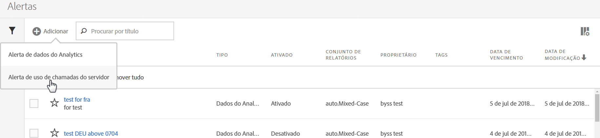
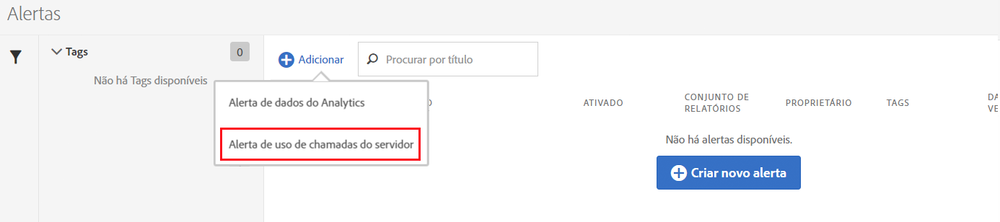
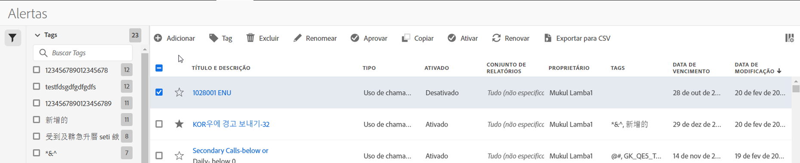

# Alertas de uso de chamada de servidor

Ao definir um alerta, ele é aplicado a todos os conjuntos de relatórios em todas as empresas de logon de uma empresa de Faturamento.

## Visão geral

A new alert category called **[!UICONTROL Server Calls Usage Alert]** is part of the the existing [Alert Management](https://marketing.adobe.com/resources/help/en_US/analytics/analysis-workspace/intellligent_alerts.html) user interface.

It is pre-populated with **1 default alert** that appears within any login company that has access to the Server Call Usage feature. Esses alertas acionam uma notificação enviada a todos os administradores da empresa de logon se um dos seguintes critérios for satisfeito:

* “Qualquer” uso de chamada do servidor que “esteja acima ou seja igual” a 100% para qualquer tipo de chamada do servidor à qual você tem direito, OU
* “Qualquer” uso de chamada do servidor que “esteja acima ou seja igual” a 90% para qualquer tipo de chamada do servidor à qual você tem direito, OU
* “Qualquer” uso de chamada do servidor que “esteja acima ou seja igual” a 75% para qualquer tipo de chamada do servidor à qual você tem direito, E “Período de uso gasto” “está abaixo ou é igual” a 75% do período de Uso.

Você pode acessar alertas de uso de chamadas do servidor de duas maneiras:

* Clique em **[!UICONTROL Gerenciar alertas]no canto superior direito da guia Uso atual ou na guia de uso do Conjunto de relatórios, ou**
* Navigate to **[!UICONTROL Components]** &gt; **[!UICONTROL Alerts]** in Adobe Analytics.

## Criar alertas de uso de chamadas do servidor {#section_2A2882C6D48D47C1944D52FB7C766BEC}

Para criar alertas adicionais,

1. Clique em **[!UICONTROL + Adicionar]** e selecione **[!UICONTROL Alerta de uso de chamadas do servidor]**.

   

1. Defina o alerta.

   

   * **Título**: Especifique um nome descritivo. Não é possível salvar o alerta sem um nome.
   * **Granularidade de tempo**: Refere-se à frequência com que o alerta será verificado. *No momento, oferecemos suporte somente à granularidade Semanal.* Isso significa que o alerta será verificado semanalmente e vai considerar os dados do período de uso atual.
   * **Destinatários**: Especifique qualquer pessoa na organização que deve receber um email quando o alerta aciona o limite especificado.
   * **Data de expiração**: Por padrão, a data de expiração é de um ano a partir da data de criação do alerta.
   * **Enviar um Alerta quando**:

      * Qualquer um desses Acionamentos
de métricas Adicionar o tipo de chamada do servidor ou s como uma métrica e especificar o limite de alerta selecionando o modificador e o limite:
         * é igual ou maior que
         * é igual ou menor que
      * Com
Especificar o limite e a condição (é acima ou igual ou é inferior ou igual a) para o Período gasto gasto.

1. Clique em **[!UICONTROL Salvar]**.

## Gerenciar alertas de uso de chamadas do servidor {#section_8FF98170763C4B5CBEC6DD43F893177A}

Para gerenciar alertas:

1. Marque a caixa de seleção próxima a um ou mais alertas. As ações de gerenciamento de alerta são exibidas na parte superior.
1. Conclua uma ou mais das seguintes ações:

   | Ação | Definição |
   |--- |--- |
   | + Adicionar | Acesse o [Criador de alertas](../../admin/c-server-call-usage/scu-alerts.md), clicando em [!UICONTROL + Adicionar]. |
   | Adicionar tag | Adicione tags a alertas para organizá-los e facilitar seu uso. |
   | Excluir | É possível excluir todos os alertas, exceto os padrões. |
   | Renomear | É possível renomear todos os alertas, exceto os padrões. |
   | Aprovar | Aprove alertas para “oficializá-los”. |
   | Habilitar/Desabilitar | É possível habilitar ou desabilitar todos os alertas, incluindo os padrões. |
   | Renovar | Quando um ou mais alertas são selecionados, eles podem ser renovados. Isso estende as datas de expiração em 1 ano a partir do dia da [!UICONTROL Renovação], independentemente da data de expiração original. |
   | Exportar para CSV | Consulte [Baixar relatório de uso](../../admin/c-server-call-usage/report-suite-usage.md) |

