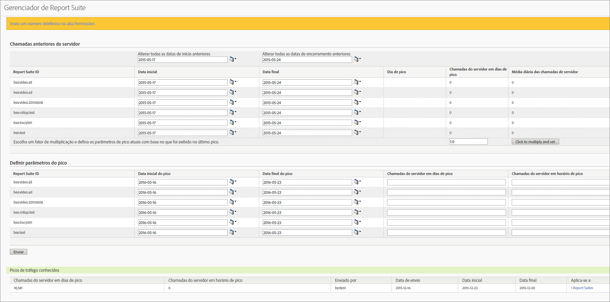

# Estimar chamadas de servidor antigas e agendar um pico de tráfego

Por exemplo, é possível obter a média diária de chamadas do servidor realizadas durante um período específico, além de gerar um aumento no volume de chamadas do servidor deste ano. Você pode, então, agendar um pico de tráfego com base nesse fator de multiplicação.

1. Log in to Analytics as an Admin and go to **[!UICONTROL Admin]** &gt; **[!UICONTROL Traffic Management]**.

1. Clique em **[!UICONTROL Expandir]** para expandir a lista do conjunto de relatórios e clique em **Selecionar conjuntos de relatórios]para selecionar vários conjuntos de relatórios.[!UICONTROL **

1. Clique em **[!UICONTROL Picos programados]**.
1. Under **[!UICONTROL Past Server Calls]**, select a start and end date for the selected report suites.

   O valor de Dia de pico, Chamadas de servidor do dia de pico e Média diária de chamadas de servidor é gerado.

1. Insira um valor para o fator de multiplicação e clique em **[!UICONTROL Clique para multiplicar e definir]**.

   O valor de cada coluna é multiplicado para cada conjunto de relatórios.

1. Under **[!UICONTROL Set Spike Parameters]**, submit the spike parameters for the selected report suites.

   O pico foi programado para cada conjunto de relatórios selecionado.

