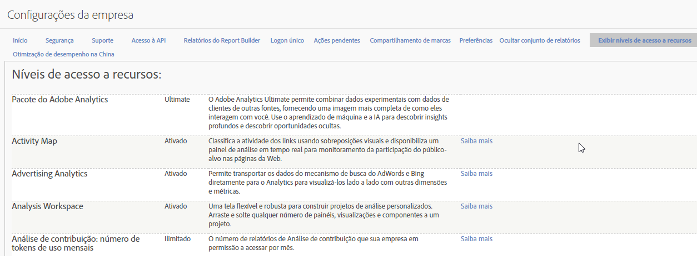

# Níveis de acesso a recursos

**[!UICONTROL Administração]** &gt; **[!UICONTROL Configurações da empresa]** &gt; **[!UICONTROL Exibir níveis de acesso a recursos]**

Esse grupo de configurações permite que você veja o nível de acesso aos recursos do Adobe Analytics aos quais sua empresa tem direito. Alguns recursos só estão disponíveis com SKUs de produtos mais avançados, como o [Adobe Analytics Ultimate](https://www.adobe.com/br/data-analytics-cloud/analytics/ultimate.html).

