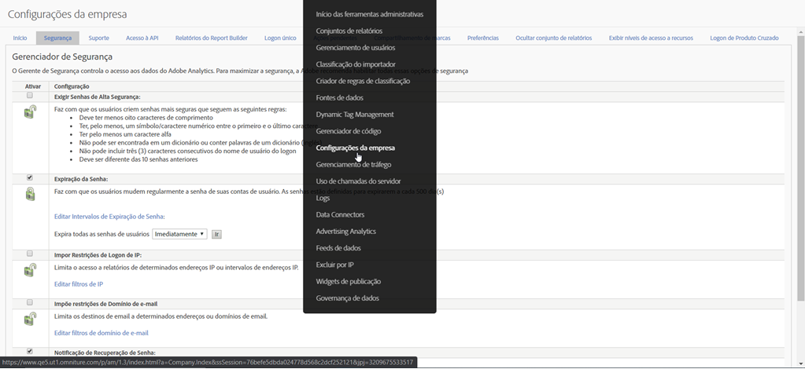

# Fim da vida útil para [!UICONTROL Impor restrições de logon de IP]

O recurso **[Impor restrições de logon de IP](/help/admin/company/security-manager.md)** no Adobe Analytics permite incluir endereços IP específicos (considerados seguros) para permitir logons bem-sucedidos e acesso ao ambiente do Adobe Analytics. Em muitos casos, esse recurso é usado para configurar um endereço IP corporativo como o único endereço IP seguro do qual os usuários podem fazer logon. Portanto, para usar o Adobe Analytics, isso requer que os usuários estejam em um escritório corporativo ou façam logon na rede via VPN.

Estamos planejando o fim da vida útil desse recurso em outubro de 2020.

## Por que vamos acabar com esse recurso?

Esse recurso é dividido em algumas circunstâncias pela migração de logon da Experience Cloud e/ou pelo logon da Experience Cloud. É dividido para clientes que usam **[!UICONTROL Atributos do cliente]** ou **[!UICONTROL Biblioteca de público-alvo]**.

Além disso, se você tiver várias Soluções da Experience Cloud, poderá navegar por esse requisito ao fazer logon na Experience Cloud com uma das outras soluções, pois esse recurso não existe ou não é compatível fora do Analytics. Os usuários também podem contornar isso por meio de falsificação de IP.

Por fim, a Adobe tem uma solução alternativa funcional e superior por meio do logon único e das Federated IDs. Este recurso oferece maior controle e segurança sobre a experiência de logon dos usuários. Veja mais informações abaixo.

## Como a remoção deste recurso afeta você?

Para qualquer cliente que tenha **[!UICONTROL Impor restrições de logon de IP]** definido, esse recurso será removido em outubro de 2020. Nesse momento, as restrições de logon de IP ainda em vigor não serão mais impostas. Se ainda precisar restringir o logon por endereço IP, deverá revisar e implementar a solução recomendada de Logon único e Federated IDs (mais informações e recursos abaixo).

Além disso, a configuração **[!UICONTROL Impor restrições de logon de IP]** será removida de **[!UICONTROLAAdministração &gt; Configurações da empresa &gt; Gerenciador de segurança]** na interface do usuário do Analytics (como mostrado abaixo).

## Quais são suas outras opções?

Como mencionado acima, esse recurso do Analytics será encerrado. Para lhe dar tempo para implementar SSO e Federated IDs, adiamos a data EOL para outubro de 2020.

O SSO e as Federated IDs são soluções superiores ao recurso Restrição de logon de IP que temos em vigor hoje e fornecerão mais controle, segurança e recursos. Para obter informações sobre como configurar SSO/Federated IDs, temos a seguinte documentação de ajuda disponível. Recomendamos ler minuciosamente e trabalhar com o departamento de TI para implementá-los:

* [Logon único e a Experience Cloud](https://spark.adobe.com/page/JeSB8EPEQIvjD/)
* [Admin Console - Documentação de configuração de identidade](https://helpx.adobe.com/br/enterprise/using/set-up-identity.html)
* [Admin Console - Tutorial de configuração de identidade (vídeo)](https://helpx.adobe.com/br/enterprise/how-to/identity-directories-domains.html?playlist=/ccx/v1/collection/product/enterprise/topics/enterprise-identity/collection.ccx.js&amp;ref=helpx.adobe.com)
* [Configurar tutorial da Federated ID (vídeo)](https://helpx.adobe.com/br/enterprise/how-to/identity-configure-ids.html?playlist=/ccx/v1/collection/product/enterprise/topics/enterprise-identity/collection.ccx.js&amp;ref=helpx.adobe.com)
* [Logon único - perguntas comuns](https://helpx.adobe.com/br/enterprise/using/sso-faq.html)
* [Tipos de identidade compatíveis com a Adobe](https://helpx.adobe.com/br/enterprise/using/identity.html)

Se desejar continuar a expressar seu suporte para Restrições de logon de IP e solicitar que seja fornecido pela Experience Cloud, poderá votar nesse recurso na [página do Fórum](https://forums.adobe.com/ideas/11648).