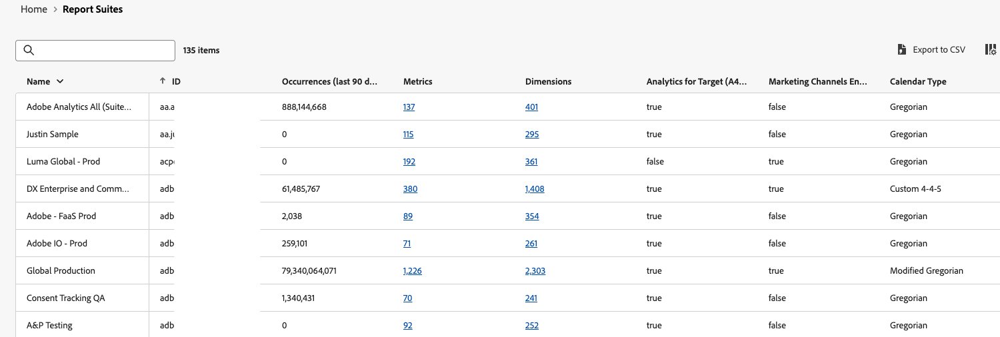

# Inventário do Analytics {#analytics-inventory}

<!-- markdownlint-disable MD034 -->

>[!CONTEXTUALHELP]
>id="analytics-inventory"
>title="Inventário do Analytics"
>abstract="Esta página fornece uma visão geral abrangente do seu ambiente do Adobe Analytics, incluindo o número de projetos e componentes, conjuntos de relatórios, usuários e muito mais. Essas informações são valiosas principalmente ao iniciar os preparativos para atualizar para o Customer Journey Analytics."

<!-- markdownlint-enable MD034 -->

O Inventário do Analytics fornece uma visão geral abrangente do seu ambiente do Adobe Analytics, incluindo o número de projetos e componentes, conjuntos de relatórios, usuários e muito mais. Essas informações são valiosas principalmente ao iniciar os preparativos para atualizar para o Customer Journey Analytics.

O objetivo do inventário do Analytics é ajudá-lo a responder às seguintes perguntas:

* Para sua organização, quais ativos (como conjuntos de relatórios, segmentos, usuários, projetos do Workspace e assim por diante) você precisa migrar e quais ativos pode deixar para trás?

* Depois de determinar qual ativo precisa ser migrado:

   * Você deve realizar alguma limpeza de ativos antes desta atualização?

   * Você deve fazer alguma consolidação de ativos como parte do processo?

   * What should the upgrade sequence be for your assets?

   * Which report suites should you upgrade first or last?

## Permissões

O Inventário do Analytics está disponível para usuários com privilégios de Administrador de produto do Adobe Analytics no [Adobe Admin Console](/help/admin/admin-console/admin-roles-in-analytics.md).

## Acessar inventário do Analytics

1. Click **[!UICONTROL Analytics Inventory]** in the **[!UICONTROL Admin]** menu. Ou vá para **[!UICONTROL Todos os administradores]** > **[!UICONTROL Inventário do Analytics]**.

1. The main screen shows a comprehensive inventory of your Adobe Analytics environment:

   

   Specifically, this screen shows:

   * O número total de projetos do Analysis Workspace e do Scorecard para dispositivos móveis ativos nesta organização, em todos os usuários.
   * O número total de segmentos e métricas calculadas que estão ativos nesta organização, em todos os usuários.
   * O número total de conjuntos de relatórios base que foram definidos. Os conjuntos de relatórios virtuais não estão incluídos.
   * Se o recurso do Media Analytics estiver ativo e, nesse caso, em que modo.
   * O número total de usuários definidos nesta organização.

## Componentes {#components}

<!-- markdownlint-disable MD034 -->

>[!CONTEXTUALHELP]
>id="analytics-inventory-components"
>title="Componentes"
>abstract="Esta seção mostra o número de projetos, segmentos e métricas calculadas existentes no seu ambiente do Adobe Analytics. É possível migrar projetos e componentes para o Customer Journey Analytics."

<!-- markdownlint-enable MD034 -->

Nesta versão inicial, você pode ver números resumidos do inventário para projetos, segmentos e métricas calculadas do Workspace. As versões subsequentes permitirão analisar esses componentes.

## Configuração e coleta de dados {#data-config}

<!-- markdownlint-disable MD034 -->

>[!CONTEXTUALHELP]
>id="analytics-inventory-data-config"
>title="Configuração e coleta de dados"
>abstract="Esta seção mostra o número de conjuntos de relatórios no seu ambiente do Adobe Analytics, bem como o seu acesso a serviços de mídia de streaming."

<!-- markdownlint-enable MD034 -->

### Conjuntos de relatórios

A exibição de conjuntos de relatórios mostra todos os conjuntos de relatórios definidos em uma organização. Ele permite responder às seguintes perguntas:

* Quais conjuntos de relatórios receberam mais ocorrências nos últimos 90 dias?
* Quais conjuntos de relatórios não receberam visitas nos últimos 90 dias?
* What report suites have the largest number of dimension defined?
* What report suites have the largest number of metrics defined?

The answers to these questions will give you a good idea as to which report suites are the best candidates for migration.

>[!NOTE]
>
>This table populates slowly, one cell value at a time.

1. Para analisar conjuntos de relatórios, navegue até **[!UICONTROL Configuração e coleção de dados]** > **[!UICONTROL Conjuntos de relatórios]** e clique em **[!UICONTROL Analisar]**.

   

   | Elemento | Descrição |
   | --- | --- |
   | Nome | O nome do conjunto de relatórios |
   | ID | The report suite ID (rsid). Especifica uma ID exclusiva que pode conter somente caracteres alfanuméricos. Essa ID não pode ser alterada após ser criada. O Adobe define o prefixo da ID necessário e ele não pode ser alterado. |
   | Ocorrências (últimos 90 dias) | A métrica “Ocorrências” exibe o número de ocorrências em que uma determinada dimensão foi definida ou mantida. How many hits did this report suite receive in the last 90 days? |
   | Métricas | How many metrics are defined in this report suite? |
   | Dimensões | How many dimensions are defined in this report suite? |
   | Analytics for Target (A4T) habilitado | [Oculto por padrão] Este conjunto de relatórios está habilitado para o [Analytics for Target](https://experienceleague.adobe.com/pt-br/docs/target/using/integrate/a4t/a4t)? |
   | Canais de marketing habilitados | [Oculto por padrão] Este conjunto de relatórios está habilitado para [Canais de marketing](/help/components/c-marketing-channels/c-getting-started-mchannel.md)? |
   | Conector de origem habilitado | Este conjunto de relatórios está habilitado para o [Adobe Analytics Source Connector para dados do conjunto de relatórios](https://experienceleague.adobe.com/pt-br/docs/experience-platform/sources/connectors/adobe-applications/analytics) no Adobe Experience Platform? Em outras palavras, esse conjunto de relatórios pode ser migrado para o Customer Journey Analytics usando o Analytics Source Connector? |
   | Tipo de calendário | [Oculto por padrão] Para obter mais informações, consulte [Calendários Personalizados](/help/admin/tools/manage-rs/edit-settings/general/custom-calendar.md) |

#### Analisar dimensões

Essa tela fornece uma exibição detalhada de todas as dimensões definidas para um conjunto de relatórios específico. Nessa visualização, você pode responder às seguintes perguntas:

* Quais dimensões estão ativadas para este conjunto de relatórios?
* What are the top ten dimension items for the last 90 days for this dimension?

1. Clique no link **[!UICONTROL Dimensões]** na página Conjunto de relatórios.

   | Elemento | Descrição |
   | --- | --- |
   | Nome | The name of the dimension |
   | ID | The dimension ID. |
   | Tipo | The type of dimension. Os valores possíveis incluem Conversão, Tráfego, Navegação, Fontes de tráfego, Clientes, Data ou dimensões específicas do produto Adobe, como AEM, Público-alvo, Adobe Campaign, Aplicativo móvel etc. |
   | Descrição | Nem todas as dimensões têm descrições. |
   | Conector de origem habilitado | Essa dimensão está habilitada para o [Adobe Analytics Source Connector para dados do conjunto de relatórios](https://experienceleague.adobe.com/pt-br/docs/experience-platform/sources/connectors/adobe-applications/analytics) no Adobe Experience Platform? Em outras palavras, essa dimensão pode ser migrada para o Customer Journey Analytics usando o Analytics Source Connector? |

1. Determine quais dimensões fazem sentido migrar para o CJA.

#### Analisar métricas

Essa tela fornece uma exibição detalhada de todas as métricas definidas para um conjunto de relatórios específico. Nessa visualização, você pode responder às seguintes perguntas:

* Quais métricas estão ativadas para este conjunto de relatórios?
* Quais são as dez principais métricas dos últimos 90 dias?

1. Clique no link **[!UICONTROL Métricas]** na página Conjunto de relatórios.

   | Elemento | Descrição |
   | --- | --- |
   | Nome | The name of the metric |
   | ID | The metric ID. |
   | Tipo | O tipo de métrica. Os valores possíveis incluem Conversão, Tráfego, Navegação, Fontes de tráfego, Clientes, Data ou dimensões específicas do produto Adobe, como AEM, Público-alvo, Adobe Campaign, Aplicativo móvel etc. |
   | Descrição | Nem todas as dimensões têm descrições. |
   | Conector de origem habilitado | Essa métrica está habilitada para o [Adobe Analytics Source Connector para dados do conjunto de relatórios](https://experienceleague.adobe.com/pt-br/docs/experience-platform/sources/connectors/adobe-applications/analytics) no Adobe Experience Platform? Em outras palavras, essa métrica pode ser migrada para o Customer Journey Analytics usando o Analytics Source Connector? |

1. Determine quais métricas fazem sentido migrar para o CJA.

### Exportar para CSV

1. Para exportar a lista de conjuntos de relatórios, dimensões ou métricas para um arquivo .csv, clique em **[!UICONTROL Exportar para CSV]**.

1. O arquivo .csv aparecerá na pasta Downloads.

1. Open and save it with a spreadsheet application on your device.

>[!NOTE]
>
>Os itens e as colunas filtrados não são exportados para o arquivo .csv.

### Filtrar, pesquisar, ordenar e navegar

* Você pode pesquisar a tabela.
* No painel à esquerda, clique no ícone Filtro para filtrar por &quot;Tipo&quot;. Ou clique em **[!UICONTROL Ocultar Filtro]**.
* Você pode ordenar todas as colunas em ordem crescente/decrescente (ordem de coluna única somente).
* You can click items in the breadcrumb to navigate to another screen.

## Gerenciamento de usuários {#user-management}

<!-- markdownlint-disable MD034 -->

>[!CONTEXTUALHELP]
>id="analytics-inventory-user-management"
>title="Gerenciamento de usuários"
>abstract="Esta seção mostra o número de usuários no seu ambiente do Adobe Analytics."

<!-- markdownlint-enable MD034 -->

O gerenciamento de usuários estará disponível em uma versão posterior do inventário do Analytics.

## Migrar componentes

Usando a [Migração de componentes](/help/admin/tools/component-migration/component-migration.md), os administradores do Adobe Analytics podem migrar projetos do Analytics e seus componentes associados para o Customer Journey Analytics.

O processo de migração inclui:

* Recriação de projetos do Adobe Analytics no Customer Journey Analytics.

* Mapeamento de dimensões e métricas de conjuntos de relatórios do Adobe Analytics de acordo com as dimensões e métricas das visualizações de dados do Customer Journey Analytics.