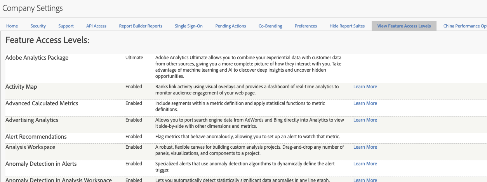

# Níveis de acesso a recursos

**[!UICONTROL Administrador]** > **[!UICONTROL Todos os administradores]** > **[!UICONTROL Configurações da empresa]** > **[!UICONTROL Exibir níveis de acesso a recursos]**

Esse grupo de configurações permite visualizar os níveis de acesso a pacotes e recursos do Adobe Analytics aos quais sua empresa tem direito. Alguns recursos só estão disponíveis com pacotes de produtos mais avançados (SKUs), como o [Adobe Analytics Ultimate](https://www.adobe.com/br/data-analytics-cloud/analytics/ultimate.html).

