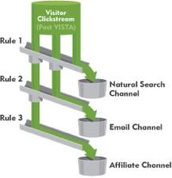

# Regras de processamento de canal de marketing

_Esta página se refere às regras de processamento que atribuem um canal de marketing a uma ocorrência. Consulte [Regras de processamento](../general/processing-rules/pr-overview.md) para obter o recurso que permite ajustar como os dados são coletados._

As regras de processamento do Canal de marketing permitem criar uma lógica que determina o valor das dimensões [Canal de marketing](/help/components/dimensions/marketing-channel.md) e [Detalhe do canal de marketing](/help/components/dimensions/marketing-detail.md). Use o [Gerenciador de canal de marketing](c-channels.md) para determinar quais canais de marketing você usa e, em seguida, use as regras de processamento para determinar como cada canal é definido.

**[!UICONTROL Analytics]** > **[!UICONTROL Admin]** > **[!UICONTROL Conjuntos de Relatórios]** > **[!UICONTROL Editar Configurações]** > **[!UICONTROL Canais de marketing]** > **[!UICONTROL Regras de processamento de canal de marketing]**

Depois que a [Configuração automática](/help/components/c-marketing-channels/c-getting-started-mchannel.md) é executada, ela cria uma regra para cada canal gerado durante a configuração.

É possível usar várias regras para definir um único canal de marketing. O uso de várias regras para um único canal pode ser benéfico se você quiser definir os detalhes do canal de forma diferente, dependendo das condições da regra. Também é possível usar várias condições para definir uma única regra.

## Definições de regra

Cada regra contém uma condição e uma atribuição:

* **[!UICONTROL Se alguma/todas as condições a seguir forem verdadeiras]**: se você adicionar várias condições a uma única regra, poderá determinar se todas as condições devem ser atendidas ou se qualquer uma das condições deve ser atendida para definir o canal e o valor associado.
* **Condições de regra**: especifique uma ou mais condições de regra que devem ser atendidas. Normalmente, você especifica uma dimensão que uma ocorrência deve corresponder para se qualificar para o canal de marketing.
* **[!UICONTROL Faça o seguinte]**: quando as condições da regra forem atendidas, defina o [Canal de Marketing](/help/components/dimensions/marketing-channel.md) ([!UICONTROL Identificar o canal como]) e os [Detalhes do Canal de Marketing](/help/components/dimensions/marketing-detail.md) ([!UICONTROL Definir o valor do canal]).

## Condições da regra

As seguintes opções estão disponíveis ao definir as condições da regra.

>[!NOTE]
>
>Todos os campos de texto são avaliados como **não diferencia maiúsculas de minúsculas**. Por exemplo, se você usar uma condição de regra em que o parâmetro da cadeia de caracteres de consulta `cmp` é igual a `abc123`, o parâmetro e o valor da cadeia de caracteres de consulta poderão usar qualquer combinação de maiúsculas e minúsculas.

**As condições detectadas pela Adobe** não contêm opções ou campos para inserir texto.

| Condição detectada pelo Adobe | Descrição |
|---|---|
| **[!UICONTROL Corresponde Às Regras De Detecção De Pesquisa Paga]** | A ocorrência se originou de um mecanismo de pesquisa reconhecido e correspondeu a [Regras de detecção de pesquisa paga](../general/paid-search-detection/paid-search-detection.md). |
| **[!UICONTROL Corresponde às Regras de Detecção de Pesquisa Natural]** | A ocorrência se originou de um mecanismo de pesquisa reconhecido e não correspondeu às regras de detecção de pesquisa paga. |
| **[!UICONTROL Referenciador Corresponde a Filtros Internos de URL]** | A ocorrência continha um [Referenciador](/help/components/dimensions/referrer.md) que correspondia a [filtros internos de URL](../general/internal-url-filter-admin.md). |
| **[!UICONTROL Referenciador Não Corresponde a Filtros Internos de URL]** | A ocorrência continha um referenciador que não correspondia aos filtros internos de URL. |
| **[!UICONTROL É a primeira ocorrência da visita]** | A ocorrência foi a primeira em uma visita. |
| **[!UICONTROL O Referenciador É Uma Rede Social]** | O [Tipo de referenciador](/help/components/dimensions/referrer-type.md) é &quot;Redes sociais&quot;. |
| **[!UICONTROL O Referenciador Não É Uma Rede Social]** | O tipo de referenciador não é &quot;Redes sociais&quot;. |
| **[!UICONTROL Referenciador É IA de Conversação]** | O tipo de referenciador é &quot;IA de conversa&quot;. |
| **[!UICONTROL O Referenciador Não É Uma IA De Conversação]** | O tipo de referenciador não é &quot;IA de conversa&quot;. |

**Os atributos de ocorrência** permitem que você especifique uma dimensão, um operador correspondente e um valor a ser procurado.

| Condição de atributo de ocorrência | Descrição |
|---|---|
| **[!UICONTROL Página]** | A dimensão [Página](/help/components/dimensions/page.md). |
| **[!UICONTROL Domínio da página]** | O domínio do URL. Por exemplo, `products.example.com`. |
| **[!UICONTROL Domínio E Caminho Da Página]** | O domínio e o caminho do URL. Por exemplo, `products.example.com/mens/pants/overview.html`. |
| **[!UICONTROL Domínio raiz da página]** | O domínio raiz do URL. Por exemplo, `example.co.uk`. |
| **[!UICONTROL URL da página]** | O URL da página inteira. |
| **[!UICONTROL Parâmetro da Cadeia de Caracteres de Consulta]** | Um parâmetro da string de consulta individual no URL da página. Use um parâmetro da cadeia de caracteres de consulta por condição de regra. Para incluir vários parâmetros da sequência de consulta em uma regra, use várias condições de regra. |
| **[!UICONTROL Referenciador]** | A dimensão [Referenciador](/help/components/dimensions/referrer.md). |
| **[!UICONTROL Domínio de referência]** | A dimensão [Domínio de Referência](/help/components/dimensions/referring-domain.md). |
| **[!UICONTROL Domínio E Caminho De Referência]** | Uma concatenação do domínio referenciador e o caminho do URL do referenciador. Por exemplo, `www.example.com/products/id/12345` ou `ad.example.com/foo`. |
| **[!UICONTROL Parâmetro de Referência]** | Um parâmetro da string de consulta no referenciador. |
| **[!UICONTROL Domínio Raiz de Referência]** | O domínio raiz de referência. |
| **[!UICONTROL Mecanismo de pesquisa]** | A dimensão [Mecanismo de pesquisa](/help/components/dimensions/search-engine.md). |
| **[!UICONTROL Palavras-chave de pesquisa]** | A dimensão [Palavra-chave de pesquisa](/help/components/dimensions/search-keyword.md). |
| **[!UICONTROL Mecanismo de pesquisa + Palavra(s)-chave de pesquisa]** | Uma concatenação de mecanismo de pesquisa e palavra-chave de pesquisa. |
| **[!UICONTROL ID do AMO]** | O código de rastreamento principal usado pelas integrações do Adobe Advertising e do Advertising Analytics. Quando uma dessas integrações estiver ativada, o prefixo do código de rastreamento poderá ser usado para identificar canais específicos do Advertising. Valores que começam com &quot;AL&quot; são para Pesquisa e Social. Os valores que começam com &quot;AC&quot; são para Exibição. Quando a ID do AMO é usada em canais de marketing, as métricas de clique/custo/impressão podem ser atribuídas ao canal correto. |
| **[!UICONTROL ID EF AMO]** | O código de rastreamento secundário usado pelo Adobe Advertising. Atua como a chave para enviar dados de volta para a Advertising. Ele pode ser usado para identificar click-throughs de exibição e view-throughs de exibição como dois canais de marketing separados. Para fazer isso, defina a lógica do canal de marketing para &quot;AMO EF ID&quot; termina com `:d` para click-throughs de exibição, ou &quot;AMO EF ID&quot; termina com `:i` para view-throughs de exibição. Se não quiser dividir a exibição em dois canais, use a dimensão da ID do AMO. |

**As variáveis de conversão** permitem que você especifique um eVar personalizado, um operador correspondente e um valor a ser procurado.

| Condição da variável de conversão | Descrição |
|---|---|
| **eVar 1-250** | A dimensão [eVar](/help/components/dimensions/evar.md) associada. |
