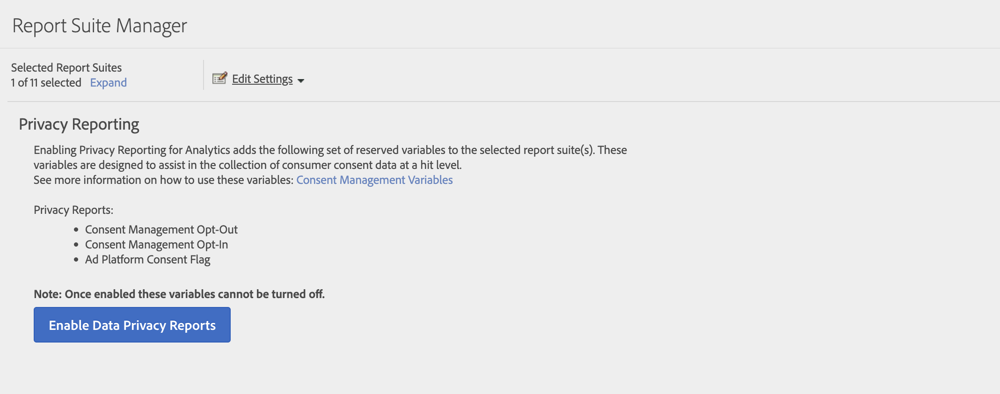

# Relatórios de privacidade

Os relatórios de privacidade permitem habilitar as dimensões [Aceitação do gerenciamento de consentimento](/help/components/dimensions/cm-opt-in.md), [Recusa do gerenciamento de consentimento](/help/components/dimensions/cm-opt-out.md) e [Consentimento da plataforma de anúncios](/help/components//dimensions/ad-consent.md) para uso nos relatórios.

>[!NOTE]
>
>Adicionamos um novo sinalizador de Consentimento da plataforma de anúncio. Você precisa reativar os Relatórios da Privacidade de dados se quiser que essa nova variável entre em vigor.

Para acessar esta página:

1. Faça logon no Adobe Analytics e acesse **[!UICONTROL Administrador]** > **[!UICONTROL Conjuntos de relatórios]**.
1. Selecione um ou mais conjuntos de relatórios e, em seguida, selecione **[!UICONTROL Editar configurações]** > **[!UICONTROL Gerenciamento de privacidade]** > **[!UICONTROL Relatórios de privacidade]**.

   

1. Clique em **[!UICONTROL Habilitar Relatórios de Privacidade de Dados]**.

   >[!NOTE]
   >
   >Após habilitadas, essas variáveis não podem ser desabilitadas.

   

1. Depois de habilitado, uma mensagem de confirmação é exibida. As dimensões estarão disponíveis em relatórios.

   
