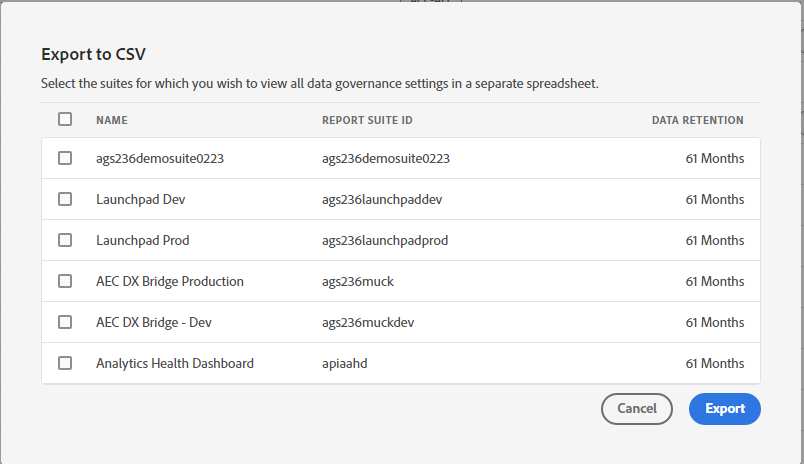

# Exibir/gerenciar a rotulagem de privacidade para a governança de dados

A caixa de diálogo **[!UICONTROL Rotulagem de privacidade para governança de dados]** fornece uma visão geral dos rótulos e namespaces de privacidade de um conjunto de relatórios. Também é possível exportar as configurações para um arquivo .csv a partir daqui.

## Exibir rótulos de privacidade {#view-privacy}

1. Faça logon no Adobe CX Enterprise.
2. Navegue até **[!UICONTROL Analytics]** > **[!UICONTROL Administrador]** > **[!UICONTROL Todos os administradores]** > **[!UICONTROL Configuração e coleta de dados]** > **[!UICONTROL Governança de dados]**.

   >[!NOTE]
   >
   >Caso não veja esse item do menu, você precisará ser adicionado a um [perfil de produto no Admin Console](/help/admin/admin-console/permissions/product-profile.md) com permissões para essa funcionalidade ou receber acesso a um conjunto de relatórios no Admin Console.

3. Na parte superior direita, selecione um conjunto de relatórios cujos rótulos de privacidade você deseja visualizar ou gerenciar.

   

| Configuração | Descrição |
| --- | --- |
| **[!UICONTROL Nome do componente]** | Essa coluna lista todos os componentes (dimensões, métricas) que fazem parte desse conjunto de relatórios. |
| **[!UICONTROL Identidade]** | Os rótulos “I” de dados de identidade são usados para classificar dados que podem identificar ou permitir o contato com uma pessoa específica. [Saiba mais](/help/admin/tools/privacy-labeling/labels.md#data-privacy-identity-labels) |
| **[!UICONTROL Sensibilidade]** | Os rótulos “S” de dados sensíveis são usados para classificar dados sensíveis, como dados geográficos. Os rótulos de Dados confidenciais adicionais serão introduzidos no futuro para identificar outros tipos de informações confidenciais. [Saiba mais](/help/admin/tools/privacy-labeling/labels.md#sensitive-data-labels) |
| **[!UICONTROL Acesso ao RGPD]** | Os rótulos de Governança de dados oferecem aos usuários a capacidade de classificar dados que refletem considerações relativas à privacidade e às condições contratuais para manter a conformidade com os regulamentos e as políticas corporativas. [Saiba mais](/help/admin/tools/privacy-labeling/labels.md#data-privacy-access-labels) |
| **[!UICONTROL Exclusão do RGPD]** | Um rótulo de exclusão é necessário apenas para campos que contenham um valor que permita a associação de uma ocorrência ao titular de dados (ou seja, que permita a identificação do titular de dados). [Saiba mais](/help/admin/tools/privacy-labeling/labels.md#data-privacy-delete-labels) |
| **[!UICONTROL Namespace]** | Ao rotular uma variável como ID-DEVICE ou ID-PERSON, você receberá uma solicitação para fornecer um namespace. Você pode usar um namespace definido anteriormente ou definir um novo. |
| **[!UICONTROL Categoria]** | Refere o tipo de componente, como Componente padrão, Variável de conversão etc. |

{style="table-layout:auto"}

## Copiar rótulos de privacidade para um conjunto de relatórios  {#copy-to-rs}

Se quiser aplicar as mesmas configurações de privacidade de dados a mais de um conjunto de relatórios, siga estas etapas:

1. Selecione a variável que deseja copiar. Observe que você só pode copiar os rótulos de uma variável por vez.
1. Clique em **[!UICONTROL Copiar para os conjuntos de relatórios]** na parte inferior da caixa de diálogo Governança de dados.

   

1. A tela resultante mostra o nome da variável, os rótulos aplicados atualmente que você está tentando copiar, os conjuntos de relatórios e suas IDs e se as configurações nos conjuntos de relatórios de destino correspondem.

   

   >[!IMPORTANT]
   >
   >Lembre-se de que todos os conjuntos de relatórios selecionados devem ser mapeados para a sua organização CX Enterprise.

   Ao copiar os rótulos de uma variável ou um conjunto de variáveis para um conjunto de relatórios diferente, a cópia é encaminhada para a variável na posição correspondente do conjunto de relatórios de destino. Para Componentes padrão, Variáveis de lista e Eventos bem-sucedidos, os rótulos serão copiados para a variável com o **mesmo nome** no conjunto de relatórios de destino.

   No entanto, para variáveis de conversão (eVars) e dimensões de tráfego (props), a cópia vai para a variável com o **mesmo número** no conjunto de relatórios de destino. Por exemplo, eVar12 será copiada para eVar12 em todos os conjuntos de relatórios de destino. Os nomes dessas variáveis serão ignorados ao determinar o destino da cópia. Se a variável correspondente não estiver ativada no conjunto de relatórios de destino, a cópia falhará para essa variável.

   Ao copiar os rótulos de classificações definidos para uma variável, eles serão copiados para uma classificação na variável correspondente do conjunto de relatórios de destino (como eVar7 a eVar7) que tenha um nome idêntico à classificação copiada. Caso contrário, ocorrerá uma falha na cópia dos rótulos dessa classificação.

1. Marque a caixa ao lado de um ou mais conjuntos de relatórios, onde as configurações correspondem.
1. Clique em **[!UICONTROL Aplicar]**.

   Uma mensagem de status é exibida após a aplicação de um rótulo. A mensagem de status incluirá os nomes de quaisquer variáveis ou classificações de destino e seus conjuntos de relatórios nos quais ocorreram a falha da cópia.

   >[!IMPORTANT]
   >
   >Você sempre deve verificar os conjuntos de relatórios de destino para garantir que os rótulos sejam copiados corretamente. Isso é especialmente importante para variáveis com rótulos de ID ou DEL.

## Exportar para um arquivo .csv {#export-csv}

É possível baixar um arquivo CSV que contém todas as definições de rótulo atuais de todas as variáveis para os conjuntos de relatórios selecionados. Recomendamos que sua equipe jurídica analise suas opções de rotulagem e essa opção facilita a análise. Em vez de precisar executar a análise enquanto estiver conectado à interface do usuário na Governança de dados, você pode compartilhar o arquivo CSV com a equipe.

1. Clique em **[!UICONTROL Exportar CSV]** na parte superior direita e essa caixa de diálogo é exibida:

   

1. Selecione um ou mais conjuntos de relatórios para os quais deseja exportar todas as configurações de governança de dados.

## Editar rótulos de privacidade {#edit}

Consulte [Atribuir ou editar rótulos de privacidade do conjunto de relatórios](/help/admin/tools/privacy-labeling/labeling-overview.md).
