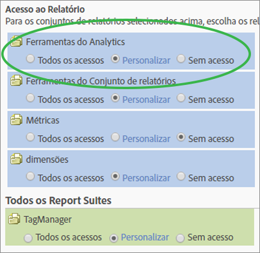

# Personalizar permissões de ferramentas do Analytics

>[!IMPORTANT]
>
>O gerenciamento de usuários e produtos foi movido para o [Admin Console](https://helpx.adobe.com/br/enterprise/using/admin-console.html). A Adobe enviará uma notificação quando for a sua vez de migrar os usuários. After all customers have migrated, help content for **[!UICONTROL Analytics]** > **[!UICONTROL Admin]** > **[!UICONTROL User Management]** will be retired.

Habilite permissões do usuário para obter integração a itens Gerais (faturas, logs etc.), Gerenciamento da empresa, Ferramentas, Acesso a serviços da Web, Report Builder e Data Connectors.

**[!UICONTROL User Management]** > **[!UICONTROL Groups]** > **[!UICONTROL All Report Access]** > **[!UICONTROL Analytics Tools]** > **[!UICONTROL Customize]**

>[!NOTE] A versão lançada no último trimestre de 2016 (20 de outubro) trouxe mudanças para o gerenciamento de grupos. Consulte [Mudanças administrativas - Último trimestre de 2016](/help/admin/user-management2/c-user-management/permissions-changes.md) para ver um resumo das mudanças.

## Acesso ao Relatório - Ferramentas do Analytics

Click **[!UICONTROL Customize]** to select items to which this group will have access.

## Descrições de campo

As configurações nesta página pertencem aos conjuntos de relatórios selecionados na [!UICONTROL Define User Groups] página.

| Elemento | Descrição |
|--- |--- |
| **Geral** |  |
| [Gerenciador de código](/help/admin/admin/code-manager-admin.md) | Permite a permissão para baixar o código de coleta de dados para plataformas móveis e da Web. |
| Gerenciador de código - Serviços da Web | Permite que um usuário não administrativo acesse o Gerenciador de código por meio dos Serviços da Web. |
| [Logs](/help/admin/admin/logs.md) | Habilita a permissão para arquivos de registro, o que ajuda você a ver quando os usuários fazem logon, seu uso, acesso, conjuntos de relatórios e Alterações administrativas. |
| Logs - Serviços da Web | Permite que um usuário não administrativo acesse os logs das Ferramentas administrativas por meio dos Serviços da Web. |
| [Gerenciamento de tráfego](/help/admin/c-traffic-management/traffic-management.md) | A página Gerenciamento de tráfego permite especificar as alterações no volume de tráfego esperado. |
| Gerenciamento de permissões | Concede a usuários não administradores acesso às páginas Gerenciamento de usuários nas Ferramentas administrativas. Esses usuários têm permissões de Leitura, mas não têm permissões de Gravação. |
| Permissões (Gravação) - Serviços da Web | Concede aos usuários não administrativos configurações de permissão de leitura e gravação em Gerenciamento de usuários nos Serviços da Web. Essa configuração se refere especificamente às ações de permissões indicadas na API de Administração. |
| Permissões (Leitura) - Serviços da Web | Permite que um usuário não administrativo visualização configurações de permissão em Gerenciamento de usuários em Serviços da Web. Essa configuração se refere especificamente às ações de permissões indicadas na API de Administração. |
| **Gerenciamento da Empresa** |  |
| [Segurança](/help/admin/company/security-manager.md) | Concede permissão para que a página Gerenciador de segurança controle o acesso a dados dos relatórios. As opções incluem senhas fortes, expiração de senha, restrições de logon de IP e restrições de domínio de email. |
| Informações de suporte | Concede permissão para as Informações de suporte em Configurações da empresa. |
| [Serviços Web](/help/admin/company/web-services-admin.md) | Permite acesso à página Serviços da Web na interface de Ferramentas administrativas ([!UICONTROL Company Settings] > [!UICONTROL Web Services]). A API de Serviços da Web fornece acesso programático a serviços do Adobe Analytics que permitem duplicar e aumentar a funcionalidade disponível por meio da interface do usuário. |
| Logon único (herdado) | Concede acesso à página de logon único nas Ferramentas administrativas. **Observação:**o Logon único na Adobe Experience Cloud é implementado com o uso da[vinculação de contas](https://marketing.adobe.com/resources/help/pt_BR/mcloud/organizations.html)entre a Experience Cloud e as demais soluções. |
| [Ações pendentes](/help/admin/company/pending-actions-admin.md) | Grants permission to manage pending actions in [!UICONTROL Company Settings]. |
| [Compartilhamento de marcas](/help/admin/company/co-branding-admin.md) | Concede permissão para o compartilhamento de marcas no Analytics. |
| [Preferências](/help/admin/admin/preferences-manager.md) | Concede permissão para o [!UICONTROL Preference Manager]. |
| [Ocultar conjunto de relatórios](/help/admin/company/c-hide-report-suites.md) | Concede permissão para ocultar conjuntos de relatórios na interface do usuário do Adobe Analytics. |
| **Ferramentas** | Essas configurações concedem acesso às ferramentas do Analytics (interfaces e aplicativos) e aos recursos avançados, como segmentação e métricas calculadas. |
| [Dados atuais](https://marketing.adobe.com/resources/help/pt_BR/reference/data_latency.html) | Concede permissão para usar o recurso Dados atuais no relatórios. |
| [Usuários da licença de Ad Hoc Analysis](https://marketing.adobe.com/resources/help/pt_BR/dsc/) | Concede permissão para acesso [!UICONTROL Ad Hoc Analysis]. |
| Acesso aos serviços da Web | Permite o acesso aos Serviços da Web para não administradores. Gera credenciais de Serviço Web. |
| [Report Builder](https://marketing.adobe.com/resources/help/pt_BR/arb/setup.html) | Concede aos membros deste grupo acesso a [!UICONTROL Report Builder] licenças. |
| [Acesso à Analysis Workspace](https://marketing.adobe.com/resources/help/pt_BR/analytics/analysis-workspace/) | Concede aos usuários acesso à Analysis Workspace, a interface de relatórios recomendada para o [!DNL Adobe Analytics]. |
| [Reports &amp; Analytics](https://marketing.adobe.com/resources/help/pt_BR/sc/user/) | Concede aos usuários acesso ao Reports &amp; Analytics. |
| [Criação de métricas calculadas](https://marketing.adobe.com/resources/help/pt_BR/analytics/calcmetrics/) | Concede aos usuários permissão para criar métricas calculadas. |
| [Criação de segmentos](https://marketing.adobe.com/resources/help/pt_BR/analytics/segment/) | Concede aos usuários permissão para criar segmentos. |
| **Data Connectors** |  |
| Integrações (Criar, Atualizar ou Excluir) | Concede permissão para criar, atualizar e excluir integrações do Conector de dados. |
