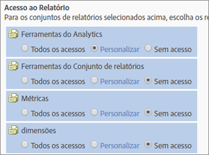

# Personalizar acesso ao relatório - visão geral

>[!IMPORTANT]
>
>O gerenciamento de usuários e de produtos está sendo transferido para o [Admin Console](https://helpx.adobe.com/br/enterprise/using/admin-console.html). A Adobe enviará uma notificação quando for a sua vez de migrar os usuários. Depois que todos os clientes tiverem migrado, o conteúdo da ajuda em **[!UICONTROL Analytics]** > **[!UICONTROL Ferramentas administrativas]** > **[!UICONTROL Gerenciamento de usuários]** será removido.

Personalize a permissão de grupo para ferramentas do Analytics e do conjunto de relatórios, métricas e dimensões.

**[!UICONTROL Adicionar novo grupo]** > **[!UICONTROL Acesso ao Relatório]**

A seção [!UICONTROL Acesso ao Relatório] da página [!UICONTROL Definir grupo de usuários] fornece categorias de acesso que permitem personalizar permissões em nível detalhado.

Por exemplo, você pode criar um grupo com acesso a várias ferramentas do Analytics, ([!UICONTROL Analysis Workspace], [!UICONTROL Reports &amp; Analytics] e [!UICONTROL Report Builder]), com permissão para métricas e dimensões específicas (inclusive eVars), e também para recursos como criação de segmentos ou métricas calculadas.

## O que você deve saber sobre permissões {#section_3D25D4A5BD044008870C5B98F696244E}

<table id="table_DB7806E05E2040EC9A4CB7C3596879EC"> 
 <thead> 
  <tr> 
   <th colname="col1" class="entry"> Item </th> 
   <th colname="col2" class="entry"> Descrição </th> 
  </tr> 
 </thead>
 <tbody> 
  <tr> 
   <td colname="col1"> 
Acesso de administradores / grupos predefinidos 
 </td> 
   <td colname="col2"> 
 Os grupos predefinidos não são mais exigidos para os administradores. Agora, os administradores têm acesso a todos os itens (ferramentas, métricas e dimensões), e também aos Serviços da Web, ao Report Builder, Activity Map e Ad Hoc Analysis. 
 
A finalidade dos grupos é conceder ou restringir o acesso de usuários não administrativos. 
 </td> 
  </tr> 
  <tr> 
   <td colname="col1"> 
Grupos personalizados 
 </td> 
   <td colname="col2"> 
 Os grupos personalizados substituíram os predefinidos. Os grupos predefinidos atuais serão migrados para grupos personalizados, usando o mesmo nome. Todos os grupos personalizados criados por você serão preservados, inclusive com suas configurações. No entanto, você observará que a localização das configurações mudou. Por exemplo, as Configurações da empresa (em Personalizar Admin Console) agora estão em <a href="/help/admin/user-management2/c-customize-report-access/groups-analytics-tools.md"> Personalizar ferramentas do Analytics</a>. 
 
 Os usuários que pertencem a  Acesso a todos os relatórios foram migrados para um grupo personalizado com acesso a: 
 
    <ul id="ul_7E1B443DEEF7452E85FEB30CA0BBC8BE"> 
     <li id="li_A510C2A4129340E0AB08EEBDBE4AEAD9">Todas as dimensões </li> 
     <li id="li_8BA1D7A2527C4F10AC93108B9E87F418">Todas as métricas </li> 
     <li id="li_265830A2C6B94AF28720DA99980EAA51">Todos os Conjuntos de relatórios </li> 
     <li id="li_685B99DEAB814D7B9C11B14AA4CB8CD4">Relatório de Canal </li> 
     <li id="li_B35420302AAB42509BD6AF0FA6349BF8">Detecção de anomalias </li> 
     <li id="li_3787E4696C454D3ABD1D75F6C282A9A2">Relatório em tempo real </li> 
     <li id="li_3797DF9C40D1426588819116362962F5">Acesso à Analysis Workspace </li> 
    </ul> 
Os administradores podem excluir grupos personalizados e criar os seus próprios, pois todas as configurações antes disponíveis nos grupos predefinidos continuam aceitando personalização nas configurações de Acesso ao relatório em Definir grupos de usuários</a>. 
 </td> 
  </tr> 
  <tr> 
   <td colname="col1"> 
Permissões no nível de dimensões 
 </td> 
   <td colname="col2"> 
Personalize permissões para que incluam ou excluam o acesso a dimensões (além das métricas). 
 
    <ul id="ul_DA5A54223673474E9151AF979DA50659"> 
     <li id="li_C3E82F7BC07A4F2F83A85D3D511292CC"> 
Todas as dimensões e métricas atuais dos grupos personalizados foram automaticamente migradas para as novas categorias. Se um grupo tiver métricas ativadas, receberá por padrão todas as novas dimensões (eVars e com sensível a conteúdo) e métricas permissíveis. 
 </li> 
     <li id="li_CC56F9181CC14AB59318628E72F2E8C9"> Permissões do Importador de classificações (antigo SAINT): o acesso a classificações é determinado pelo acesso à <a href="https://marketing.adobe.com/resources/help/pt_BR/reference/c_classifications.html">variável</a> em que se baseia a classificação. </li> 
    </ul> 
Consulte <a href="/help/admin/user-management2/c-customize-report-access/groups-dimensions.md">Personalizar permissões de dimensão</a>. 
 </td> 
  </tr> 
  <tr> 
   <td colname="col1"> 
<a href="https://helpx.adobe.com/br/enterprise/using/admin-console.html"> Adobe Admin Console</a> 
 </td> 
   <td colname="col2"> 
Recomendado somente para clientes novos ou com empresas <a href="https://marketing.adobe.com/resources/help/pt_BR/mcloud/core_services.html">provisionadas na Experience Cloud</a>. Há planos para a migração dos atuais clientes do Analytics para o sistema de gerenciamento de identidade da Experience Cloud. 
 
Mais informações disponíveis em <a href="https://marketing.adobe.com/resources/help/pt_BR/experience-cloud/admin-console/analytics-migration/"> Migração de usuários do Analytics para o Admin Console</a>. 
 </td> 
  </tr> 
  <tr> 
   <td colname="col1"> 
Sensível a conteúdo 
 </td> 
   <td colname="col2"> 
A opção Sensível a conteúdo inclui variáveis que permitem gerenciar as permissões em métricas relacionadas a integrações de soluções da Experience Cloud. É possível gerenciar permissões em Redes sociais, em Dispositivos móveis ou qualquer outro tipo de dados que tenha sido inserido por meio da integração com a Experience Cloud. Eles serão ativados por padrão. 
 </td> 
  </tr> 
  <tr> 
   <td colname="col1"> 
Permissões / relatórios extintos 
 </td> 
   <td colname="col2"> 
Estes relatórios extintos serão removidos: 
 
    <ul id="ul_C0415CFF0562472297272EC58ECC0774"> 
     <li id="li_62B1CE33B1454987B878B321EB40D62E">Resumo Mensal </li> 
     <li id="li_71CD776D212540A18F9B083D2E11A296">Página inicial do visitante </li> 
     <li id="li_406200AD68C74D11B5F53988A4E76A68">Plugins do Netscape </li> 
     <li id="li_A124637D69C94C78921C8B028D890541">Visitantes principais </li> 
     <li id="li_5C26FF95371B4F3080FF75C7F8DE0F72">Páginas visualizadas por visitantes-chave </li> 
     <li id="li_E7E262BD0CF64E16B838F995F6A13B8A">Instantâneo do visitante </li> 
     <li id="li_0EDC74625C0D4B1A992FCA49B648E4C0">DRM </li> 
     <li id="li_ACC92E6EA188409486E7C943F26B9DAC">Protocolos de rede </li> 
     <li id="li_6E18C4D12377416A8124BBD13164B03A">Versão do Java </li> 
     <li id="li_1599265E59EF4F34BB406356410C9E68">Tamanho do URL de marcador </li> 
     <li id="li_3035442010984C409089B21E03DB7BCC">Transmissão de números de dispositivo </li> 
     <li id="li_6B2163ED8FC84EBF933D97A504B4D527">PTT </li> 
     <li id="li_0EB8A4A7619B45DF87109B183A7C69C8">Suporte a email de decoração </li> 
     <li id="li_989FAC662F7344E6BDDC517B79D4581E">Informações </li> 
     <li id="li_F1FB7F8E415443F3B63F6D11D59A04AB">Serviço de informação </li> 
    </ul> 
Estes relatórios: 
 
    <ul id="ul_F71505C59F734EA9B541BF8AB9F9388F"> 
     <li id="li_7D461907B895447280E69CF1520DF47C">Ainda podem ser acessados por Marcadores. </li> 
     <li id="li_27BA2DD6BA4C446FBAA06B6C76CD171F">Não estão incluídos na nova categoria de permissão Dimensões. </li> 
     <li id="li_504E9D8421714406A0F37DEF1E10E34B">Não podem mais ter suas permissões editadas. </li> 
     <li id="li_0022E8DCA07344C793847E8282EFBEEF">Manterão o acesso para grupos personalizados com acesso atual. </li> 
    </ul> </td> 
  </tr> 
 </tbody> 
</table>

