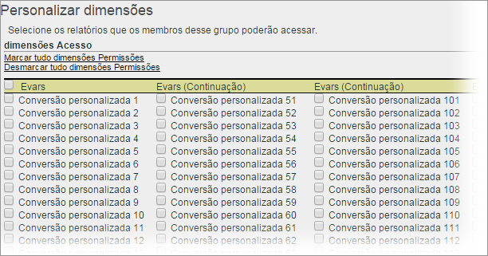

# Personalizar permissões de dimensões

>[!IMPORTANT] O gerenciamento de usuários e de produtos está sendo transferido para o [Admin Console](https://helpx.adobe.com/br/enterprise/using/admin-console.html). A Adobe enviará uma notificação quando for a sua vez de migrar os usuários. After all customers have migrated, help content for **[!UICONTROL Analytics]** > **[!UICONTROL Admin Tools]** > **[!UICONTROL User Management]** will be retired.

Personalize detalhadamente o acesso dos usuários, inclusive a eVars e relatórios de tráfego, de soluções e de definição de caminho.

**[!UICONTROL User Management]** > **[!UICONTROL Groups]** > **[!UICONTROL Report Access]** > **[!UICONTROL Dimensions]** > **[!UICONTROL Customize]**

>[!IMPORTANT] Não é possível atribuir permissões a algumas dimensões neste momento. Essas dimensões são: Comprimento do marcador móvel; Número do dispositivo móvel; DRM móvel; Serviços de informação móveis; Java VM móvel; Decoração do correio móvel; Protocolos de rede móveis; Mobile OS; Empurramento móvel para falar.
>
>Essas dimensões estão disponíveis para todos os usuários, independentemente de outras permissões.

As configurações nesta página pertencem aos conjuntos de relatórios selecionados na [!UICONTROL Define User Groups] página.

Entenda as seguintes informações sobre a categoria Dimensão para permissões.

* As eVars 1-250 são autorizadas individualmente.
* Todos os relatórios de tráfego são dimensões.
* Os relatórios de Vídeo e Mobile são dimensões, como outros relatórios de soluções do Analytics (Experience Manager, Advertising Cloud, Social e outros.)
* Relatórios de definição de caminho estarão disponíveis se um usuário tiver acesso à dimensão pai.
* Todas as dimensões e métricas atuais em grupos personalizados foram automaticamente migradas para as novas categorias. Se um grupo existente tiver métricas ativadas, todas as novas dimensões (eVars e sensíveis ao conteúdo) e métricas serão atribuídas por padrão.
* Permissões do Importador de classificações (antigo SAINT): o acesso a classificações é determinado pelo acesso à [variável](https://marketing.adobe.com/resources/help/pt_BR/reference/c_classifications.html) em que se baseia a classificação.

Para obter mais informações, consulte Perguntas [frequentes sobre mudanças](https://marketing.adobe.com/resources/help/pt_BR/reference/permissions_faq.html)de permissão.

**Personalizar dimensões**

Os itens a seguir são dimensões que você pode permitir.

<table id="table_F37D74A1619A4560A5F5651E855DAF1C"> 
 <thead> 
  <tr> 
   <th colname="col1" class="entry"> Elemento </th> 
   <th colname="col2" class="entry"> Descrições </th> 
  </tr> 
 </thead>
 <tbody> 
  <tr> 
   <td colname="col1"> 
 <a href="/help/admin/admin/conversion-var-admin/conversion-var-admin.md"> eVars </a> 
 </td> 
   <td colname="col2"> 
As eVars 1-250 são autorizadas individualmente. As eVars são variáveis de conversão personalizadas que você usa para segmentar métricas de sucesso de conversão em relatórios personalizados. 
 </td> 
  </tr> 
  <tr> 
   <td colname="col1"> 
 <a href="https://marketing.adobe.com/resources/help/pt_BR/sc/implement/props_eVars.html"> Props </a> 
 </td> 
   <td colname="col2"> 
As props são variáveis de tráfego personalizadas. 
 
Consulte <a href="https://marketing.adobe.com/resources/help/pt_BR/sc/implement/props_eVars.html">Props de tráfego e eVars de conversão</a> em Implementação do Analytics. 
 </td> 
  </tr> 
  <tr> 
   <td colname="col1"> 
 <a href="https://marketing.adobe.com/resources/help/pt_BR/sc/implement/hierN.html"> Hierarquia </a> 
 </td> 
   <td colname="col2"> 
 A variável de hierarquia (hierN) determina a localização de uma página da hierarquia do site ou na estrutura da página. 
 </td> 
  </tr> 
  <tr> 
   <td colname="col1"> 
 <a href="https://marketing.adobe.com/resources/help/pt_BR/sc/implement/listN.html"> Listvar </a> 
 </td> 
   <td colname="col2"> 
 Semelhante ao modo como as Props de Lista funcionam, as variáveis de lista permitem vários valores na mesma solicitação de imagem. 
 </td> 
  </tr> 
  <tr> 
   <td colname="col1"> 
Padrão 
 </td> 
   <td colname="col2"> 
Faz referência a dimensões padrão (pronto para uso) no Analytics. 
 </td> 
  </tr> 
  <tr> 
   <td colname="col1"> 
 <a href="https://marketing.adobe.com/resources/help/en_US/em/"> AEM </a> 
 </td> 
   <td colname="col2"> 
Adobe Experience Manager 
 </td> 
  </tr> 
  <tr> 
   <td colname="col1"> 
 <a href="https://marketing.adobe.com/resources/help/en_US/media-optimizer/"> AMO </a> 
 </td> 
   <td colname="col2"> 
Adobe Advertising Cloud 
 </td> 
  </tr> 
  <tr> 
   <td colname="col1"> 
 <a href="https://marketing.adobe.com/resources/help/pt_BR/analytics/activitymap/"> Activity Map </a> 
 </td> 
   <td colname="col2"> 
 Dimensões do relatório do Activity Map: página do Activity Map; link do Activity Map; região do Activity Map; link por região do Activity Map; Activity Map XY 
 </td> 
  </tr> 
  <tr> 
   <td colname="col1"> 
 <a href="https://marketing.adobe.com/resources/help/pt_BR/mobile/"> Mobile </a> 
 </td> 
   <td colname="col2"> 
Adobe Mobile Services 
 </td> 
  </tr> 
  <tr> 
   <td colname="col1"> 
 Comscore 
 </td> 
   <td colname="col2"> 
Esta Integração de parceiro não está mais ativa. 
 </td> 
  </tr> 
  <tr> 
   <td colname="col1"> 
 <a href="https://docs.adobe.com/content/help/pt-BR/media-analytics/using/media-overview.html"> Nielsen </a> 
 </td> 
   <td colname="col2"> 
Esta Integração de parceiro não está mais ativa. 
 </td> 
  </tr> 
  <tr> 
   <td colname="col1"> 
 Social 
 </td> 
   <td colname="col2"> 
Não usado. 
 </td> 
  </tr> 
 </tbody> 
</table>
