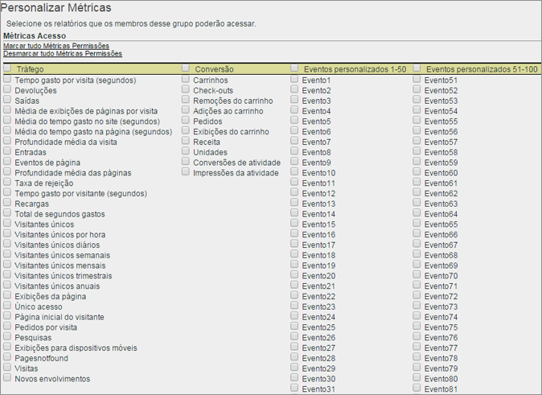

# Personalizar permissões de métricas

>[!IMPORTANT]
>
>O gerenciamento de usuários e de produtos está sendo transferido para o [Admin Console](https://helpx.adobe.com/br/enterprise/using/admin-console.html). A Adobe enviará uma notificação quando for a sua vez de migrar os usuários. Depois que todos os clientes tiverem migrado, o conteúdo da ajuda em **[!UICONTROL Analytics]** > **[!UICONTROL Ferramentas administrativas]** > **[!UICONTROL Gerenciamento de usuários]** será removido.

Ative permissões para métricas de tráfego e de conversão, eventos personalizados, de soluções e sensíveis a conteúdo.

**[!UICONTROL Gerenciamento de usuários]** > **[!UICONTROL Grupos]** > **[!UICONTROL Acesso ao Relatório]** > **[!UICONTROL Métricas]** > **[!UICONTROL Personalizar]**

As configurações da página Personalizar métricas aplicam-se aos conjuntos de relatórios selecionados na página [!UICONTROL Definir grupos de usuários].

## Eventos de soluções

Além de [Eventos personalizados](https://marketing.adobe.com/resources/help/pt_BR/sc/implement/events.html), esta categoria inclui eventos de soluções do Analytics, como Experience Manager (AEM), Advertising Cloud (AMO), Mobile, Vídeo e Social. Todos os grupos personalizados, com qualquer métrica, terão todos os eventos de soluções do Analytics adicionados como novas métricas.

Defina permissões para Eventos personalizados e eventos de soluções do Analytics (AEM, AMO, Mobile, Vídeo e Social).

Todos os grupos personalizados, com qualquer métrica, terão todos os eventos de soluções do Analytics adicionados como novas métricas.

Consulte [Visão geral de métricas](/help/components/c-variables/c-metrics/metricslist.md) para obter informações sobre métricas usadas no Analytics.

## Sensível a conteúdo

A opção Sensível a conteúdo inclui variáveis que permitem gerenciar as permissões em métricas relacionadas a integrações de soluções da Experience Cloud. Gerencie permissões em dados do [!DNL Social], [!DNL Mobile] ou qualquer outro que tenha sido inserido por meio de uma integração [!DNL Experience Cloud]. Eles serão ativados por padrão.
