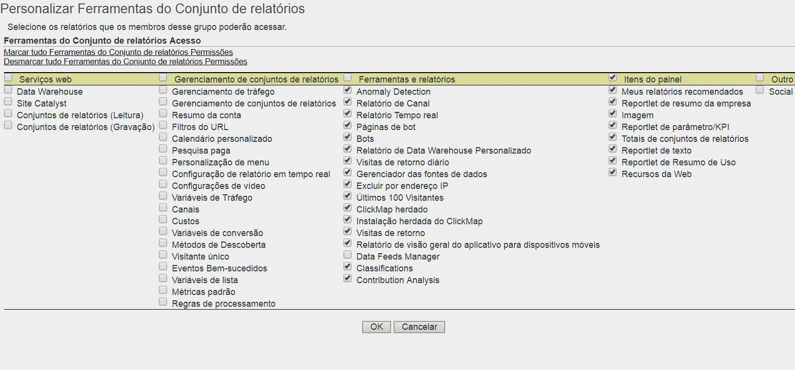

# Personalizar permissões de ferramentas do Conjunto de relatórios

>[!IMPORTANT]
>
>User and product management is moving to the [Admin Console](https://helpx.adobe.com/enterprise/using/admin-console.html). A Adobe enviará uma notificação quando for a sua vez de migrar os usuários. After all customers have migrated, help content for **[!UICONTROL Analytics]** &gt; **[!UICONTROL Admin Tools]** &gt; **[!UICONTROL User Management]** will be retired.

Ative permissões do usuário para Acesso à API, Gerenciamento de conjuntos de relatórios, Ferramentas e relatórios, além de Itens do painel.

**[!UICONTROL Gerenciamento de usuários]** &gt; **[!UICONTROL Grupos]** &gt; Acesso **[!UICONTROL ao Relatório]** &gt; **[!UICONTROL Ferramentas do Conjunto de relatórios]** &gt; **[!UICONTROL Personalizar]**

A página [!UICONTROL Personalizar ferramentas do Conjunto de relatórios] concede aos membros de um grupo acesso aos seguintes itens.

## Descrições de campo

As configurações desta página pertencem aos conjuntos de relatórios selecionados na página [!UICONTROL Definir grupos de usuários].

| Elemento | Descrição |
|--- |--- |
| **Serviços Web** |  |
| Essas configurações permitem aos usuários fazer chamadas para o método do Data Warehouse e extrair configurações de conjuntos de relatórios. |  |
| Data Warehouse | Permite que um usuário não administrativo faça chamadas usando os métodos do Data Warehouse por meio da API de serviços da Web. See [Data Warehouse - Developer Documentation](/help/export/data-warehouse/data-warehouse.md) |
| Conjuntos de relatórios (Leitura) | Permite que um usuário não administrativo use os métodos do conjunto de relatórios na API. |
| Conjuntos de relatórios (Gravação) | Permite que um usuário não administrativo use os métodos do conjunto de relatórios na API. |
| **Gerenciamento de conjuntos de relatórios** |  |
| These settings grant access to the menu items in  Admin &gt;  Report Suites  &gt;  Edit Settings ([Report Suite Manager](../../../admin/c-manage-report-suites/report-suites-admin.md)). |  |
| [Gerenciamento de tráfego](../../../admin/c-traffic-management/traffic-management.md) | Concede permissão para o Gerenciamento de tráfego. |
| [Gerenciamento de conjuntos de relatórios](../../../admin/c-manage-report-suites/report-suites-admin.md) | Concede permissão para gerenciar conjuntos de relatórios. |
| [Resumo da conta](../../../admin/admin/general-acct-settings-admin.md) | Concede permissão para editar configurações da conta de um conjunto de relatórios. |
| [Filtros do URL](../../../admin/admin/internal-url-filter-admin.md) | Concede permissão para Filtros internos do URL em conjuntos de relatórios. Os Filtros internos do URL são usados para determinar quais referenciadores, ou páginas referenciadoras, são internos ao seu site. |
| [Calendário personalizado](../../../admin/admin/custom-calendar.md) | Concede permissão para editar o calendário personalizado. |
| [Pesquisa paga](https://marketing.adobe.com/resources/help/en_US/reference/paid_search_detection.html) | A Detecção de pesquisa paga diferencia pesquisas pagas das naturais nos Mecanismos de pesquisa e nos relatórios de Palavras-chave de pesquisa. |
| [Personalização de menu](../../../admin/admin/customize-menus.md) | Personalize os menus de relatório que o usuário vê em Reports &amp; Analytics. |
| [Configuração de relatórios em tempo real](../../../admin/admin/realtime/t-realtime-admin.md) | Permissões para configurar relatórios em tempo real no Analytics. |
| [Configurações de vídeo](../../../admin/admin/video-management.md) | Permissões para designar um conjunto de Variáveis de conversão (eVars) personalizadas e Eventos personalizados para uso em rastreamento e relatórios em vídeo. |
| [Classificações de vídeo](https://marketing.adobe.com/resources/help/en_US/sc/appmeasurement/video/video_config.html) | Permissões para designar um conjunto de Variáveis de conversão (eVars) personalizadas e Eventos personalizados para uso em rastreamento e relatórios em vídeo. |
| [Variáveis de tráfego](../../../admin/admin/c-traffic-variables/traffic-var.md) | Permissão para correlacionar dados personalizados com eventos específicos relacionados ao tráfego. |
| [Classificações de tráfego](/help/admin/admin/c-traffic-variables/traffic-classifications.md) | Consolidado em Classificações (em Ferramentas e Relatórios). |
| [Canais](https://marketing.adobe.com/resources/help/en_US/mchannel/index.html) | Concede permissão para configurações de Canal de marketing em Gerenciador de conjunto de relatórios &gt; Editar configurações &gt; Canais de marketing. |
| [Custos](https://marketing.adobe.com/resources/help/en_US/mchannel/c_overview_budget.html) | Ativa a permissão para Canais de marketing &gt; Custos de canal de marketing no Gerenciador de conjunto de relatórios. |
| [Variáveis de conversão](../../../admin/admin/conversion-var-admin/conversion-var-admin.md) | A variável de conversão do Custom insight (ou eVar) é colocada no código da Adobe em páginas da Web selecionadas do site. Seu propósito principal é segmentar métricas de sucesso de conversão em relatórios de marketing personalizados. |
| [Métodos de descoberta](../../../admin/admin/finding-methods.md) | Permite identificar como os vários relatórios de métodos de descoberta recebem créditos relativos a eventos de sucesso de conversão no seu site. |
| [Classificações de conversão](../../../admin/admin/conversion-var-admin/conversion-classifications.md) | Consolidado em Classificações (em Ferramentas e Relatórios). |
| [Visitante único](https://marketing.adobe.com/resources/help/en_US/reference/t_unique_visitor_variable.html) | Concede permissão para especificar a variável Visitante único. |
| [Eventos bem-sucedidos](https://marketing.adobe.com/resources/help/en_US/reference/success_event.html) | Ações que podem ser rastreadas, como exibição do produto, check-out e compra. |
| [Hierarquias de classificação](../../../components/c-classifications2/classification-hierarchies.md) | Consolidado em Classificações (em Ferramentas e Relatórios). |
| [Variáveis da lista](https://marketing.adobe.com/resources/help/en_US/sc/implement/listN.html) | Também conhecidas como List Var. Semelhante ao modo de funcionamento de Propriedades de lista, a List Vars permite vários valores na mesma solicitação de imagem. |
| [Métricas padrão](../../../admin/admin/default-metrics.md) | O Reports &amp; Analytics exibe um conjunto padrão de métricas em todos os relatórios de conversão, exceto quando um usuário seleciona um conjunto personalizado de métricas. As métricas selecionadas são exibidas para todos os usuários do conjunto de relatórios associado. |
| [Regras de processamento](https://marketing.adobe.com/resources/help/en_US/sc/implement/ref-processing-rules.html) | Concede acesso às Regras de processamento, que simplificam a coleta de dados e gerenciam o conteúdo conforme é enviado para os relatórios. |
| **Ferramentas e relatórios** |  |
| [Detecção de anomalias](https://marketing.adobe.com/resources/help/en_US/analytics/analysis-workspace/anomaly_detection.html) | Concede permissão para Detecção de anomalias, que oferece um método estatístico para determinar como determinada métrica foi alterada em relação a dados anteriores. |
| [Relatório de Canal](https://marketing.adobe.com/resources/help/en_US/mchannel/index.html) | Concede permissão para relatórios de Canal de marketing, encontrados em Relatórios &gt; Relatórios do canal de marketing. |
| [Relatório em tempo real](../../../admin/admin/realtime/t-realtime-admin.md) | Concede acesso ao Relatório em tempo real. |
| [Páginas de bot](../../../admin/admin/bot-rules/bot-rules.md#concept_A306689C65EB4D0F9AE65E3FD48ED5F7) | As regras de bot permitem que você remova o tráfego que é gerado pelos spiders e bots conhecidos de seu conjunto de relatórios. A remoção do tráfego de bot pode proporcionar uma medida mais precisa da atividade do usuário em seu site. |
| [Bots](../../../admin/admin/bot-rules/bot-rules.md) | As regras de bot permitem que você remova o tráfego que é gerado pelos spiders e bots conhecidos de seu conjunto de relatórios. A remoção do tráfego de bot pode proporcionar uma medida mais precisa da atividade do usuário em seu site. |
| [Relatório de Data Warehouse Personalizado](../../..//export/data-warehouse/data-warehouse.md) | O Data warehouse refere-se à cópia de dados brutos não processados para armazenamento e relatórios personalizados, que podem ser executados ao filtrar os dados. Você pode solicitar relatórios para exibir relações de dados avançadas a partir de dados brutos com base em suas perguntas exclusivas. |
| [Visitas de Retorno Diário](../../../components/c-variables/dimensionslist/reports-daily-return-visits.md) | (Herdado) Relatório que exibe o número de visitantes no seu site mais de uma vez em um dia específico. Um dia é definido como o último período de 24 horas. |
| [Gerenciador das fontes de dados](../../../admin/admin/data-sources.md) | O recurso Fontes de dados permite importar dados para o Analytics de fontes offline. |
| [Excluir por endereço IP](../../../admin/admin/exclude-ip.md) | É possível excluir dos seus relatórios alguns dados de endereços IP específicos, como atividades internas, testes e uso de sites por funcionário. |
| ClickMap herdado | Concede acesso ao menu para a ferramenta de sobreposição ClickMap herdado. |
| Instalação do ClickMap herdado | Concede direitos de instalação para a ferramenta ClickMap herdado. |
| [Visitas de Retorno](../../../components/c-variables/dimensionslist/reports-return-visits.md) | Um relatório que mostra o número de visitas, em que o no número de visitas for maior que 1. O Relatório de visitas de retorno inclui os visitantes sem cookies. |
| [Importador / exportador de classificações](https://marketing.adobe.com/resources/help/en_US/reference/c_working_with_saint.html) e [Construtor de regras](https://marketing.adobe.com/resources/help/en_US/reference/classification_rule_builder.html) | Consolidado em classificações (veja abaixo). |
| Gerenciador de feeds de dados | Concede direitos a Feed de dados do Analytics. |
| Classificações | Combina as seguintes permissões: «Classificações de tráfego», «Classificações de vídeo», «Classificações de conversão», «Hierarquias de classificação», «Gerenciador de classificações» e «Importador de classificações/Exportador e Construtor de regras». Observação: com essa permissão, usuários editam classificações para todos os conjuntos de relatórios, não somente os selecionados. |
| [Análise de contribuição](https://marketing.adobe.com/resources/help/en_US/analytics/analysis-workspace/contribution-analysis.html) | Concede direitos de uso à Análise de contribuição na Analysis Workspace. |
| **Itens do painel** |  |
| The settings in Dashboard Items enables access to [reportlets](https://marketing.adobe.com/resources/help/en_US/sc/user/dashboard.html) in Reports &amp; Analytics:, My Recommended Reports, Company Summary Reportlet, Image, KPI/Gauge Reportlet, Report Suite Totals, Text, Reportlet, Usage Summary Reportlet, and Web Resources |  |
| **Outro** |  |
| Social | Controla o acesso ao menu Gerenciamento social no Gerenciador de conjunto de relatórios. |
