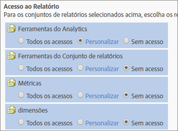
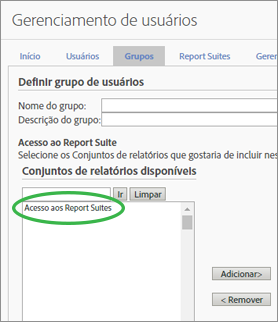

# Mudanças de permissões de usuários e grupos

>[!IMPORTANT]
>
>O gerenciamento de usuários e de produtos está sendo transferido para o [Admin Console](https://helpx.adobe.com/br/enterprise/using/admin-console.html). A Adobe enviará uma notificação quando for a sua vez de migrar os usuários. After all customers have migrated, help content for **[!UICONTROL Analytics]** > **[!UICONTROL Admin Tools]** > **[!UICONTROL User Management]** will be retired.

## O que mudou? {#section_2C205DE94155441B9E9D3E4C46CCF2EE}

**[!UICONTROL Admin]** > **[!UICONTROL User Management]** > **[!UICONTROL Groups]**

>[!NOTE] Devido ao alto número de combinações de permissões possíveis disponíveis, não podemos oferecer uma documentação que descreva todos os métodos de API que podem ser usados em todas as combinações de permissões. Geralmente, os não administradores aos quais é concedido acesso aos Serviços da Web terão somente acesso de Leitura aos métodos da API. Eles não terão acesso de Gravação aos métodos.

Como a API e a interface usam o mesmo sistema de permissão, quaisquer permissões que um administrador específico que não seja administrador tenha sido concedido por um administrador na interface (Adobe Admin Console), serão as mesmas permissões que o usuário tem na API.

<table id="table_D1DB0DE37752450BBCCA44DB760BB505"> 
 <thead> 
  <tr> 
   <th colname="col1" class="entry"> Aprimoramento </th> 
   <th colname="col2" class="entry"> Descrição </th> 
  </tr> 
 </thead>
 <tbody> 
  <tr> 
   <td colname="col1"> 
Mudanças no Acesso ao Relatório (Personalizar grupos) 
 </td> 
   <td colname="col2"> 
  Adicionar novo grupo &gt; Acesso ao Relatório 
 
A seção Acesso ao Relatório da página Definir grupo de usuários foi redimensionada para quatro categorias, permitindo redimensionar permissões detalhadamente. 
 
 </img> 
 
Os itens que antes estavam em 
 
    <ul id="ul_16D5EF18D57D4608AEEDEC40D90D8828"> 
     <li id="li_F29E84C6228A464C8807F09205AEAAC6"> 
 <a href="/help/admin/user-management2/c-customize-report-access/groups-analytics-tools.md"> Ferramentas do Analytics</a>: ative as permissões do usuário para obter integração a itens Gerais (faturamento, logs etc.), Gerenciamento da empresa, Ferramentas, Acesso a serviços da Web, Report Builder e Data Connectors. 
 
 <b>Observação:</b> as configurações da empresa feitas na categoria Personalizar o Admin Console foram movidas para as Ferramentas do Analytics. 
 </li> 
     <li id="li_A6EB788162A2455E94CE54B9279A854D"> 
 <a href="/help/admin/user-management2/c-customize-report-access/groups-report-suite-tools.md"> Ferramentas do Conjunto de relatórios</a>: ative permissões do usuário para Serviços da Web, Gerenciamento de conjuntos de relatórios, Ferramentas e relatórios, além de Itens do painel. 
 </li> 
     <li id="li_EDB0255E009B4F1CAFAF53966B41363C"> 
 <a href="/help/admin/user-management2/c-customize-report-access/groups-metrics.md"> Métricas</a>: ative permissões para eventos de tráfego, conversão, personalizados, de soluções e sensíveis a conteúdo, entre outros. 
 </li> 
     <li id="li_8DAE87D1DEF54803A9C6FE31C01F0FB0"> 
 <a href="/help/admin/user-management2/c-customize-report-access/groups-dimensions.md"> Dimensões</a>: personalize detalhadamente o acesso dos usuários, inclusive a eVars e relatórios de tráfego, de soluções e de definição de caminho. 
 </li> 
    </ul> 
Por exemplo, você pode criar um grupo com acesso a várias ferramentas do Analytics, (Analysis Workspace, Reports &amp; Analytics e Report Builder), com permissão para métricas e dimensões específicas (inclusive eVars), e também para recursos como criação de segmentos ou métricas calculadas. 
 </td> 
  </tr> 
  <tr> 
   <td colname="col1"> 
Alterações em grupos predefinidos 
 </td> 
   <td colname="col2"> 
 <b>Acesso do administrador:</b> Grupos predefinidos não são mais necessários para administradores. Os administradores agora têm acesso a todos os itens (ferramentas, métricas, dimensões), bem como ao serviço da Web, ao Construtor de relatórios, ao Mapa de Atividades e à Análise ad hoc. 
 
A finalidade dos grupos é conceder ou restringir o acesso a usuários não administrativos. 
 
 <b>Grupos personalizados:</b> Os grupos personalizados substituíram os predefinidos. Os grupos predefinidos existentes serão migrados para grupos personalizados, usando o mesmo nome de grupo. Todos os grupos personalizados criados, incluindo suas configurações, serão preservados. No entanto, você observará que o local das configurações foi movido. Por exemplo, as Configurações da empresa (em Personalizar Admin Console) agora estão em <a href="/help/admin/user-management2/c-customize-report-access/groups-analytics-tools.md"> Personalizar ferramentas do Analytics</a>. 
 
 Os usuários que pertencem a  Acesso a todos os relatórios foram migrados para um grupo personalizado com acesso a: 
 
    <ul id="ul_696A9243F5FD4AF187352C2F4B1CFDC2"> 
     <li id="li_683A0A3BB7214CFFBC61D5A4CD237F48">Todas as dimensões </li> 
     <li id="li_D8FDBF6A32224731AB706315DEA0A03E">Todas as métricas </li> 
     <li id="li_65ABE5C95D43444D88E63EE95C9AED05">Todos os Report Suites </li> 
     <li id="li_7ED1505590144B38B3B9851BAA6BBB49">Relatório de Canal Permissão </li> 
     <li id="li_F718FE1FCF9A4B05AB933CA3F105F3EC">Permissão para relatório de detecção de anomalias </li> 
     <li id="li_527BD52007E846FE8B5F71AB3C12F695">Permissão para relatórios em tempo real </li> 
     <li id="li_AFFB58C7FB644AC8A85E2D76BA7D51F5">Permissão de acesso à área de trabalho de Análise </li> 
    </ul> 
Os administradores podem excluir grupos personalizados e criar os seus próprios, pois todas as configurações antes disponíveis nos grupos predefinidos continuam aceitando personalização nas configurações de Acesso ao relatório em <a href="/help/admin/user-management2/c-user-groups/groups.md">Definir grupos de usuários</a>. 
 </td> 
  </tr> 
  <tr> 
   <td colname="col1"> 
Permissões no nível de dimensão 
 </td> 
   <td colname="col2"> 
Você pode personalizar permissões para incluir ou excluir o acesso a dimensões (além de métricas). 
 
    <ul id="ul_DA5A54223673474E9151AF979DA50659"> 
     <li id="li_C3E82F7BC07A4F2F83A85D3D511292CC"> 
Todas as dimensões e métricas atuais em grupos personalizados foram automaticamente migradas para as novas categorias. Se um grupo existente tiver métricas ativadas, todas as novas dimensões (eVars e sensíveis ao conteúdo) e métricas serão atribuídas por padrão. 
 </li> 
     <li id="li_CC56F9181CC14AB59318628E72F2E8C9"> Permissões do Importador de classificações (antigo SAINT): o acesso a classificações é determinado pelo acesso à <a href="https://marketing.adobe.com/resources/help/pt_BR/reference/c_classifications.html">variável</a> em que se baseia a classificação. </li> 
    </ul> 
Consulte <a href="/help/admin/user-management2/c-customize-report-access/groups-dimensions.md">Personalizar permissões de dimensão</a>. 
 </td> 
  </tr> 
  <tr> 
   <td colname="col1"> 
Admin Console 
 </td> 
   <td colname="col2"> 
Recomendado somente para clientes novos ou com empresas <a href="https://marketing.adobe.com/resources/help/pt_BR/mcloud/core_services.html">provisionadas na Experience Cloud</a>. Há planos para a migração dos atuais clientes do Analytics para o sistema de gerenciamento de identidade da Experience Cloud. 
 
Mais informações disponíveis em <a href="https://helpx.adobe.com/br/enterprise/using/manage-permissions-and-roles.html"> Gerenciar permissões de produto no Admin Console</a>. 
 </td> 
  </tr> 
 </tbody> 
</table>

## Perguntas frequentes sobre mudanças nas permissões {#section_02809EFC95054B40A089E6C6E4FACA13}

Estas são informações importantes sobre atualizações novas e planejadas e como elas afetam seu ambiente administrativo.

<table id="table_1E93F45C66E841E6882FB602509F30A3"> 
 <thead> 
  <tr> 
   <th colname="col1" class="entry"> Pergunta </th> 
   <th colname="col2" class="entry"> Resposta </th> 
  </tr> 
 </thead>
 <tbody> 
  <tr> 
   <td colname="col1">Que mudanças de permissões ocorreram na versão <b>de julho de 2016</b> ? </td> 
   <td colname="col2"> 
 <b>Acesso aos Conjuntos de relatórios</b> 
 
Ao adicionar conjuntos de relatórios para inclusão em um grupo, é possível especificar Acesso a todo o conjunto de relatórios. Esta definição aplica as permissões do grupo a todos os conjuntos de relatórios atuais e futuros. 
 
Para ativar este recurso, vá até Gerenciamento de usuários &gt; Grupos &gt; Adicionar novo grupo de usuários e selecione Acesso a todo o conjunto de relatórios. 
 
 
 </td> 
  </tr> 
  <tr> 
   <td colname="col1"> 
Devo usar o Admin Console ou o Gerenciamento de usuários já existente do Analytics para gerenciar usuários? 
 </td> 
   <td colname="col2"> 
As mudanças feitas em Analytics &gt; Administração &gt; Gerenciamento de usuários não se refletem no Admin Console. Sendo assim, somente os novos clientes que já usam o Admin Console para gerenciamento de usuários e grupos devem continuar a fazê-lo. Há planos para a migração do atual gerenciamento de grupos do Analytics para o Admin Console. 
 </td> 
  </tr> 
  <tr> 
   <td colname="col1"> 
Que mudanças de Permissões foram feitas na versão de <b>outubro de 2016</b>? 
 </td> 
   <td colname="col2"> 
Estarão disponíveis os seguintes aprimoramentos da atual interface de Ferramentas administrativas: 
 
 
     <ul id="ul_2A31E8DC17A94B7FABDBA9C87C3947EF"> 
      <li id="li_AE2ECCA01CC64D30B109BE74379EE474">Alterações de permissão conforme descrito em <a href="/help/admin/user-management2/c-user-management/permissions-changes.md"> Mudanças administrativas - Último trimestre de 2016</a>. </li> 
      <li id="li_33CB2B6A2E5F45BE97CC5E0983AF280E">Foram removidos relatórios de tráfego extintos que não apareciam mais no menu. </li> 
      <li id="li_57234CF27E1D405987DE89312CD62C52">Permissões de classificações: o acesso a classificações será determinado pelo acesso à variável relativa à classificação. </li> 
     </ul> 
 </td> 
  </tr> 
  <tr> 
   <td colname="col1"> 
Há alguma coisa que eu precise fazer para migrar usuários? 
 </td> 
   <td colname="col2"> 
Não, todas as migrações de permissões ocorrerão de forma transparente. 
 
 
     <ul id="ul_654F85286EC04416B3E0BA725EBE10AD"> 
      <li id="li_8050B8941F794103B82A0ADF0930D216">Todos os relatórios de tráfego atuais em um Grupo personalizado serão automaticamente migrados para a nova Categoria de Dimensão. </li> 
      <li id="li_B97079DB29A346B98D066F11AB7F94AF">Se um Grupo personalizado tiver alguma métrica já ativada, ele receberá automaticamente todas as novas dimensões permissíveis (variáveis eVars e Solução). </li> 
      <li id="li_F1219EF490DA473BA15F2B215F2995AE"> Um grupo personalizado com pelo menos uma métrica receberá automaticamente acesso a todas as eVars e outras dimensões sensíveis ao conteúdo, <b>exceto</b> as novas dimensões de tráfego disponíveis (anteriormente, relatórios de tráfego). </li> 
      <li id="li_F494CE6144A04A6199CFBBA1D7BEA32B">Todos os grupos predefinidos serão alterados para uma permissão. Estas novas permissões serão adicionadas a uma nova categoria de Ferramentas do Analytics. </li> 
      <li id="li_2FCD9254FC3C4FD7871EEF9453E5CE1E">Todos os grupos personalizados com qualquer métrica terão todos os eventos de soluções do Analytics adicionados como novas métricas. </li> 
      <li id="li_34C4560769B64F28A4E83BAE71065DCC">Todos os usuários que antes estavam em Todo acesso a relatório serão adicionados ao novo grupo personalizado. Todo o acesso ao relatório não existirá mais. </li> 
     </ul> 
 </td> 
  </tr> 
  <tr> 
   <td colname="col1"> 
O que não mudará? 
 </td> 
   <td colname="col2"> 
Os Atributos do Visitante continuarão sem permissão. 
 </td> 
  </tr> 
 </tbody> 
</table>

## Referência rápida de permissões {#section_A3FDD8259F524B21A5489833533D1B28}

A tabela a seguir lista tarefas e onde elas podem ocorrer (dependendo do status da empresa).

>[!NOTE] Um *`migrated user`* e *`Experience Cloud user`* se referem a usuários que aceitaram um convite feito por email para se associar à Experience Cloud. Se esse convite não for aceito, os usuários permanecerão no Analytics e não poderão ser gerenciados no Admin Console. (A exceção é se a migração estiver usando IDs corporativas ou federadas. Nesse caso, o usuário é migrado quando o administrador migra usuários individualmente.)

<table id="table_B68FD00FC5D24823A86BB69558C0327C"> 
 <thead> 
  <tr> 
   <th colname="col1" class="entry"> Tarefa </th> 
   <th colname="col2" class="entry"> Empresa de logon de não migração </th> 
   <th colname="col3" class="entry"> Migração de Empresa no momento </th> 
   <th colname="col4" class="entry"> Empresa de logon de migração concluída </th> 
  </tr> 
 </thead>
 <tbody> 
  <tr> 
   <td colname="col1"> Criar um usuário </td> 
   <td colname="col2"> 
Admin Console (a criação e a adição de um usuário a uma <a href="https://marketing.adobe.com/resources/help/pt_BR/mcloud/admin_getting_started.html">configuração de produto</a> no Analytics também criam a conta do usuário no Analytics). 
 
 <a href="/help/admin/user-management2/c-user-management/t-add-user-account.md"> Ferramentas administrativas</a> 
 </td> 
   <td colname="col3"> 
 <a href="https://adminconsole.adobe.com/enterprise/">Admin Console</a> 
 </td> 
   <td colname="col4"> 
 <a href="https://adminconsole.adobe.com/enterprise/">Admin Console</a> 
 </td> 
  </tr> 
  <tr> 
   <td colname="col1"> Editar um usuário </td> 
   <td colname="col2"> 
 <a href="/help/admin/user-management2/c-user-management/t-add-user-account.md"> Ferramentas administrativas</a> 
 </td> 
   <td colname="col3"> 
 <a href="https://adminconsole.adobe.com/enterprise/">Admin Console</a> 
 
 Ferramentas administrativas - A edição de usuários migrados nas Ferramentas administrativas limita-se ao gerenciamento de chaves de API e à exclusão / transferência de ativos. 
 </td> 
   <td colname="col4"> 
 <a href="https://adminconsole.adobe.com/enterprise/">Admin Console</a> 
 
 Ferramentas administrativas - A edição é limitada ao gerenciamento de chaves de API e à exclusão/transferência de ativos. 
 </td> 
  </tr> 
  <tr> 
   <td colname="col1"> Excluir um usuário </td> 
   <td colname="col2"> 
Admin Console - Para usuários da Experience Cloud 
 
Ferramentas administrativas - Para todos os usuários, mas para os usuários da Experience Cloud, exclui somente o usuário do Analytics mapeado, não a conta da Experience Cloud. 
 </td> 
   <td colname="col3"> 
Admin Console - Para usuários migrados. 
 
Ferramentas administrativas - Para usuários exclusivos ao Analytics. 
 </td> 
   <td colname="col4"> 
Admin Console 
 
 Ferramentas administrativas - Após excluir um usuário da Experience Cloud ou desvincular sua conta no Admin Console, é possível excluir o logon do Analytics com as Ferramentas administrativas. 
 </td> 
  </tr> 
  <tr> 
   <td colname="col1"> Logon no Analytics </td> 
   <td colname="col2"> 
 <b>Experience Cloud: </b> marketing.  adobe.com. Disponível somente para usuários da Experience Cloud. 
 
 <b>Analytics (herdado):</b> sc.omniture.com. Somente para usuários do Analytics e para usuários da Experience Cloud com credenciais do Analytics 
 </td> 
   <td colname="col3"> 
  marketing.adobe.com - disponível somente para usuários da Experience Cloud. 
 
  sc.omniture.com - Apenas para usuários do Analytics e para usuários da Experience Cloud com credenciais do Analytics. 
 
Durante a migração, os administradores podem desativar o recurso de logon em omniture.com para usuários específicos. 
 </td> 
   <td colname="col4"> 
Admin Console 
 </td> 
  </tr> 
  <tr> 
   <td colname="col1"> Criar um grupo </td> 
   <td colname="col2"> 
Admin Console - Quando um grupo é criado no Admin Console, as Ferramentas administrativas exibem um grupo mapeado no Analytics, mas esse grupo não pode ter seu nome alterado nas Ferramentas administrativas nem ser excluído dali. 
 
Ferramentas administrativas. 
 </td> 
   <td colname="col3"> 
Admin Console (<a href="https://marketing.adobe.com/resources/help/pt_BR/mcloud/admin_getting_started.html">criar configuração de produto</a>) 
 </td> 
   <td colname="col4"> 
Admin Console (<a href="https://marketing.adobe.com/resources/help/pt_BR/mcloud/admin_getting_started.html">criar configuração de produto</a>) 
 </td> 
  </tr> 
  <tr> 
   <td colname="col1"> Editar usuários em um grupo </td> 
   <td colname="col2"> 
Admin Console - Somente para usuários da Experience Cloud 
 
Ferramentas administrativas - É possível editar a associação a grupos de usuários da Experience Cloud e os usuários exclusivos do Analytics nas Ferramentas administrativas. No entanto, se um usuário da Experience Cloud integrar um grupo no Admin Console, não poderá ser removido do grupo nas Ferramentas administrativas. 
 </td> 
   <td colname="col3"> 
Admin Console - Somente usuários da Experience Cloud 
 
 Ferramentas administrativas - Logons exclusivos ao Analytics ainda podem ser adicionados/removidos dos grupos com as Ferramentas administrativas. 
 </td> 
   <td colname="col4"> 
Admin Console 
 </td> 
  </tr> 
  <tr> 
   <td colname="col1"> Editar permissões para um grupo </td> 
   <td colname="col2"> 
Admin Console - Você pode editar grupos criados no Admin Console. 
 
Ferramentas administrativas - É possível editar permissões para qualquer grupo. 
 </td> 
   <td colname="col3"> 
Admin Console 
 </td> 
   <td colname="col4"> 
Admin Console 
 </td> 
  </tr> 
  <tr> 
   <td colname="col1"> Excluir grupo </td> 
   <td colname="col2"> 
Admin Console - você pode excluir somente grupos criados no Admin Console. 
 
Ferramentas administrativas - Só é possível excluir grupos criados nas Ferramentas administrativas. 
 </td> 
   <td colname="col3"> 
Admin Console 
 </td> 
   <td colname="col4"> 
Admin Console 
 </td> 
  </tr> 
  <tr> 
   <td colname="col1"> Mudar o status administrativo do usuário </td> 
   <td colname="col2"> 
Admin Console - somente para usuários da Experience Cloud. 
 
Ferramentas administrativas 
 </td> 
   <td colname="col3"> 
Admin Console - somente para usuários da Experience Cloud. 
 
Ferramentas administrativas - Para usuários exclusivos ao Analytics. 
 </td> 
   <td colname="col4"> 
Admin Console 
 </td> 
  </tr> 
 </tbody> 
</table>
