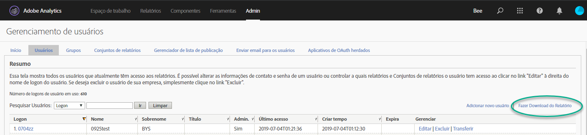
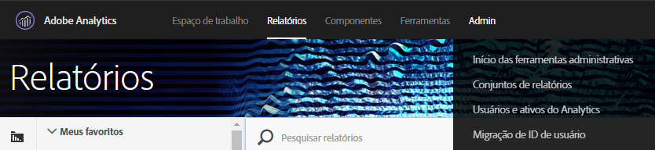
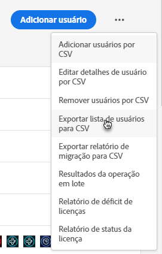
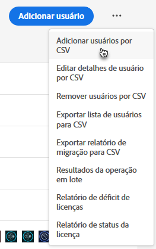
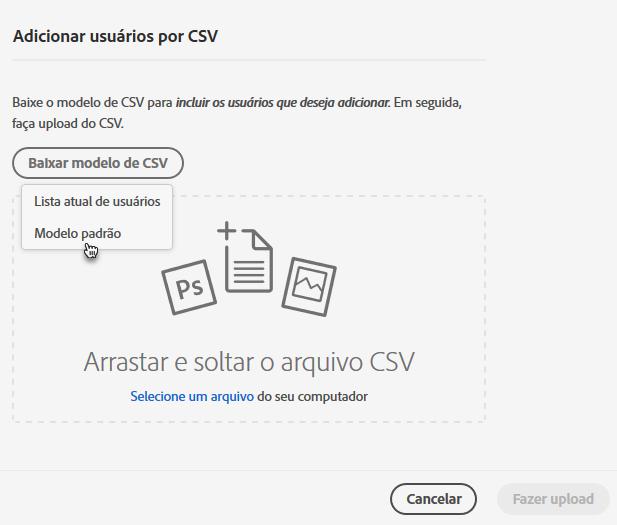
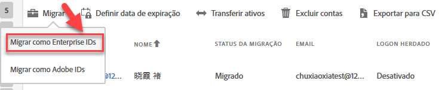

# Migrar contas de usuário do Analytics para Enterprise e Federated IDs{#migrate-analytics-user-accounts-for-enterprise-and-federated-ids}

Como migrar contas de usuário do Analytics como Enterprise ou Federated IDs para o Admin Console.

## Pré-requisitos {#concept-e60d8deb3fc54a1a81f1f47a26658de3}

Pré-requisitos para gerenciar usuários no Admin Console.

Para novos domínios e diretórios, siga os passos para:

* Configurar um diretório
* Configurar domínios
* Vincular domínios em diretórios

Consulte [Configurar um sistema de identidade](https://helpx.adobe.com/enterprise/using/set-up-identity.html) para obter ajuda.

Se um diretório já foi criado em outra organização por outra unidade comercial ou equipe, siga os passos em [confiabilidade de diretório](https://helpx.adobe.com/enterprise/using/set-up-identity.html#Directorytrusting) para estabelecer o diretório na organização que você está usando para o Analytics.

## Migrar contas do usuário para Enterprise e Federated IDs {#task-0cfb3e4400fd4ab58e4d9704528b05fa}

Neste procedimento, você poderá:

* Download a user login list from **[!UICONTROL Analytics]** &gt; **[!UICONTROL Analytics Users &amp; Assets]**.

* Download a current users list from the **[!UICONTROL Admin Console]** &gt; **[!UICONTROL Users]**.

* Compare as listas (procurando por duplicatas para exitar substituir dados da conta no Admin Console).
* Upload a finished [!DNL .csv] (from **[!UICONTROL Admin Console]** &gt; **[!UICONTROL Users]**) with Enterprise ID or Federated ID users to the Admin Console.

Se precisar migrar contas de usuário com Adobe ID para uma Enterprise ID ou Federated ID, contate o Atendimento ao cliente da Adobe e solicite uma [mudança de identidade de usuário em massa](https://helpx.adobe.com/enterprise/using/bulk-operations.html).

**Para migrar contas do usuário**

1. Baixe o arquivo de logins do usuário do Analytics ([!DNL User Logins List.tab]) no Gerenciamento de usuários do Analytics usando um dos seguintes métodos (dependendo se você já migrou os usuários).
   1. *Antes da migração,* navegue até **[!UICONTROL Administrador]** &gt; **[!UICONTROL Gerenciamento de usuários (Herdado)]** &gt; **[!UICONTROL Editar usuários]** e clique **[!UICONTROL em Download do relatório]**.

      

      O link Baixar relatório exibe somente os clientes que não migraram usuários.

   1. *Se você já migrou usuários,* navegue até **[!UICONTROL Analytics]** &gt; **[!UICONTROL Usuários e ativos do Analytics]**.

      

   1. On the [!DNL Users] page, select users, then click **[!UICONTROL Export to CSV]**.

      

   1. Open the downloaded [!DNL User List.csv] file in Excel.

      Be prepared to copy the *`Email`*, *`First Name`*, and *`Last Name`* values to a [!DNL sample.csv] file (described in the next step).

      >[!IMPORTANT]
      >
      >Os valores no arquivo CSV devem ser delimitados por vírgulas.

      **Dica**: durante essa etapa, a Adobe recomenda a simplificação de sua lista de usuários para garantir que apenas os usuários com uma ID de email válido sejam incluídos na migração de Enterprise ou Federated ID.

1. No Admin Console, baixe uma lista de usuários do Admin Console:

   1. Navigate to [Admin Console](http://adminconsole.adobe.html/#) &gt; **[!UICONTROL Users]**, then click [Export users list to CSV](https://helpx.adobe.com/enterprise/using/users.html).

      

   1. Compare the two files: the existing Admin Console users in the exported [!DNL .csv] file ( [!DNL sample.csv], in this example) with the users in the Analytics [!DNL User Logins List.csv] file.

      >[!IMPORTANT]
      >
      >If you find duplicates, delete them from the Analytics [!DNL User Logins List.csv] file. Essa etapa ajuda a impedir a sobreposição de permissões do usuário da Experience Cloud no Admin Console e fornece uma lista de contas para migração.

1. Baixe o modelo CSV no Admin Console:
   1. On the Users tab, click **[!UICONTROL Add users by CSV]**, then **[!UICONTROL Download CSV Template]**.

      

   1. Choose **[!UICONTROL Standard Template]**.

      Esta etapa baixa um arquivo de modelo [!DNL sample.csv].

      

1. Copy the *`Email`*, *`First Name`*, and *`Last Name`* column values from [!DNL User Logins List.tab] to the corresponding columns in the [!DNL sample.csv] template.

   **Exemplo de arquivo do modelo**

   

1. No modelo ([!DNL sample.csv]), preencha os seguintes campos obrigatórios:

<table id="table_1B5EEFDB5BD8436EB760BE5FFAB1CF02"> 
 <thead> 
  <tr> 
   <th colname="col1" class="entry"> Campo </th> 
   <th colname="col2" class="entry"> Descrição </th> 
  </tr>
 </thead>
 <tbody> 
  <tr> 
   <td colname="col1"> 
Email 
 </td> 
   <td colname="col2"> 
Copiado de User Logins List.tab. 
 </td> 
  </tr> 
  <tr> 
   <td colname="col1"> 
Nome 
 </td> 
   <td colname="col2"> 
Copiado de User Logins List.tab. 
 </td> 
  </tr> 
  <tr> 
   <td colname="col1"> 
Sobrenome 
 </td> 
   <td colname="col2"> 
Copiado de User Logins List.tab. 
 </td> 
  </tr> 
  <tr> 
   <td colname="col1"> 
Tipo de identidade 
 </td> 
   <td colname="col2"> 
 Federated ID ou  Enterprise ID. 
 </td> 
  </tr> 
  <tr> 
   <td colname="col1"> 
Domínio 
 </td> 
   <td colname="col2"> 
Verifique se os domínios na  coluna Domínio e  Email correspondem aos domínios estabelecidos nos <a href="../c-migration-tool/migrate-enterprise.md#concept-e60d8deb3fc54a1a81f1f47a26658de3" format="dita" scope="local"> pré-requisitos</a>. 
 </td> 
  </tr> 
  <tr> 
   <td colname="col1"> 
Código do país 
 </td> 
   <td colname="col2"> </td> 
  </tr> 
 </tbody> 
</table>

For more information about the fields in the [!DNL .csv] file, see [CSV file format](https://helpx.adobe.com/enterprise/using/users.html).

>[!NOTE]
>
>Other columns, such as *`Product Configurations`* and *`Admin Roles`* can be blank.

1. On the Users tab in the Admin Console, upload the template file by clicking **[!UICONTROL Add users by CSV]** (as shown in [Step 3](../c-migration-tool/migrate-enterprise.md#step-190321c6025947e38b195daed122c063).).
1. In Analytics, run the migration tool (as described in [Migrate Analytics user accounts](../c-migration-tool/t-migrate-users.md#task-f3355f3b14a340feae58cfa04c0ba1c9)).
1. Click **[!UICONTROL Migrate]** &gt; **[!UICONTROL Migrate as Enterprise IDs]**.

   

   When you click **[!UICONTROL Migrate]**, user are linked to the Enterprise ID/Federated ID account in Admin Console. The permissions of the legacy user account in Analytics will match the permissions granted to the Enterprise/Federated ID login in **[!UICONTROL Admin Console]** &gt; **[!UICONTROL Analytics]** &gt; **[!UICONTROL Product Profiles]**. A ID do usuário exibida no bucket de Migração concluída. Você pode desabilitar o acesso ao [!DNL my.omniture.com] herdado.

   After migrating users, the status under the Migration Status column changes from *`Not Initiated`* to *`Migrated`*.

   Os usuários da Adobe ID que aparecem na ferramenta de migração também podem ser migrados no processo. Eles ainda devem fazer logon com a Adobe ID até a identidade ser trocada. Contate o atendimento ao cliente da Adobe para obter ajuda com uma troca de identidade.
