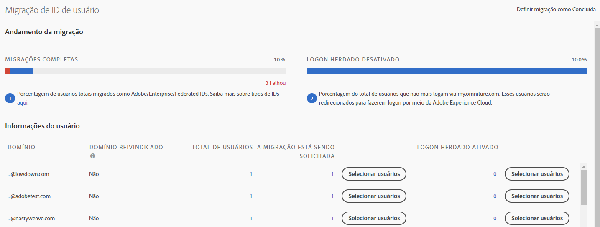
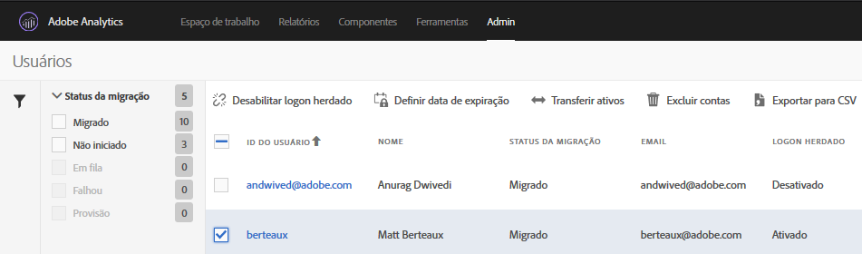

# Migrar contas de usuário do Analytics para Adobe IDs{#migrate-analytics-user-accounts-for-adobe-ids}

Migre usuários do sistema de gerenciamento de usuário herdado do Analytics para o Admin Console.

## Migrar contas de usuário do Analytics para Adobe IDs {#task-f3355f3b14a340feae58cfa04c0ba1c9}

Migre usuários do sistema de gerenciamento de usuário herdado do Analytics para o Admin Console.

>[!NOTE]
>
>Se um administrador não conectado através da Experience Cloud tentar acessar a ferramenta de Migração de ID de usuário, ele será redirecionado para a página de logon da Experience Cloud.

**Para migrar usuários do Analytics**

1. Navegue até **Analytics** &gt; **[!UICONTROL Admin]** &gt; **[!UICONTROL Migração de ID de usuário]**.

   

   A página de Migração da ID do usuário tem duas seções: *Processo de migração* e *Informações do usuário*.

   **Andamento da migração**

<table id="table_F9F1CFF762C745E198CB075A02BA2DDA"> 
 <thead> 
  <tr> 
   <th colname="col1" class="entry"> Fase </th> 
   <th colname="col2" class="entry"> Descrição </th> 
  </tr>
 </thead>
 <tbody> 
  <tr> 
   <td colname="col1"> 
Migrações concluídas 
 </td> 
   <td colname="col2"> 
Os usuários aceitaram o convite. 
 </td> 
  </tr> 
  <tr> 
   <td colname="col1"> 
Logon herdado desabilitado 
 </td> 
   <td colname="col2"> 
O logon antigo que usa uma ID da empresa está desativado. Os usuários passarão a acessar a Experience Cloud usando uma Adobe ID ou uma Enterprise ID. Quando todos os usuários atingirem essa fase, você terá concluído a migração. 
 
Na migração, o logon antigo está desativado. Users are redirected to  experiencecloud.adobe.com and must log in using the Adobe ID or Enterprise ID. 
 
See <a href="../c-migration-tool/t-disable-legacy-login.md#task-c9262e469814473c8a3ff3971c95570b" format="dita" scope="local"> Disable Legacy Logins</a> for more information. 
 </td> 
  </tr> 
 </tbody> 
</table>

**Informações do usuário**

As informações do usuário descrevem os usuários em sua organização, separados por nome de domínio.

<table id="table_3822E27AF81E4A188562FEB5131548A5"> 
 <thead> 
  <tr> 
   <th colname="col1" class="entry"> Elemento </th> 
   <th colname="col2" class="entry"> Descrição </th> 
  </tr>
 </thead>
 <tbody> 
  <tr> 
   <td colname="col1"> 
Domínio 
 </td> 
   <td colname="col2"> 
Os domínios são específicos das IDs de email da base de usuários atual do Analytics. Um domínio pode ser reivindicado apenas por uma única organização, e somente os administradores de sistema podem reivindicar um domínio. Para obter mais informações, consulte <a href="https://helpx.adobe.com/enterprise/help/request-access-to-claimed-domain.html" format="html" scope="external">Solicitar acesso a um domínio reivindicado</a>. 
 </td> 
  </tr> 
  <tr> 
   <td colname="col1"> 
Domínio reivindicado 
 </td> 
   <td colname="col2"> 
Caso deseje migrar os usuários como Enterprise ou Federated IDs, você deve ser um Administrador do sistema e reivindicar um domínio disponível pelo Admin Console antes de migrar os usuários. Saiba mais <a href="https://helpx.adobe.com/enterprise/help/identity.html" format="html" scope="external">aqui</a>. 
 
Se você não deseja reivindicar domínios para Enterprise or Federated IDs, ignore este passo e migre os usuários como Adobe IDs. Saiba mais sobre os tipos de IDs <a href="https://helpx.adobe.com/enterprise/help/identity.html" format="html" scope="external">aqui</a>. 
 </td> 
  </tr> 
 </tbody> 
</table>

1. Locate the domain containing the user IDs you want to migrate, then, under **[!UICONTROL Requiring Migration]**, click **[!UICONTROL Select Users]**.
1. On the [!DNL Users] page, select the users you want to migrate, then click **[!UICONTROL Migrate]**.

   When you click **[!UICONTROL Migrate]**, users receive an invitation (Migration Initiated) and must accept it. Essa ação mova a ID do usuário para Migração concluída. É possível desativar o acesso herdado para [!DNL my.omniture.com].

   

1. Especifique o tipo de ID para a qual você deseja migrar a ([Adobe ID ou Enterprise ID](https://helpx.adobe.com/enterprise/help/identity.html)) dos usuários. 

   After migrating users, the status under the column Migration Status changes from *`Not Initiated`* to *`Migrated`*.

   If *`Failed`* displays, hover over the icon for a description about why the migration failed.
