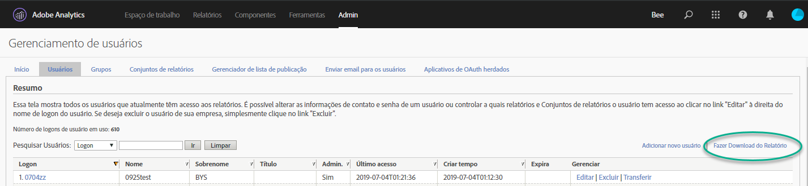
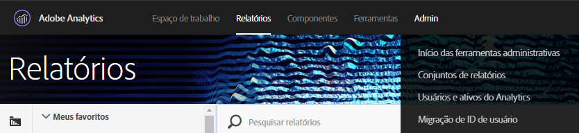
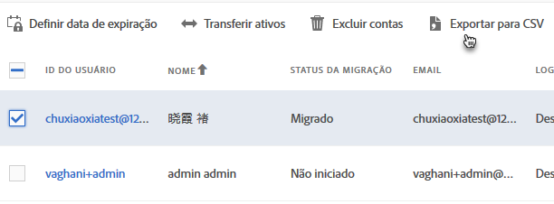
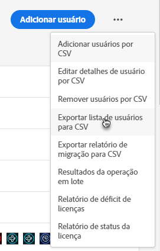
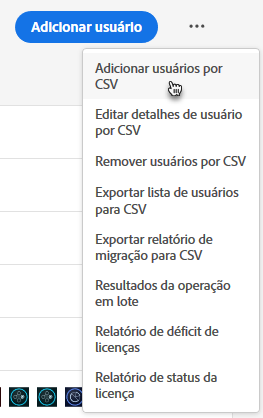
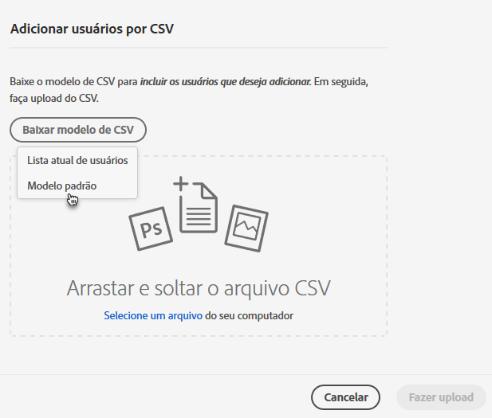
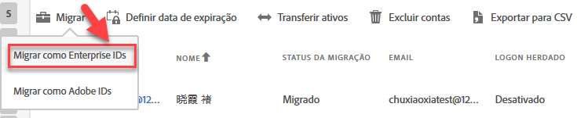

# Migrar contas de usuário do Analytics para Enterprise e Federated IDs {#migrate-analytics-user-accounts-for-enterprise-and-federated-ids}

Como migrar contas de usuário do Analytics como Enterprise ou Federated IDs para o Admin Console.

## Pré-requisitos {#prereqs}

Pré-requisitos para gerenciar usuários no Admin Console.

Para novos domínios e diretórios, siga os passos para:

* Configurar um diretório
* Configurar domínios
* Vincular domínios em diretórios

Consulte [Configurar um sistema de identidade](https://helpx.adobe.com/enterprise/using/set-up-identity.html) para obter ajuda.

Se um diretório já foi criado em outra organização por outra unidade comercial ou equipe, siga os passos em [confiabilidade de diretório](https://helpx.adobe.com/enterprise/using/set-up-identity.html#Directorytrusting) para estabelecer o diretório na organização que você está usando para o Analytics.

## Migrar contas do usuário para Enterprise e Federated IDs  {#task-0cfb3e4400fd4ab58e4d9704528b05fa}

Neste procedimento, você poderá:

* Baixar uma lista de logon do usuário em **[!UICONTROL Analytics]** &gt; **[!UICONTROL Usuários e ativos do Analytics]**.

* Baixar uma lista de usuários atuais em **[!UICONTROL Admin Console]** &gt; **[!UICONTROL Usuários]**.

* Compare as listas (procurando por duplicatas para exitar substituir dados da conta no Admin Console).
* Carregue um [!DNL .csv] concluído (em **[!UICONTROL Admin Console]** &gt; **[!UICONTROL Usuários]**) com Enterprise ID ou Federated ID de usuários para o Admin Console.

Se precisar migrar contas de usuário com Adobe ID para uma Enterprise ID ou Federated ID, contate o Atendimento ao cliente da Adobe e solicite uma [mudança de identidade de usuário em massa](https://helpx.adobe.com/enterprise/using/bulk-operations.html).

**Para migrar contas do usuário**

1. Baixe o arquivo de logins do usuário do Analytics ([!DNL User Logins List.tab]) no Gerenciamento de usuários do Analytics usando um dos seguintes métodos (dependendo se você já migrou os usuários).
   1. *Antes de migrar,* acesse **[!UICONTROL Administração]** &gt; **[!UICONTROL Gerenciamento de usuários (herdado)]** &gt; **[!UICONTROL Editar usuários]** e clique em **[!UICONTROL Baixar relatório]**.

      

      O link Baixar relatório exibe somente os clientes que não migraram usuários.

   1. *Se você já migrou usuários,* acesse **[!UICONTROL Analytics]** &gt; **[!UICONTROL Usuários e ativos do Analytics]**.

      

   1. Na página [!DNL Users], selecione os usuários e, em seguida, clique em **[!UICONTROL Exportar para CSV]**.

      

   1. Abra o arquivo [!DNL User List.csv] baixado no Excel.

      Esteja preparado para copiar os valores *`Email`*, *`First Name`* e *`Last Name`* para um arquivo [!DNL sample.csv] (descrito na próxima etapa).

      > [!IMPORTANT] Os valores no arquivo CSV devem ser delimitados por vírgulas.

      > [!TIP] Durante essa etapa, a Adobe recomenda a simplificação de sua lista de usuários para garantir que apenas os usuários com uma ID de email válida sejam incluídos na migração de Enterprise ou Federated ID.

1. In the [!UICONTROL Admin Console], download a list of Admin Console users:

   1. Acesse [!UICONTROL Admin Console] &gt; **[!UICONTROL Usuários]** e, em seguida, clique em [Exportar a lista de usuários para CSV](https://helpx.adobe.com/enterprise/using/users.html).

      

   1. Compare os dois arquivos: os usuários existentes do Admin Console no arquivo [!DNL .csv] exportado ([!DNL sample.csv], neste exemplo) com os usuários no arquivo [!DNL User Logins List.csv] do Analytics.

      > [!IMPORTANT] Caso encontre duplicatas, exclua todas no arquivo [!DNL User Logins List.csv] do Analytics. Essa etapa ajuda a impedir a sobreposição de permissões do usuário da Experience Cloud no Admin Console e fornece uma lista de contas para migração.

1. Baixe o modelo CSV no Admin Console:
   1. Na guia Usuários, clique em **[!UICONTROL Adicionar usuários ao CSV]** e **[!UICONTROL Baixar modelo CSV]**.

      

   1. Selecione **[!UICONTROL Modelo padrão]**.

      Esta etapa baixa um arquivo de modelo [!DNL sample.csv].

      

1. Copie os valores de coluna *`Email`*, *`First Name`* e *`Last Name`* de [!DNL User Logins List.tab] para as colunas correspondentes no modelo [!DNL sample.csv].

   **Exemplo de arquivo do modelo**

   

1. No modelo ([!DNL sample.csv]), preencha os seguintes campos obrigatórios:

<table id="table_1B5EEFDB5BD8436EB760BE5FFAB1CF02"> 
 <thead> 
  <tr> 
   <th colname="col1" class="entry"> Campo </th> 
   <th colname="col2" class="entry"> Descrição </th> 
  </tr>
 </thead>
 <tbody> 
  <tr> 
   <td colname="col1"> 
Email 
 </td> 
   <td colname="col2"> 
Copiado de User Logins List.tab. 
 </td> 
  </tr> 
  <tr> 
   <td colname="col1"> 
Nome 
 </td> 
   <td colname="col2"> 
Copiado de User Logins List.tab. 
 </td> 
  </tr> 
  <tr> 
   <td colname="col1"> 
Sobrenome 
 </td> 
   <td colname="col2"> 
Copiado de User Logins List.tab. 
 </td> 
  </tr> 
  <tr> 
   <td colname="col1"> 
Tipo de identidade 
 </td> 
   <td colname="col2"> 
 Federated ID ou  Enterprise ID. 
 </td> 
  </tr> 
  <tr> 
   <td colname="col1"> 
Domínio 
 </td> 
   <td colname="col2"> 
Verifique se os domínios na  As colunas  Domínio e  Email correspondem aos domínios estabelecidos nos pré-requisitos</a>. 
 </td> 
  </tr> 
  <tr> 
   <td colname="col1"> 
Código do país 
 </td> 
   <td colname="col2"> </td> 
  </tr> 
 </tbody> 
</table>

Para obter mais informações sobre os campos no arquivo [!DNL .csv], consulte o [formato de arquivo CSV](https://helpx.adobe.com/enterprise/using/users.html).

> [!NOTE] Outras colunas, como Configurações [!UICONTROL de] produtos e Funções  administrativas, podem estar em branco.

1. Na guia Usuários do Admin Console, faça upload do arquivo de modelo clicando em **[!UICONTROL Adicionar usuário por CSV]** (como mostrado na Etapa 3).
1. No Analytics, execute a ferramenta de migração (conforme descrito em [Migrar contas de usuário do Analytics](/help/admin/user-management2/user-migration/t-migrate-users.md)).
1. Clique em **[!UICONTROL Migrar]** &gt; **[!UICONTROL Migrar como Enterprise IDs]**.

   

   Ao clicar em **[!UICONTROL Migrar]**, o usuário é vinculado à conta da Enterprise ID/Federated ID no Admin Console. As permissões da conta de usuário herdada no Analytics corresponderão às permissões concedidas ao logon da Enterprise/Federated ID em **[!UICONTROL Admin Console]** &gt; **[!UICONTROL Analytics]** &gt; **[!UICONTROL Perfis de produto]**. A ID do usuário exibida no bucket de Migração concluída. Você pode desabilitar o acesso ao [!DNL my.omniture.com] herdado.

   After migrating users, the status under the Migration Status column changes from **[!UICONTROL Not Initiated]** to **[!UICONTROL Migrated]**.

   Os usuários da Adobe ID que aparecem na ferramenta de migração também podem ser migrados no processo. Eles ainda devem fazer logon com a Adobe ID até a identidade ser trocada. Contate o atendimento ao cliente da Adobe para obter ajuda com uma troca de identidade.
